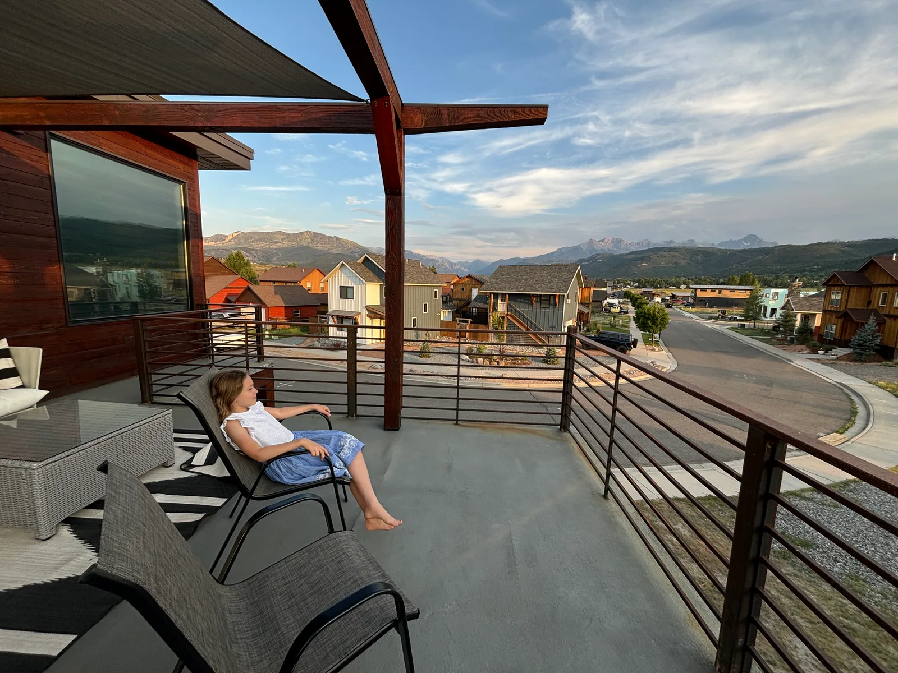
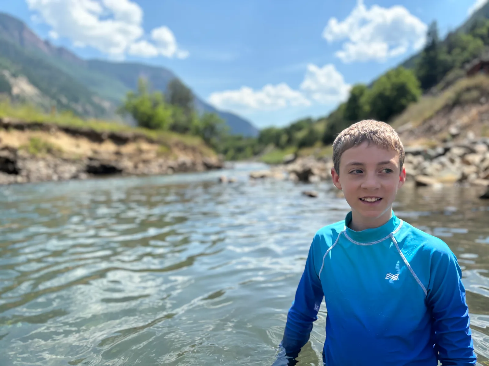
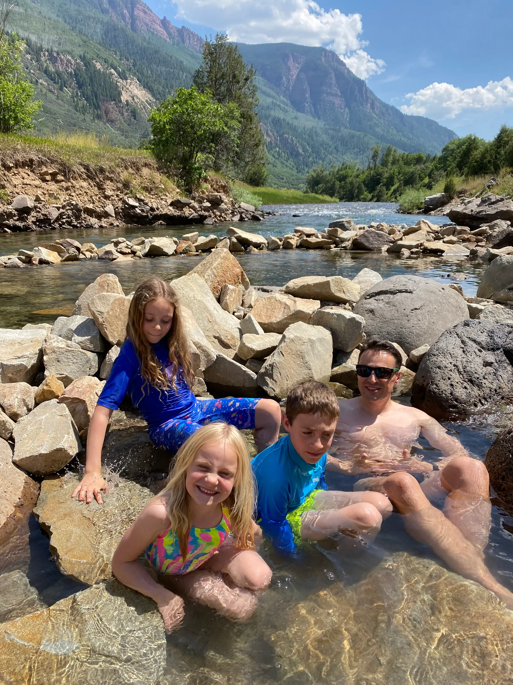
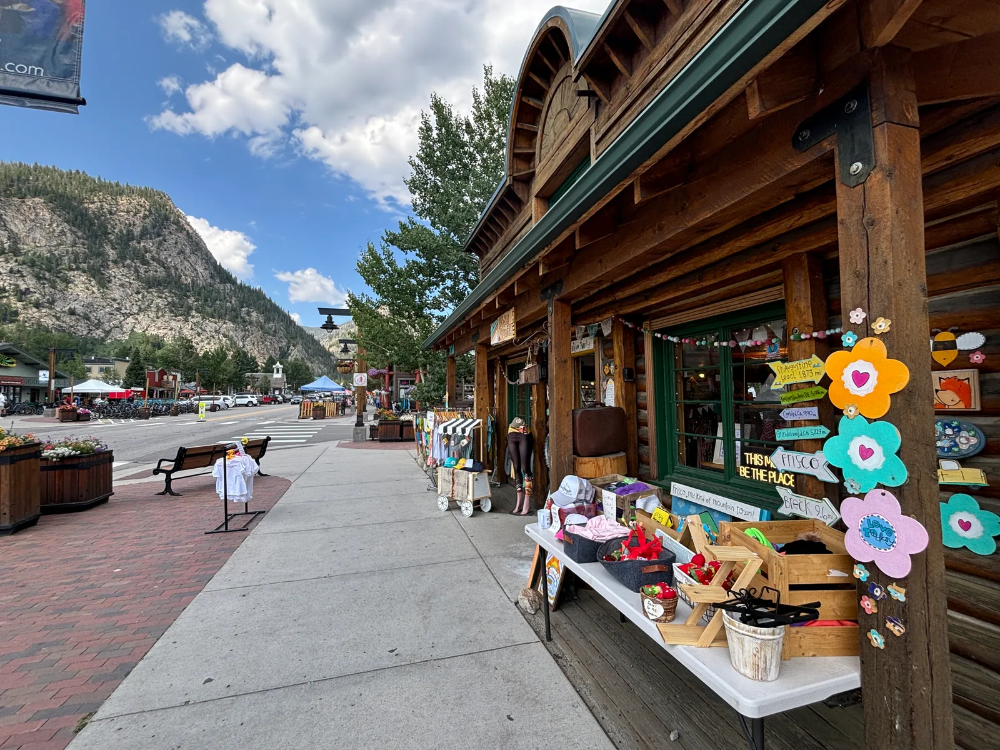
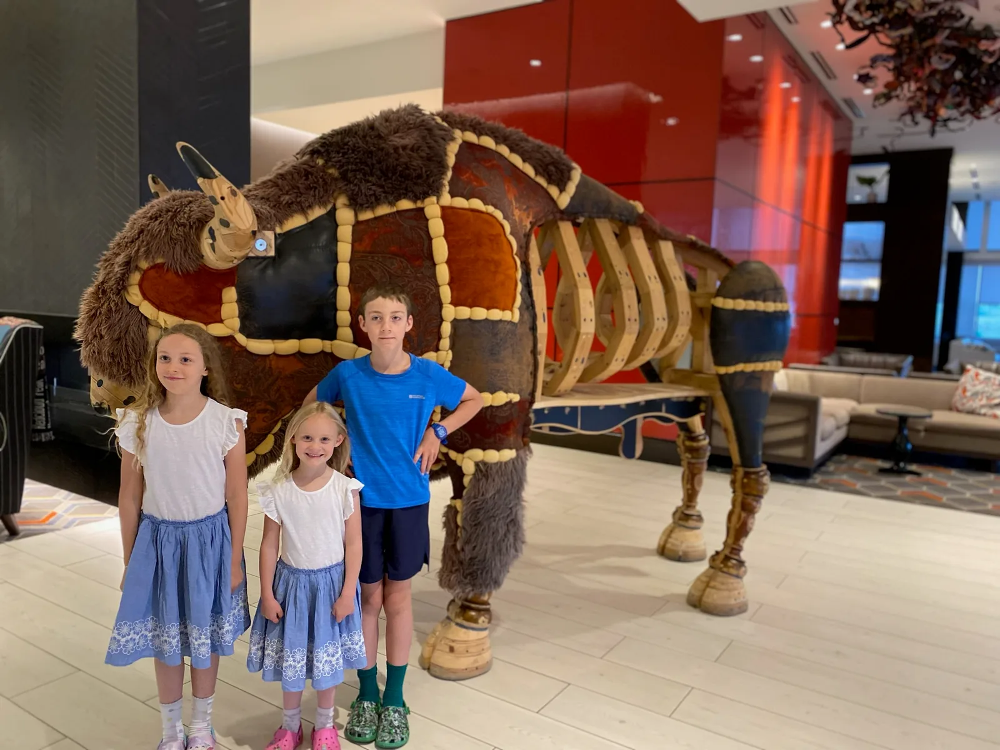
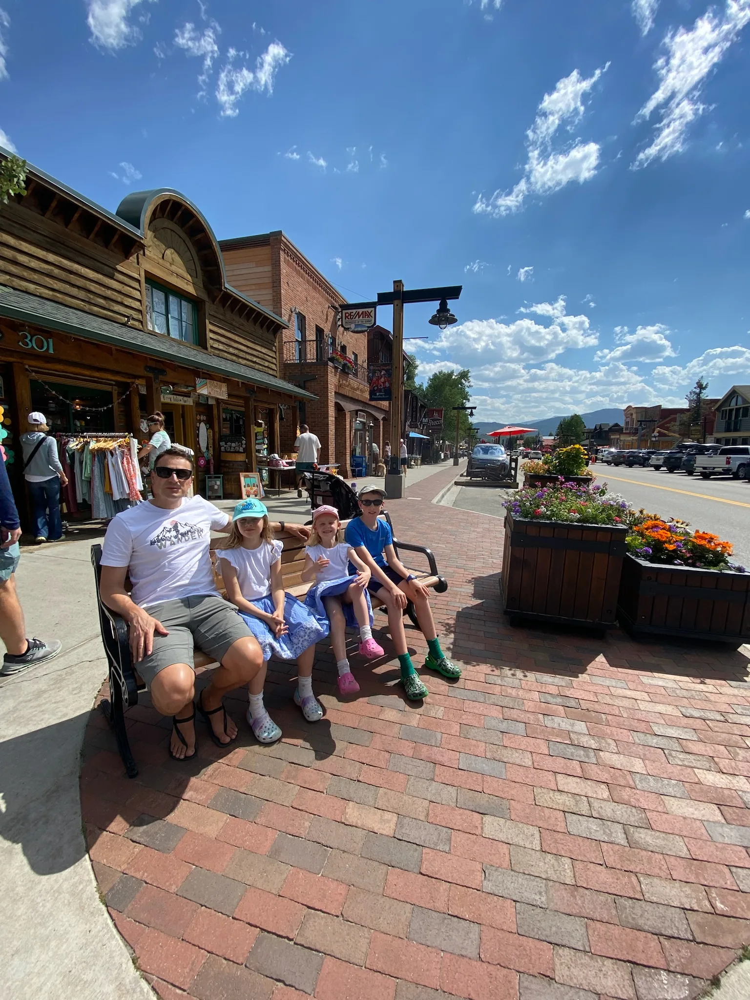
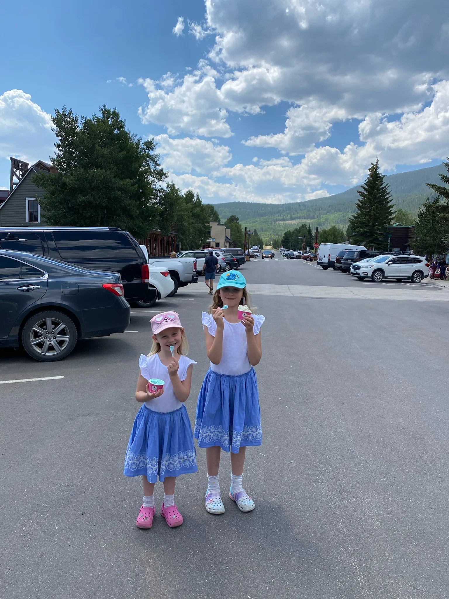
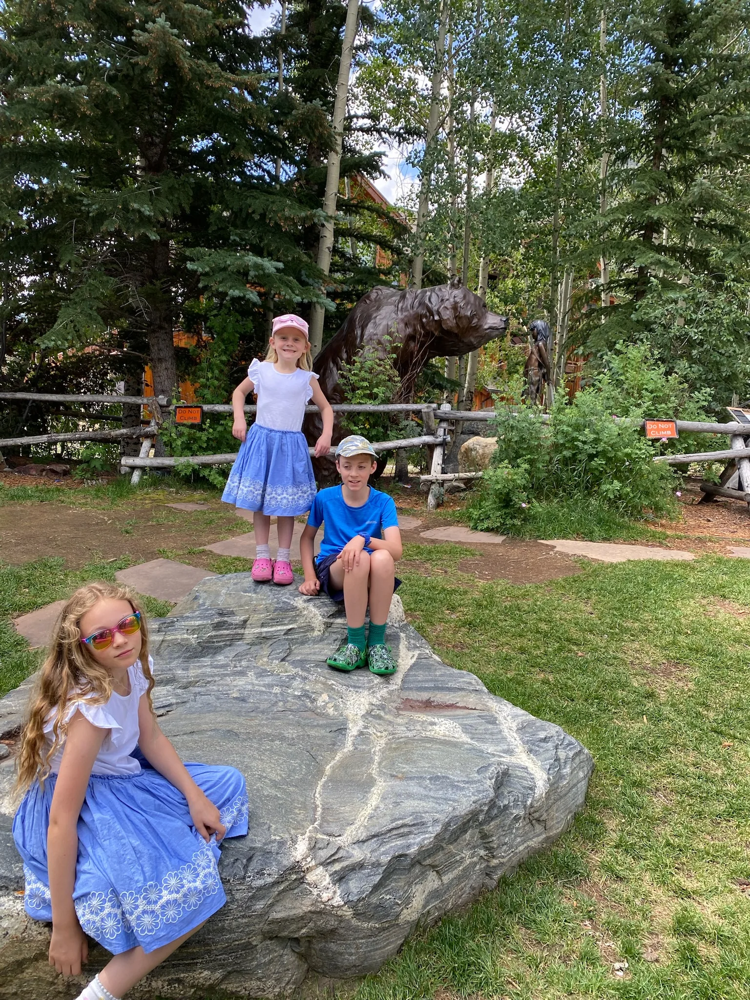
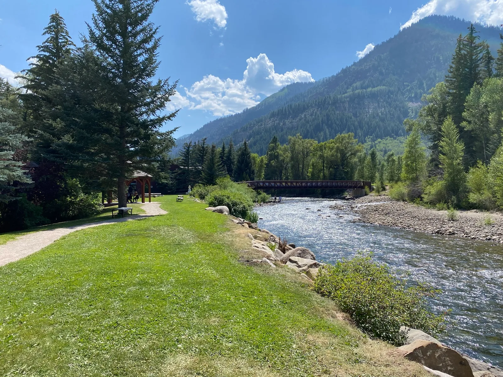

## Travel Log

We were clearly still on UK time to some extent and all woke at 4am Denver time. Luckily the hotel served breakfast from 6am and we were first. The kids made up for lack of dinner last night by making the most of the all you can eat buffet which included a waffle maker and rainbow Cheerios.

We were checked out and on the road by 7:10am heading across Denver and up into the mountains. The new car was amazing and we quickly enjoyed the adaptive cruise control, buckets of storage and very comfortable seats.

Our first stop was Georgetown but the museum wasn’t open so we moved on.

Further up the road was the mountain town of Frisco with a delightful Main Street and neat historic site and museum with a dozen or so restored log cabins. The Walmart sorted us out with some holiday essentials like an inflatable rubber ring and cool box.

The highlight of the day however was the natural Penny Hot Springs where hot water bubbled right next to the river and people had made various pools and natural hot tubs. The river itself was just perfect though and we spent a good hour or so just swimming in the river and riding the current.

We then passed through a tiny, quirky village called Redstone, we would have liked to have more time to explore here but the kids were getting tired so we pushed on over McClure Pass (8770ft) and down into the different scenery of Paonia - orchards and vineyards. We stopped at Big B’s Delicous Orchards to stock up on fruit and the kids discovered some massive tree swings whilst we enjoyed listening to the band warming up for the evening barn dance. Sadly we couldn’t stay but have added it to the growing list of things to do on a future trip.

We finally checked into our first holiday house, a stunning home in Ridgway with mountain views and a balcony with hammock. After fully exploring it we had a quick dinner and an early night.

Accommodation:

[https://www.airbnb.co.uk/rooms/2071044?check_in=2024-05-09&check_out=2024-05-14&guests=1&adults=1&s=67&unique_share_id=ad0e06b2-0acb-4afe-aad2-2f9352992ef0](https://www.airbnb.co.uk/rooms/2071044?check_in=2024-05-09&check_out=2024-05-14&guests=1&adults=1&s=67&unique_share_id=ad0e06b2-0acb-4afe-aad2-2f9352992ef0)

Route:

70/50/550. I70 to Glenwood Springs.

[https://www.google.co.uk/maps/dir/ridgway/Redstone+General+Store,+Redstone+Boulevard,+Redstone+Historic+District,+CO,+USA/denver/@38.9291909,-109.1453446,7z/data=!4m20!4m19!1m5!1m1!1s0x873f248ff00ebbe9:0x425be0d2736e9382!2m2!1d-107.7556162!2d38.1525873!1m5!1m1!1s0x874057795bc43b27:0xd1d587e88ab71a44!2m2!1d-107.2375824!2d39.1829827!1m5!1m1!1s0x876b80aa231f17cf:0x118ef4f8278a36d6!2m2!1d-104.990251!2d39.7392358!3e0?entry=ttu](https://www.google.co.uk/maps/dir/ridgway/Redstone+General+Store,+Redstone+Boulevard,+Redstone+Historic+District,+CO,+USA/denver/@38.9291909,-109.1453446,7z/data=!4m20!4m19!1m5!1m1!1s0x873f248ff00ebbe9:0x425be0d2736e9382!2m2!1d-107.7556162!2d38.1525873!1m5!1m1!1s0x874057795bc43b27:0xd1d587e88ab71a44!2m2!1d-107.2375824!2d39.1829827!1m5!1m1!1s0x876b80aa231f17cf:0x118ef4f8278a36d6!2m2!1d-104.990251!2d39.7392358!3e0?entry=ttu)
