## Travel Log

Today we said goodbye to Ridgway, a really perfect  small Colorado town and somewhere we’d love to come back to (or live!). After checking out of our Airbnb we had a leisurely morning at the park, drinking coffee from the Cimarron coffee shop  across the street whilst the kids played in the playground.

Horse riding was next on the agenda, from a stables in the foothills above Ouray. It was hot but we had a nice ride with views down to the valley floor. We are not natural cowboys and cowgirls so it was nice to be back with our own two feet on the ground, butt sore after an hour in the saddle!

The first drops of rain fell as we left the horses, turning into a mountain thunderstorm that left white dustings of hail higher up the mountain. Not the best weather for driving the dicey Million Dollar Highway with its precipitous drops and no edge protection. Apparently they can’t install barriers because it would make it too difficult to clear the snow through the winter.

The beauty was lost on the kids who were busy colouring. We reminded them to watch out for bears to which Thea replied ‘but I’m colouring - take a picture for me!’

The Million Dollar Highway is certainly a beautiful road and the views around each bend were fantastic, and better than we remembered when we last drove it in September 2006 (!). The most eventful part of the journey, recalling that it’s a winding, narrow, steep, mountain road, was when the kids erupted in primal screams from the back, hyperventilating the word “spider”! Between tears and screams of pure terror! We pulled over as soon as we could and everyone flew out the car shaking themselves and still feeling that crawling sensation on their skin. The kids refused to go anywhere near the car until the demon arachnid had been found. Since we were moving between accommodations our car was full with everything we had, not to mention plenty of pillows, blankets, teddies and other nooks and crannies to hide a large spider. Luckily, mainly due to its huge size, we found it quickly enough although it took several full stomps of a size 11 shoe to kill it. Even with it dead the kids spent the next hours of the journey periodically twitching as if an unseen creature was crawling on the back of their neck. Now we have to enter and exit the car like a formula one pitstop, with the doors open for the minimal amount of time possible!

Eventually we all calmed down. We stopped in Silverton (an old mining town) for more coffee and ice cream and some supplies from the tiny general store before dropping our bags at the new house (with hot tub, pool table and retro arcade machine!) we headed out for dinner and entertainment at the Bar D Chuckwagon. Alex and I were here back in September 2006, nearly 18 years ago! It looked like it hadn’t changed in that time either, and in fact the ageing band were probably the same that sang to us back then! After browsing the stalls and trying our hand at panning for gold we took our place at the trestle tables. Unfortunately the kids didn’t like their food so a bit of food swapping ensued since the kids did like the taste of the adult steaks (of course they would!). The music was fun enough but by now we were all exhausted and Thea had fallen asleep, so halfway through the last song we left via the back exit and made our way home, driving in the dark for the first time and keeping our eyes peeled for nocturnal wildlife (hopefully of the mammal variety as we’re done with insects!).

Horse ride rating: 6/10

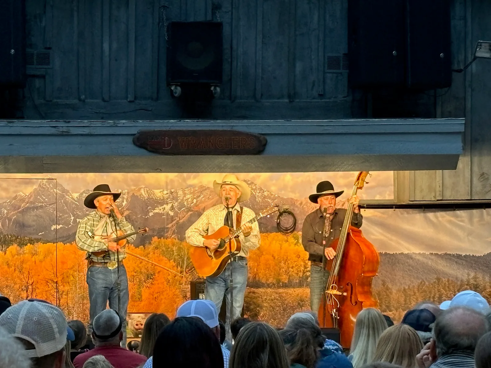

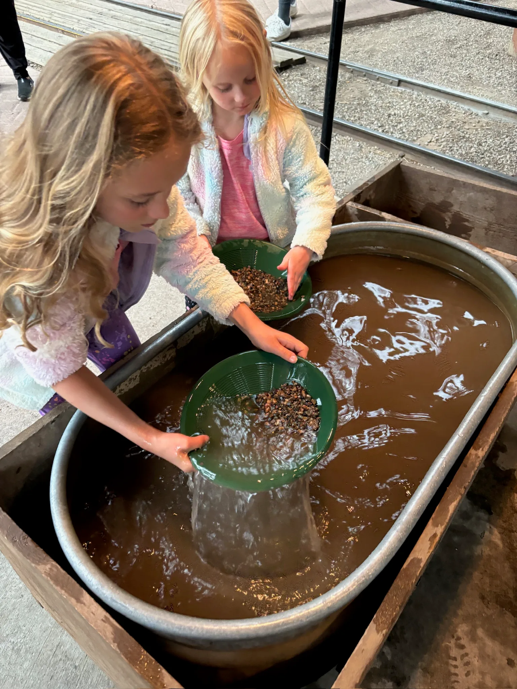

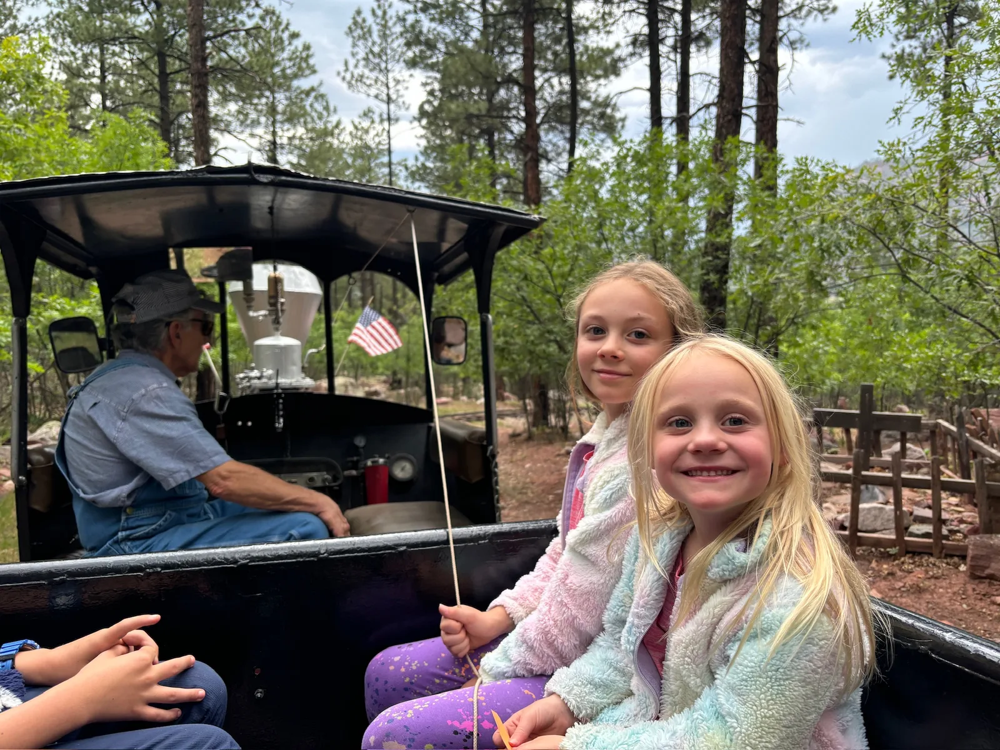

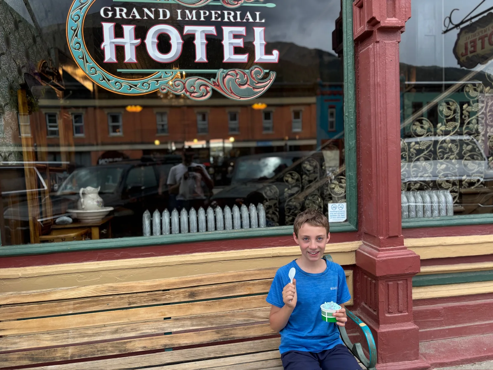

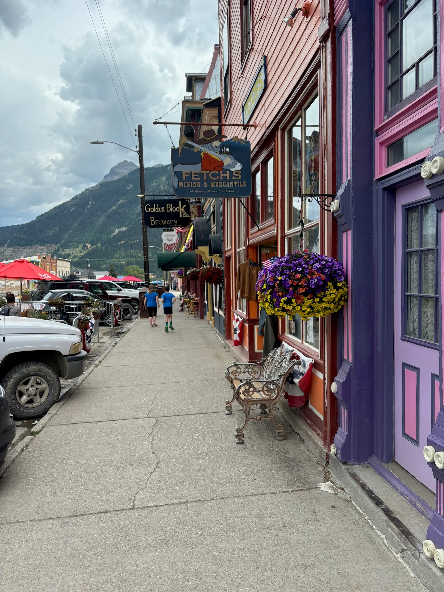

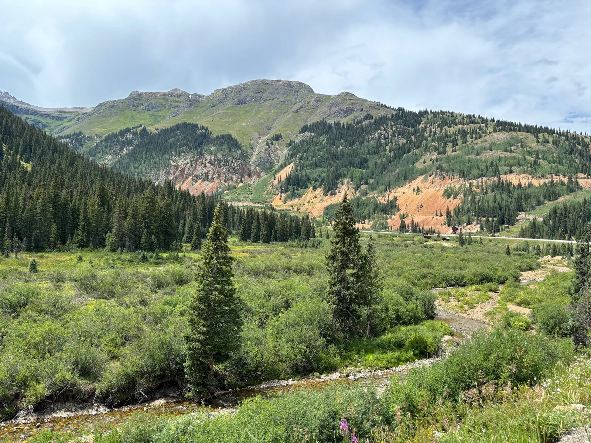

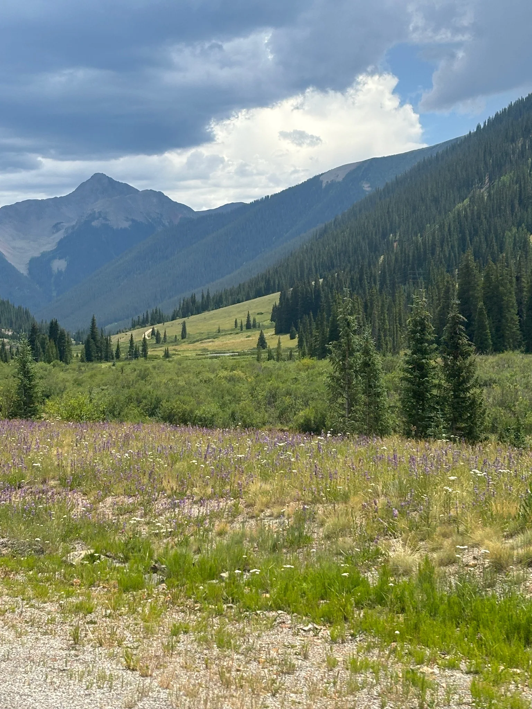

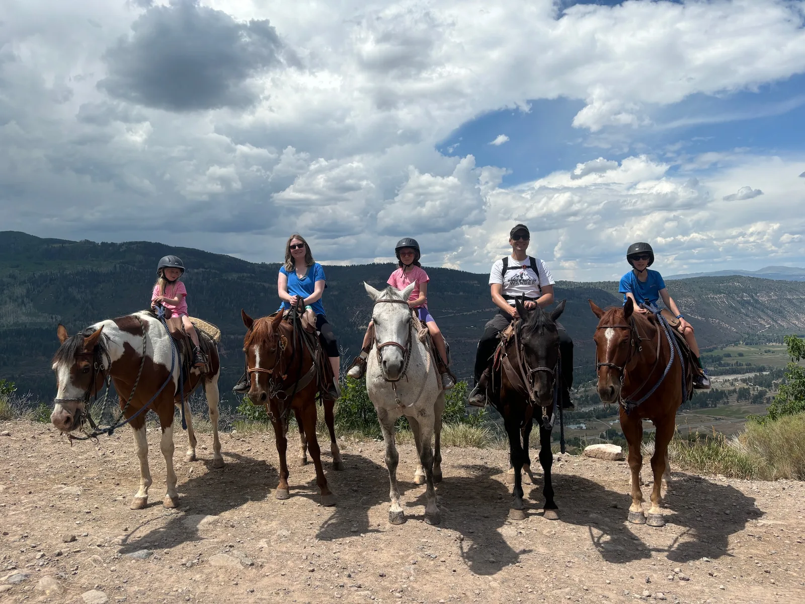

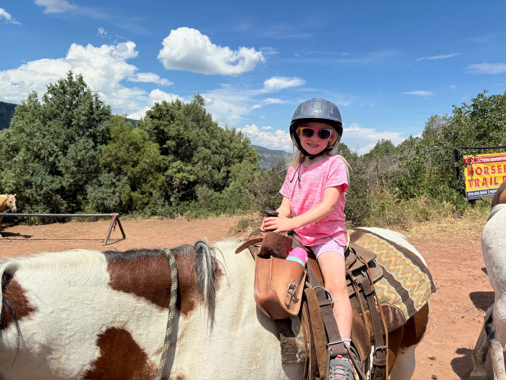

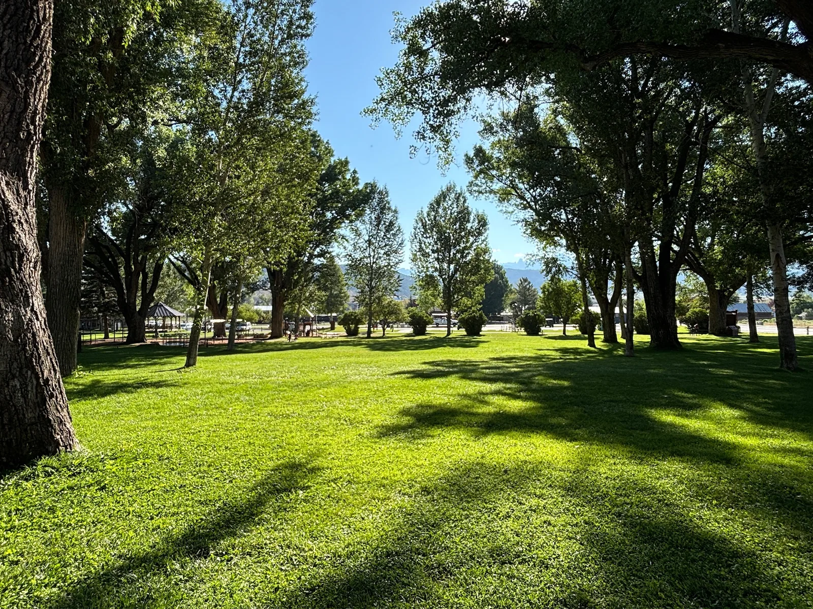

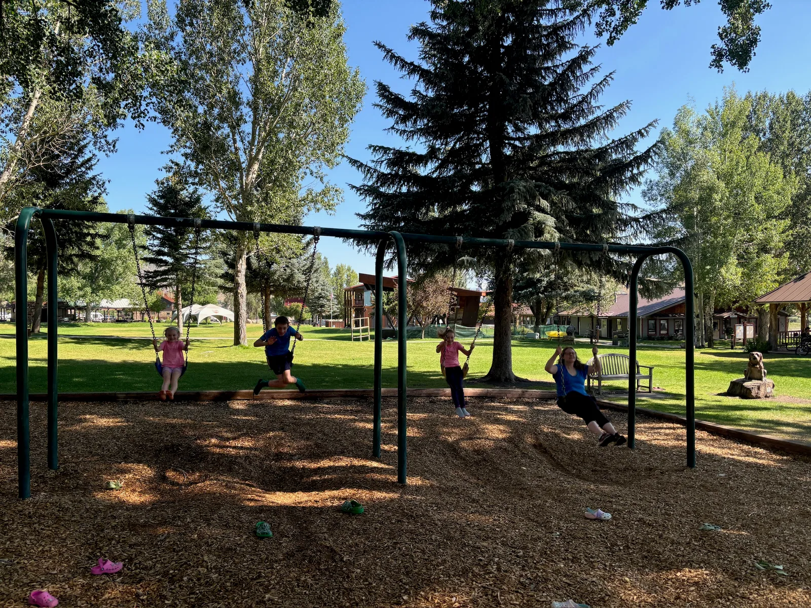

Accommodation:

[https://www.airbnb.co.uk/rooms/895067794091297199?source_impression_id=p3_1715017146_fGIGEDes1pfNpCCg](https://www.airbnb.co.uk/rooms/895067794091297199?source_impression_id=p3_1715017146_fGIGEDes1pfNpCCg)

Route:

[https://www.google.com/maps/dir/Ridgway,+CO,+USA/37.6149093,-107.8128593/@37.9687322,-107.8331293,10.53z/data=!4m9!4m8!1m5!1m1!1s0x873f248ff00ebbe9:0x425be0d2736e9382!2m2!1d-107.7556162!2d38.1525873!1m0!3e0?entry=ttu](https://www.google.com/maps/dir/Ridgway,+CO,+USA/37.6149093,-107.8128593/@37.9687322,-107.8331293,10.53z/data=!4m9!4m8!1m5!1m1!1s0x873f248ff00ebbe9:0x425be0d2736e9382!2m2!1d-107.7556162!2d38.1525873!1m0!3e0?entry=ttu)

Activities:

[https://horsebackadventures.com/](https://horsebackadventures.com/)

Dinner:

[https://bardchuckwagon.com/](https://bardchuckwagon.com/)
