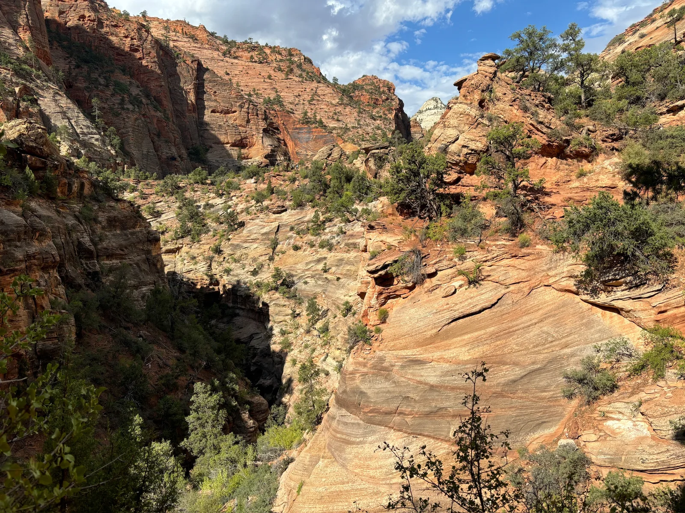
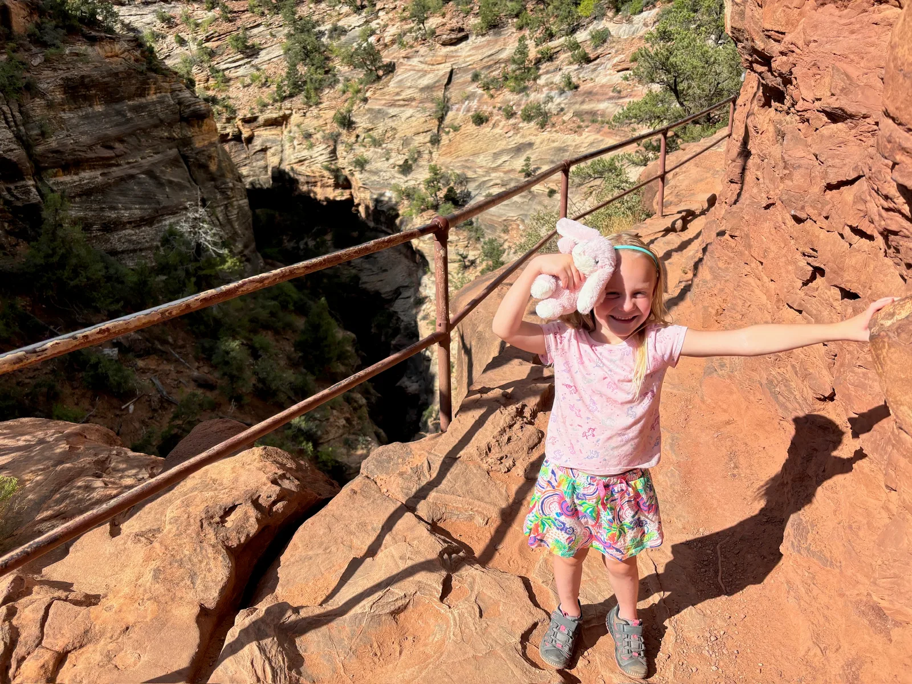
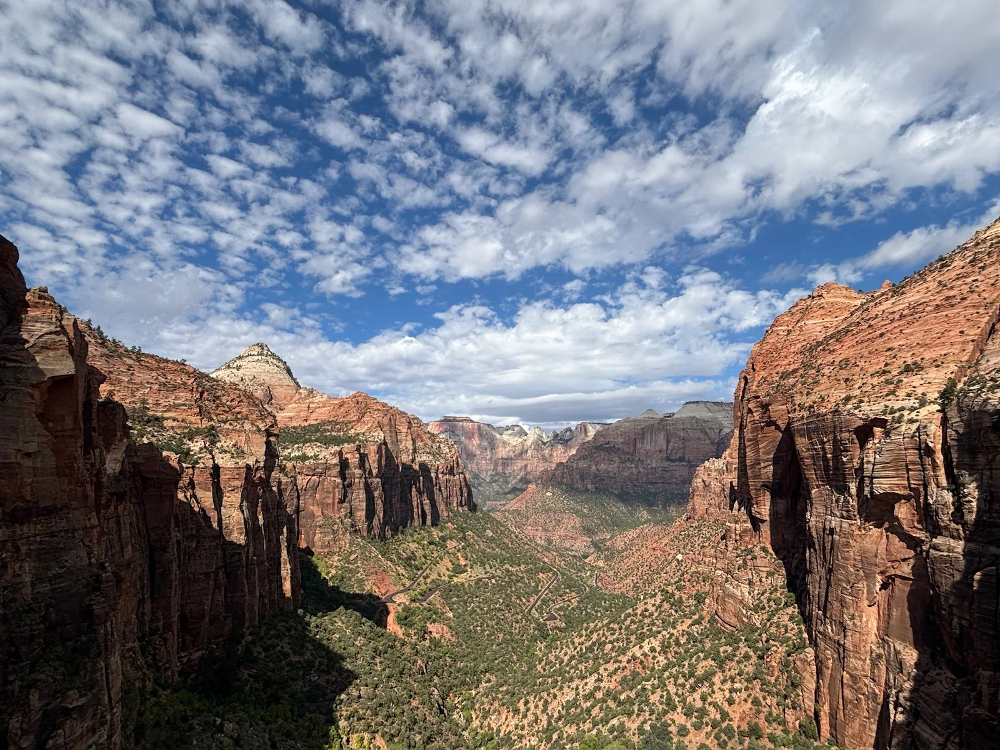
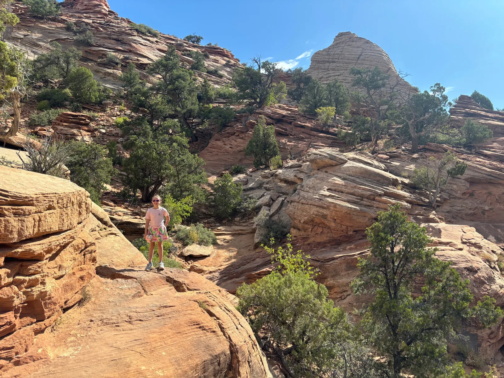
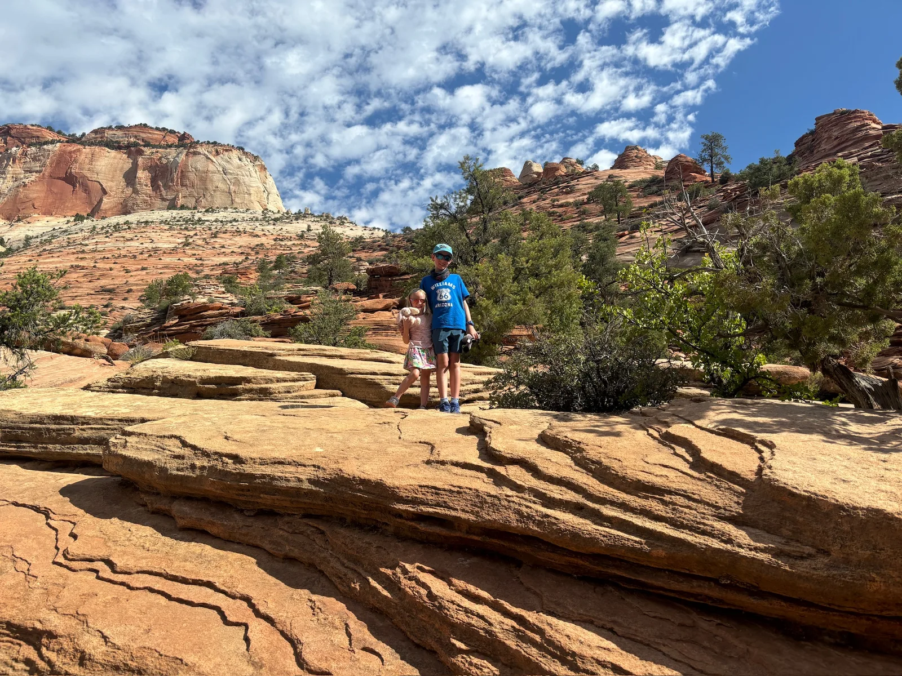
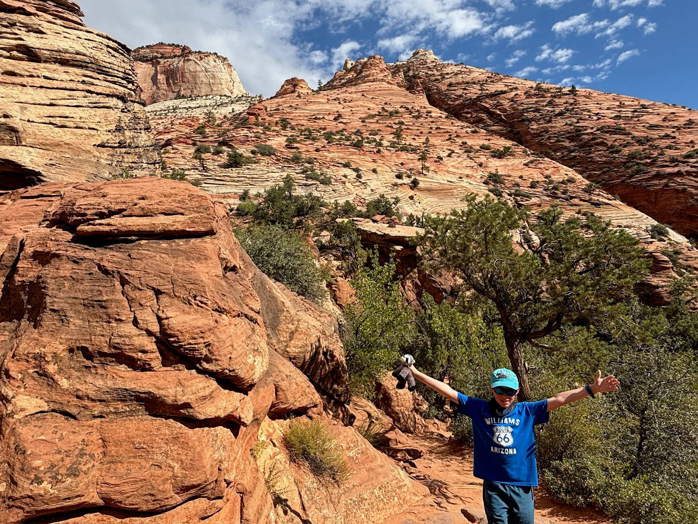
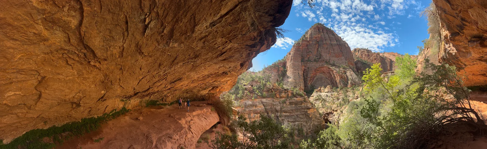
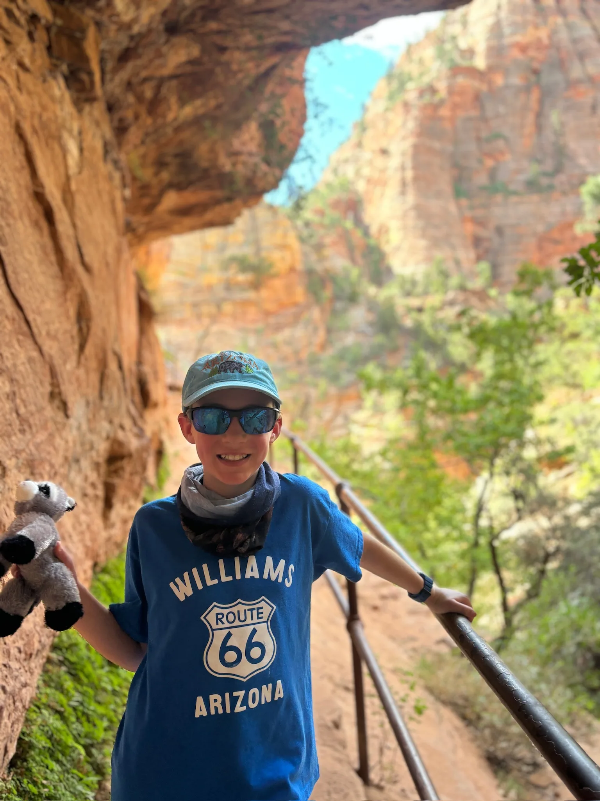
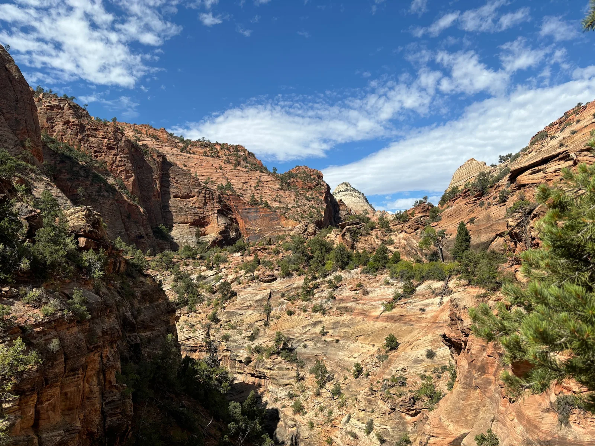
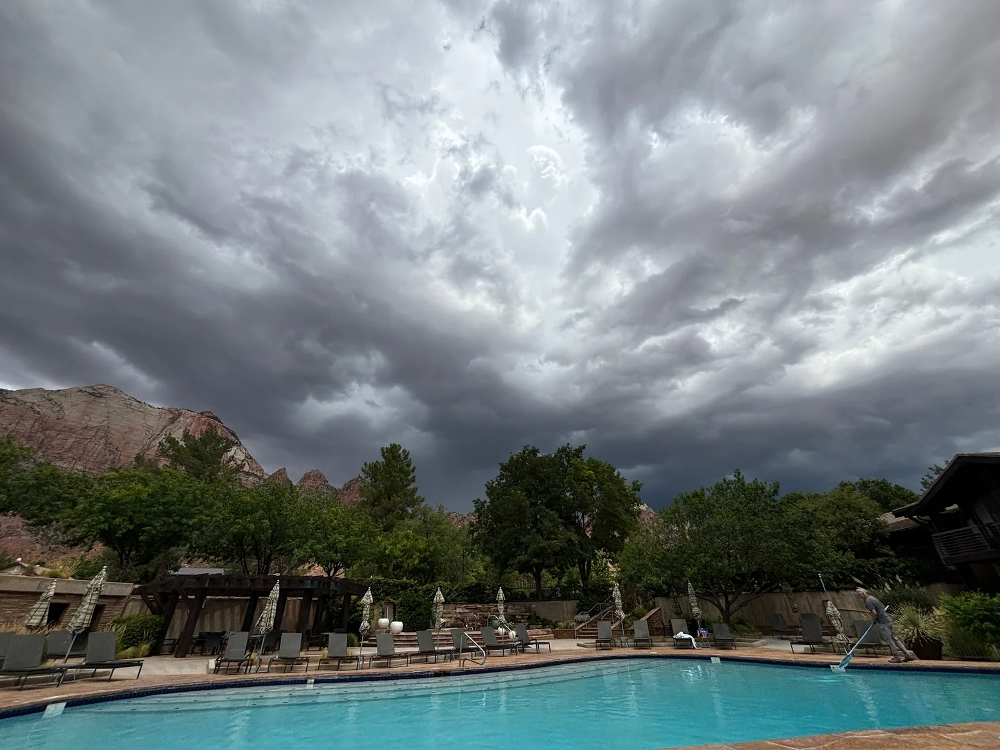

## Travel Log

Today we headed back up the switchbacks and through the tunnel to get to the east side of the park and the trailhead for the Canyon Overlook trail. We didn’t get a particularly early start so it was already fairly hot. The Canyon Overlook turned out to be an amazing walk. It was quite short but fun through canyon scenery and the desert landscape. There were some undercut caves to escape the heat and even a little bridge hanging over the drop. The route terminates at an overlook with stunning views of the Zion valley. It gave us a fun and easy taste of Zion without the permit system and danger of Angel’s Landing/the Narrows (flash flood risk was high today so Narrows was closed anyway).

We were back down by lunch where we were met with thunderstorms while playing in the hotel pool. The afternoon proceeded with sun and showers but it was a good excuse to relax by the pool in between lightening strikes and we met another family from London who the kids enjoyed playing with.

We walked into town for dinner at Porters, it was not great, but this was rectified with Bumbleberry’s ice cream and another dip in the pool after dinner - such a great way to entertain the kids for hours and relaxing for us.

Accommodation:

[https://www.desertpearl.com/en/homepage](https://www.desertpearl.com/en/homepage)

Hike:

[https://www.alltrails.com/en-gb/trail/us/utah/canyon-overlook-trail](https://www.alltrails.com/en-gb/trail/us/utah/canyon-overlook-trail)
