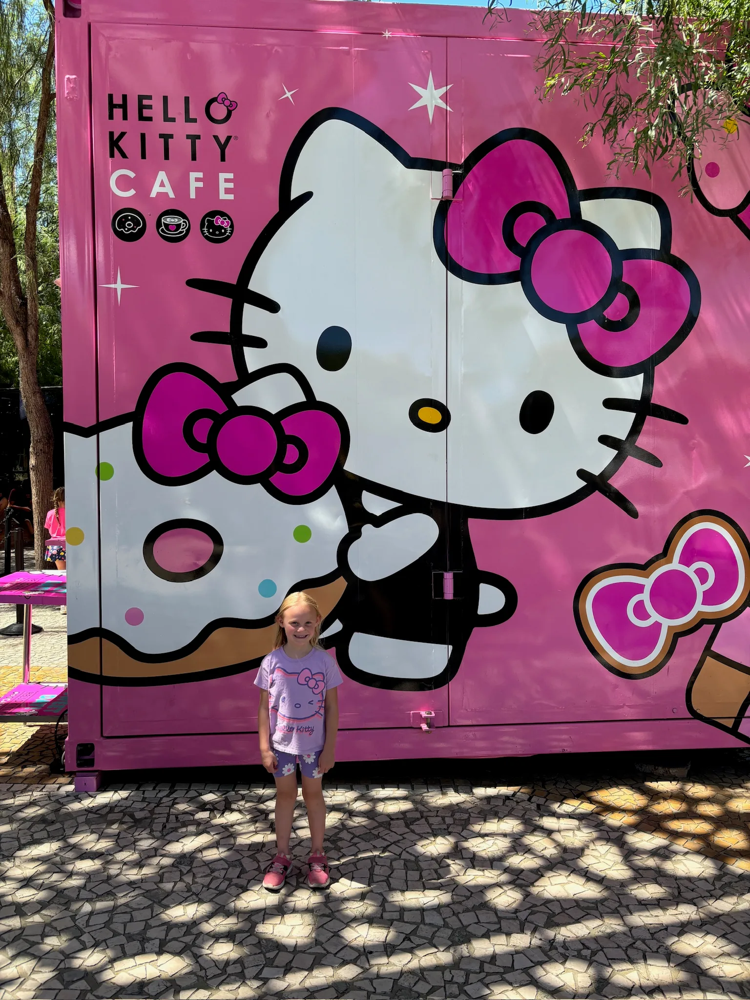
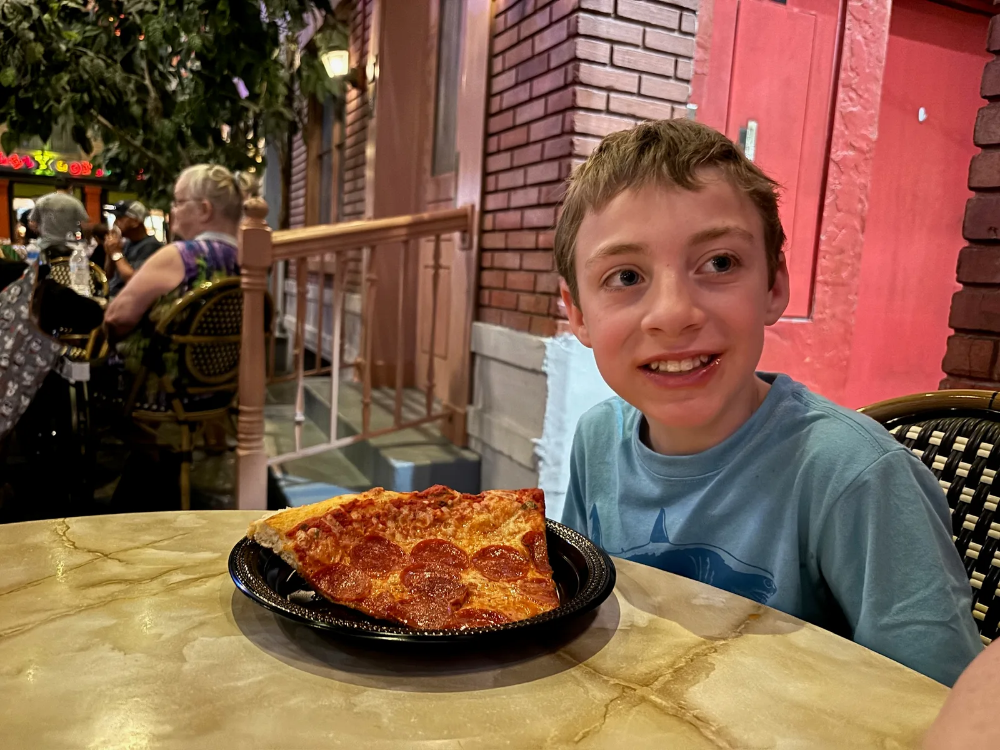
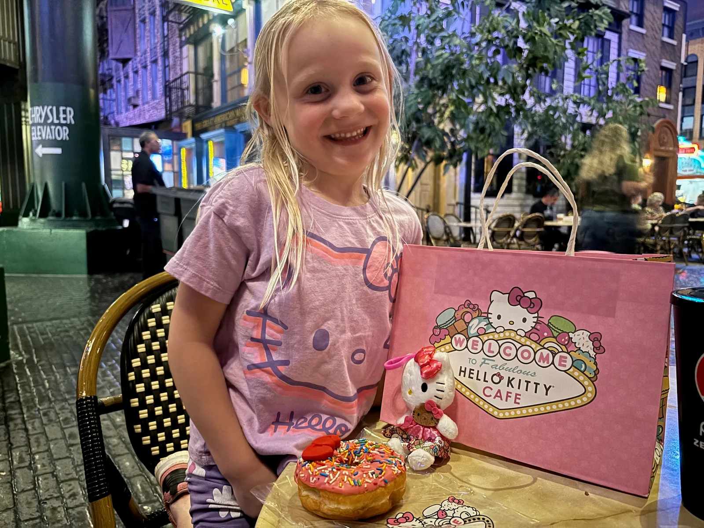
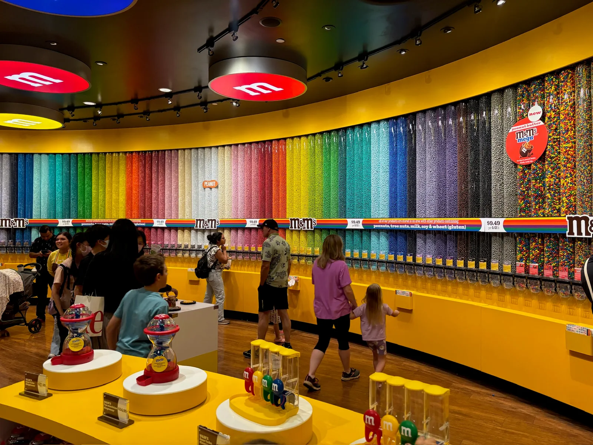
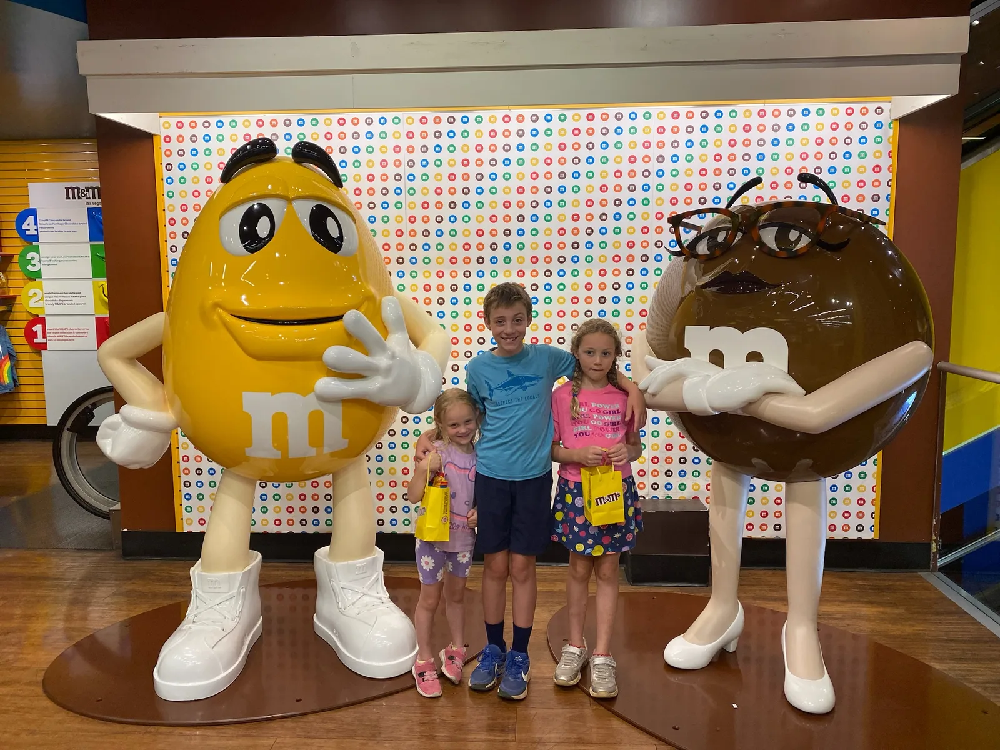
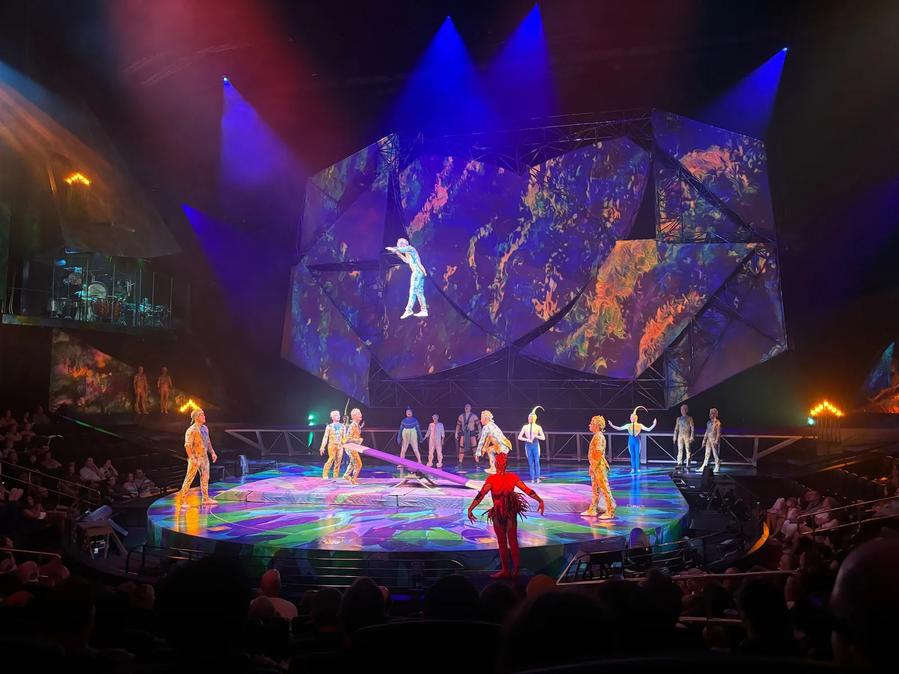
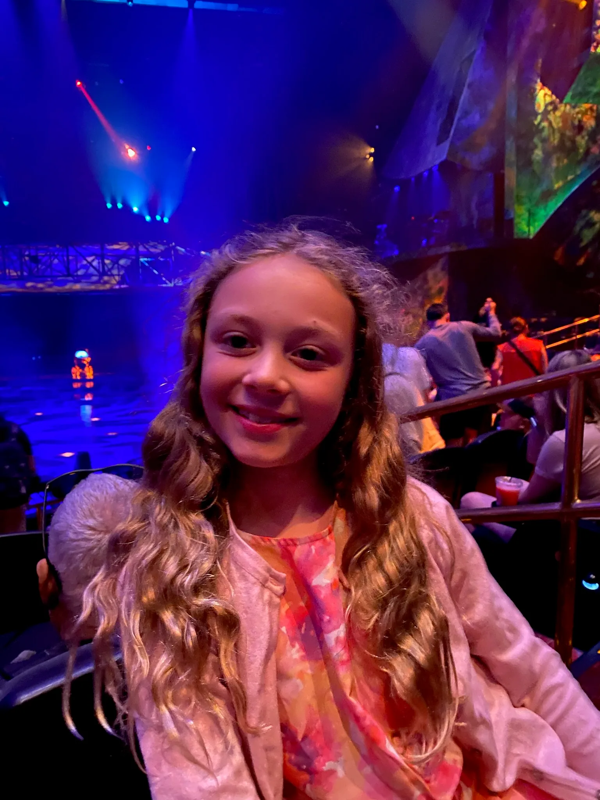

## Travel Log

After a good nights sleep in our luxurious apartment and a starbucks coffee (which was on site) we headed to the pool for a morning swim, the pool was refreshingly cool and quiet and despite the heat we even enjoyed the hot tub. We then headed out to the strip to explore a few more casinos. The distances between them were huge especially for a 5 year old and it was uncomfortably hot, we made it through the cosmopolitan and MGM, we tried to buy slush puppies for the kids but discovered they were all alcoholic! We did find the more appropriate Hershey's and M&M shops and a Hello Kitty shop for Thea which she was thrilled about. We had to buy an over priced doughnut that she ate one bite of and a keyring. We then went to New York New York for pizza before going to Flyover - this was amazing, you are in seats suspended over a huge screen so it feels as if you are flying with added effects of wind and spray. We did the Southwest USA and Canadian Rockies one, the kids loved it and it helped make up for all the walking in the heat that morning. After Flyover we found some basic supplies in a CVS, the only real food there were the supplies for making fajitas. After we had carried 2 heavy shopping bags  of food several blocks home it occurred to us we should have used have used Uber Eats for food supplies and [meals.Next](http://meals.next/) time!

We had a couple hours relaxing and recovering back at our hotel and made an early dinner before heading back out again for the Cirque Du Soleil Mystere performance @ Treasure Island. We decided to drive as it was a 40 minute walk along the strip each way. The performance was fun, a little odd, not quite what we had expected but still impressive and the enjoyable. Thea fell asleep but the Jasper and Bess enjoyed it and Thea enjoyed the parts she was awake for.

Accommodation:

[https://www.hilton.com/en/hotels/lascsgv-hilton-grand-vacations-club-elara-center-strip-las-vegas/](https://www.hilton.com/en/hotels/lascsgv-hilton-grand-vacations-club-elara-center-strip-las-vegas/)

Activities:

[https://www.flyoverlasvegas.com/](https://www.flyoverlasvegas.com/)

[https://www.cirquedusoleil.com/mystere](https://www.cirquedusoleil.com/mystere)
