## Travel Log

The kids managed a quick swim before we went to Area 15 for Meow Wolf. Area 15 and Meow Wolf (Omega Mart) are a sort of immersive art and entertainment experience. The Omega Mart is an alternative reality game where you explore the complex and uncover a narrative. I thought the kids would be more into it than they were but they didn’t really get it and were tired and grumpy making it difficult for us to explore it properly. We still managed around 2 hours there but ended up having to google the plot over the lunch to try figure out what it was all about. In hindsight it, although there were plenty of kids there, it is really for young care free adults with plenty of time on their hands and no distractions!

Area 15 was still a pretty cool place to hang out and we had a nice lunch there before heading back to our hotel for a few hours. The kids had another afternoon swim but it was too hot and we kept it brief. We then headed out again after dinner for the Neon Museum. This place was great, really fascinating to learn the history of the signs and Vegas and it was beautiful to be amongst the signs lit up as the sun set. The kids had a quiz to complete which kept them entertained which meant we could properly enjoy it and absorb the atmosphere.

Once we got back we nipped out to see the Bellagio fountains, it was late and we were tired but it is something we had to do before moving on. We made it to watch two shows and the kids seemed suitably impressed. It was a different atmosphere after dark and there were lots of questions about the outfits of scantily clad women on the strip!

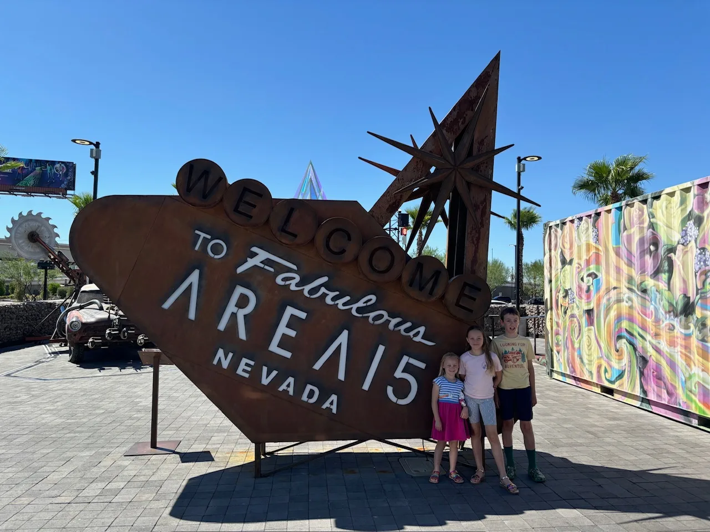

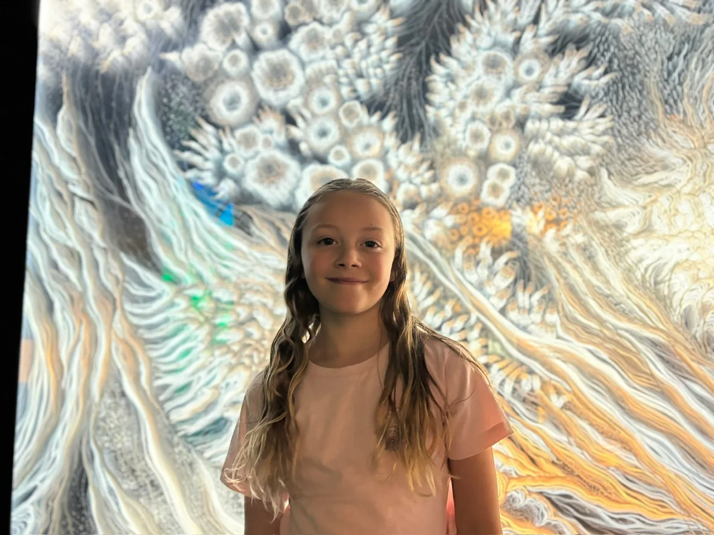

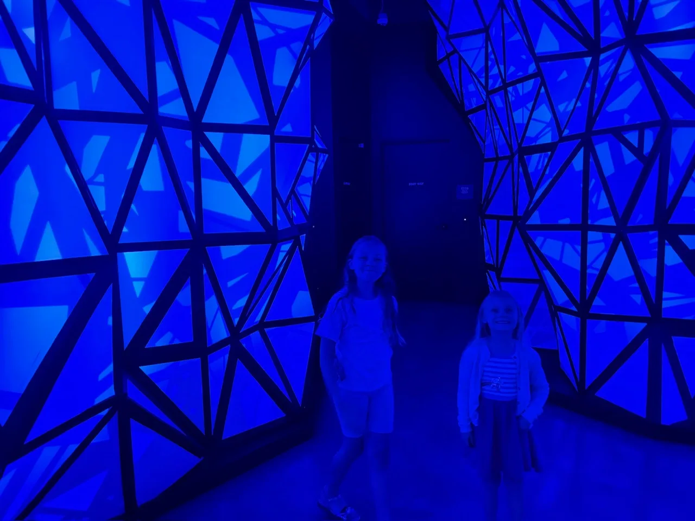

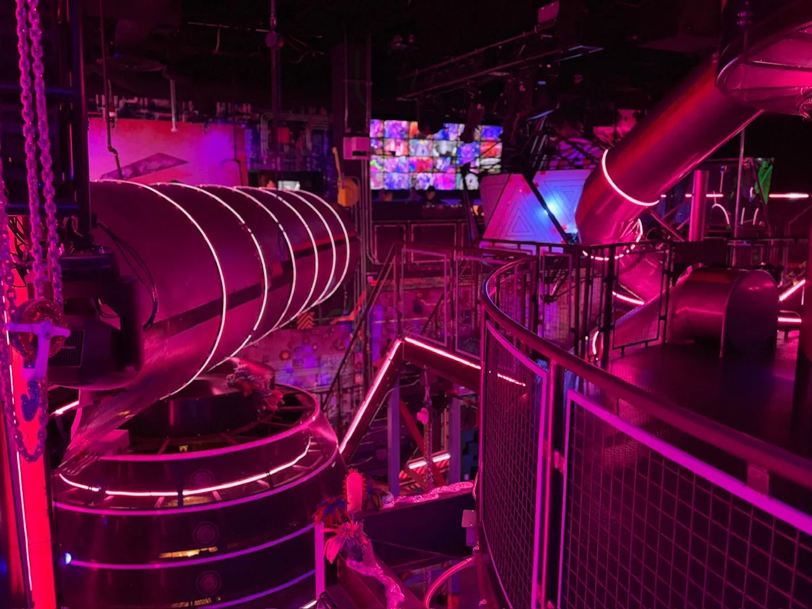

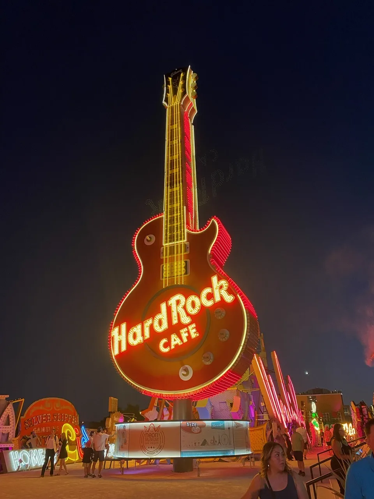

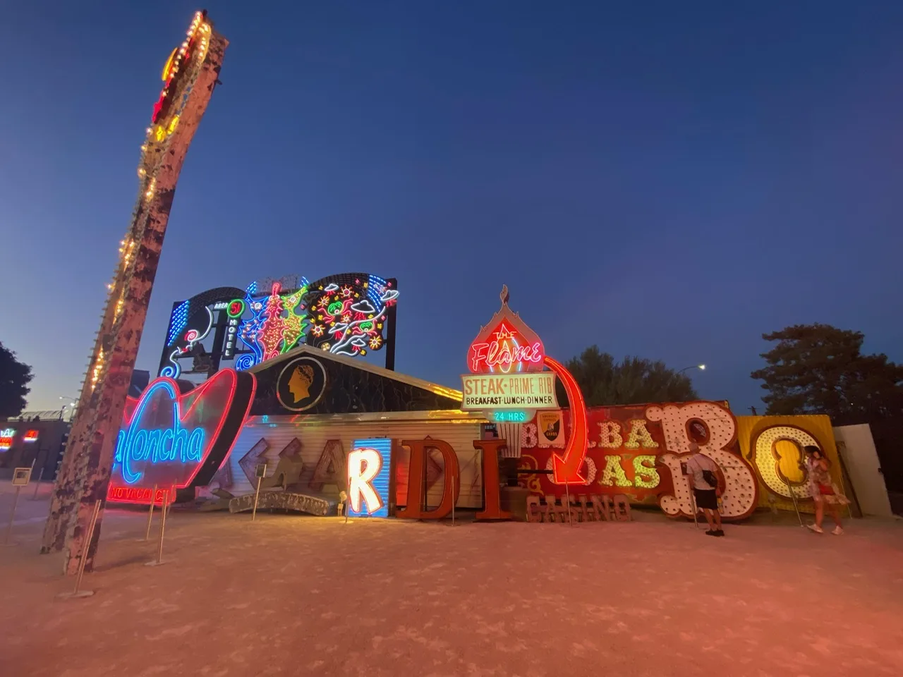

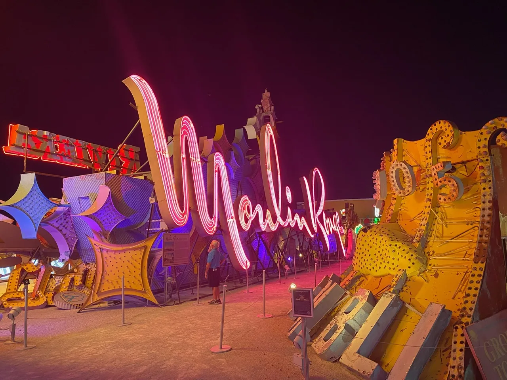

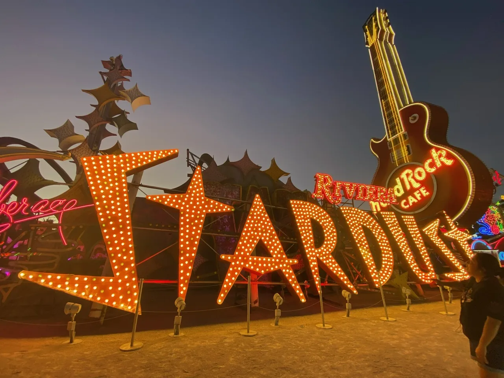

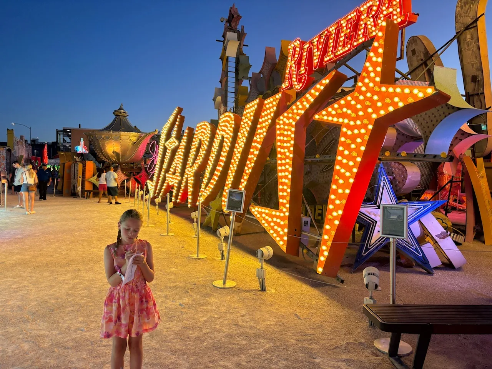

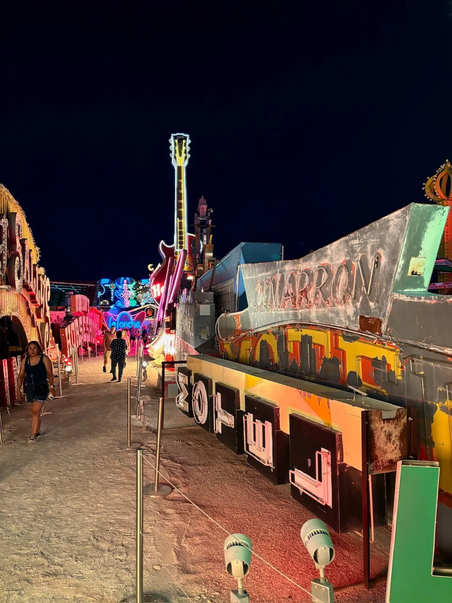

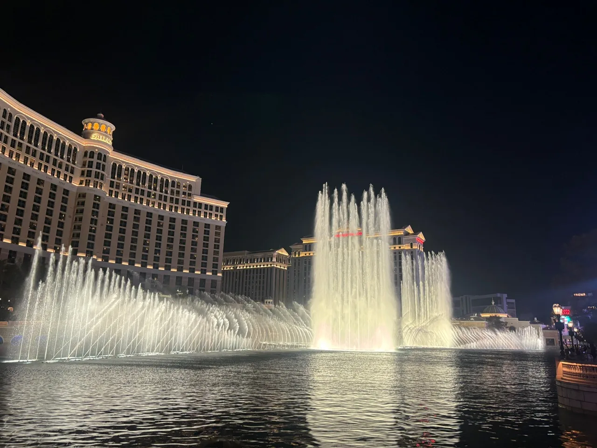

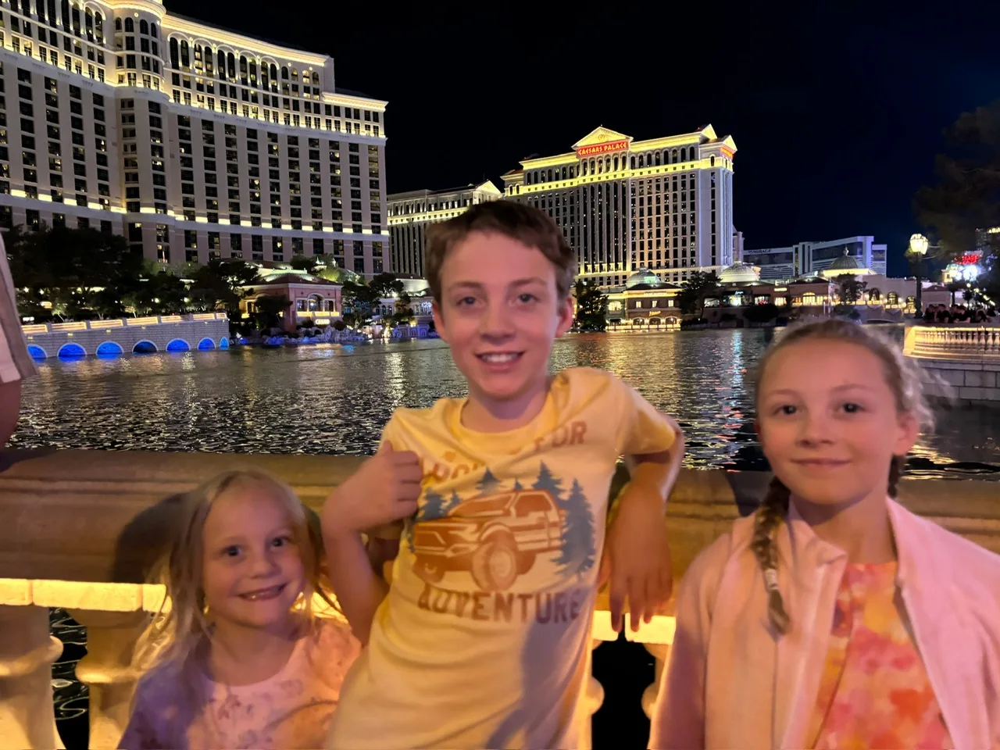

Accomodation:

[https://www.hilton.com/en/hotels/lascsgv-hilton-grand-vacations-club-elara-center-strip-las-vegas/](https://www.hilton.com/en/hotels/lascsgv-hilton-grand-vacations-club-elara-center-strip-las-vegas/)

Activities:

[https://www.meowwolf.com/](https://www.meowwolf.com/)

[https://www.neonmuseum.org/](https://www.neonmuseum.org/)
