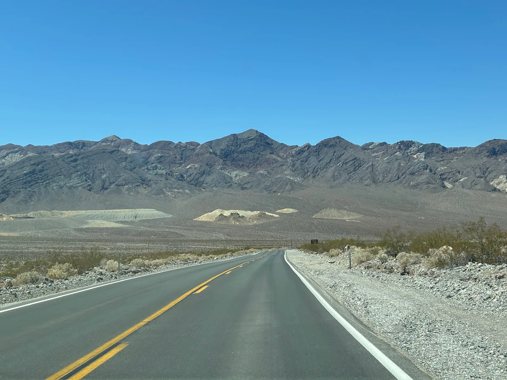
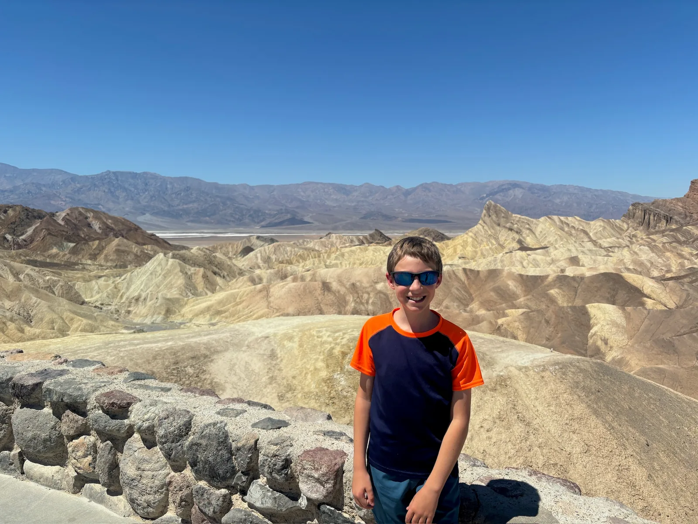
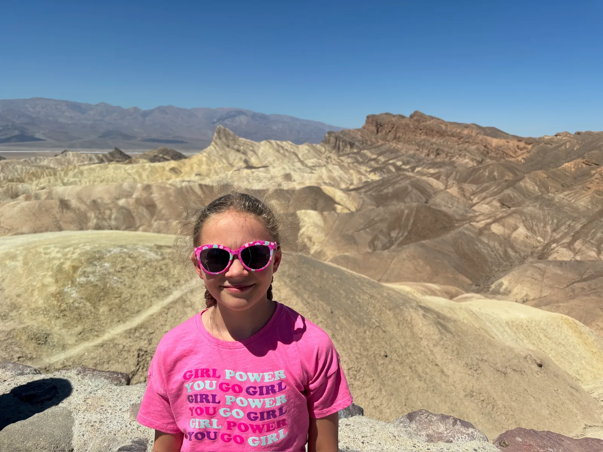
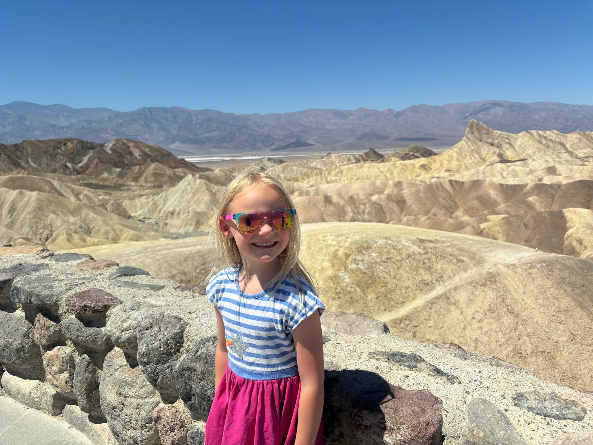
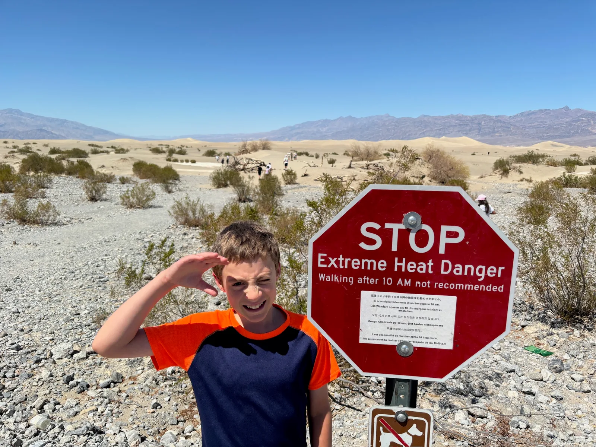
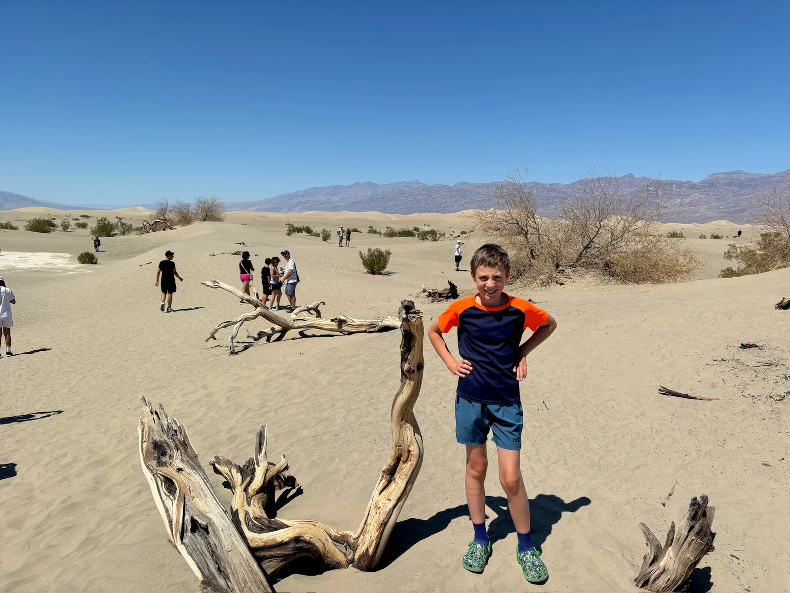
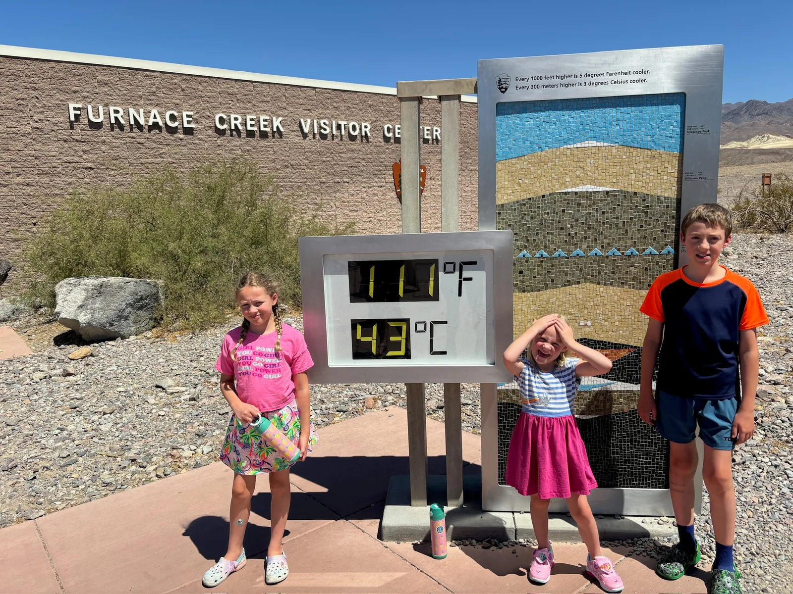
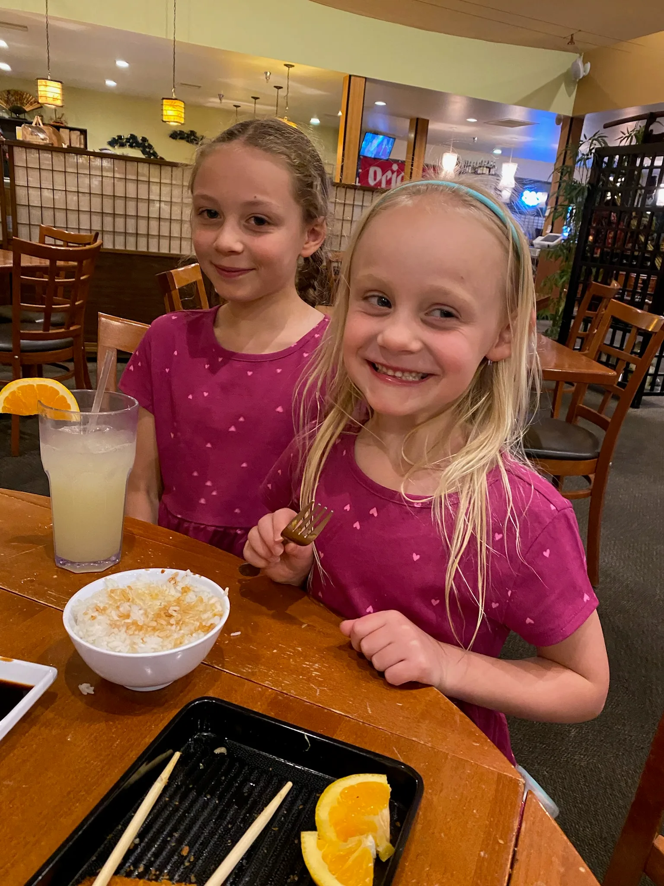

## Travel Log

We left Vegas early for a long day on the road. It was a relief to leave the chaos and noise of LV. We had loved Vegas 18 years ago but now older, with kids, it just felt overwhelming and exhausting and we were glad to leave and head back to the peace of the desert. The drive through Death Valley was pretty and despite worrying the car would break down and we’d be left to die in the heat on the side of the road it was actually fine, there was no such tragedy and it was very uneventful! We stopped at one view point for a short walk and actually it didn’t feel much hotted than LV. We then went to the visitor centre, watched the movie and explored the exhibit. The drive through Stovepipe Wells was probably the hottest as we had to turn our air con off for 20 minutes, it felt like a very long 20 minutes! It actually was cooler to open the windows and have the breeze. Once we started to climb up out of Stovepipe Wells the temperature dropped considerably, we went from 0 feet to a much more comfortable 6000 feet in around 30 minutes and we also saw some Joshua trees as we left the park. We took a break in Lone Pine which had a cool hiker vibe being the start of the Mt Whitney trail head. There was a great little store (Lone Star Bistro) that did coffee and ice cream as well as merchandise and we spent a while here enjoying the break from the car and heat and buying various things we didn’t need!

Finally we arrived in Bishop around 5pm, we checked into our hotel, it was pretty basic but had everything we needed. The kids managed a quick swim at the pool and then we had Sushi for dinner at Yamatani Japanese Restaurant this was a real treat as we were trying not to eat out much but there was no catering option at our hotel and it was nice to not have something smoked or fried for a change!

Accommodation:

[https://www.ihg.com/holidayinnexpress/hotels/gb/en/bishop/bshop/hoteldetail](https://www.ihg.com/holidayinnexpress/hotels/gb/en/bishop/bshop/hoteldetail)

Route:

[https://www.google.com/maps/dir/Las+Vegas,+NV,+USA/Bishop,+CA,+USA/@36.4060361,-117.0126606,9.22z/data=!4m23!4m22!1m10!1m1!1s0x80beb782a4f57dd1:0x3accd5e6d5b379a3!2m2!1d-115.1391009!2d36.171563!3m4!1m2!1d-116.2522012!2d35.9728275!3s0x80c65d5f50774b03:0xac75c8a3a2c80fbf!1m5!1m1!1s0x80be16019ea66407:0x13cd1e4d95e98916!2m2!1d-118.395236!2d37.3613936!2m3!6e0!7e2!8j1722537600!3e0?entry=ttu](https://www.google.com/maps/dir/Las+Vegas,+NV,+USA/Bishop,+CA,+USA/@36.4060361,-117.0126606,9.22z/data=!4m23!4m22!1m10!1m1!1s0x80beb782a4f57dd1:0x3accd5e6d5b379a3!2m2!1d-115.1391009!2d36.171563!3m4!1m2!1d-116.2522012!2d35.9728275!3s0x80c65d5f50774b03:0xac75c8a3a2c80fbf!1m5!1m1!1s0x80be16019ea66407:0x13cd1e4d95e98916!2m2!1d-118.395236!2d37.3613936!2m3!6e0!7e2!8j1722537600!3e0?entry=ttu)
