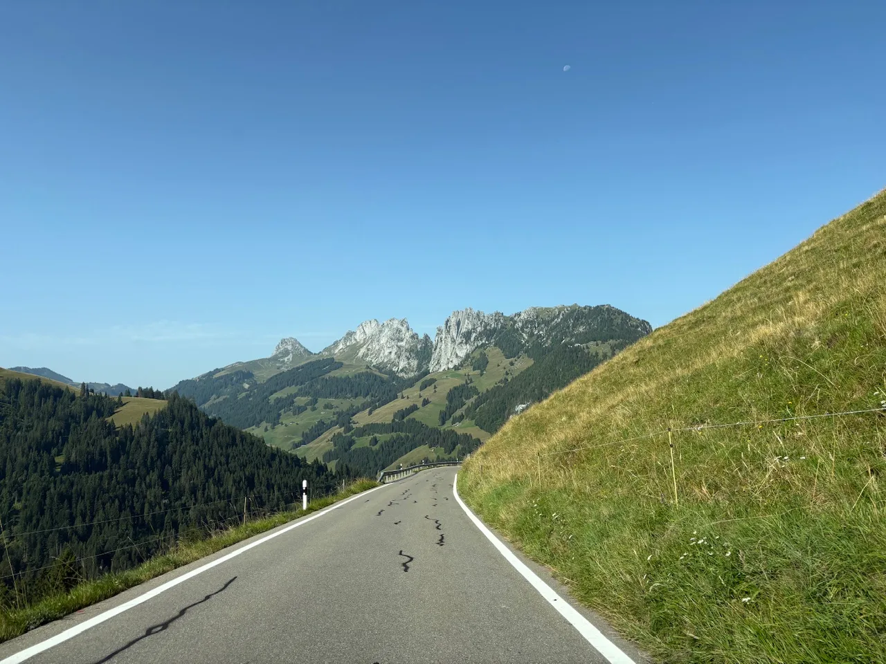
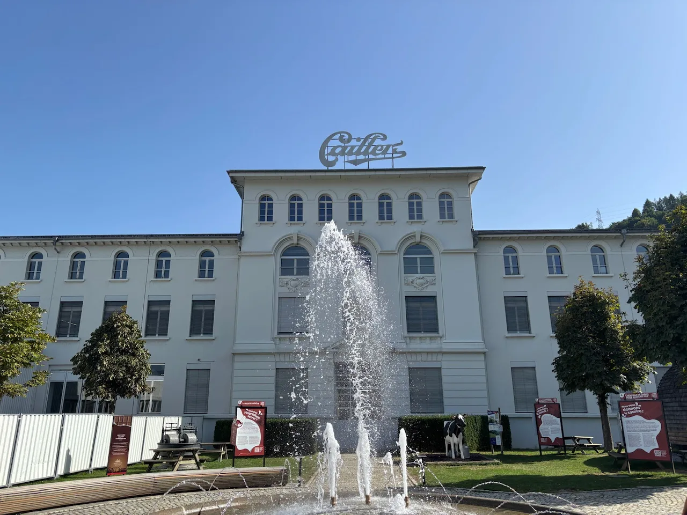
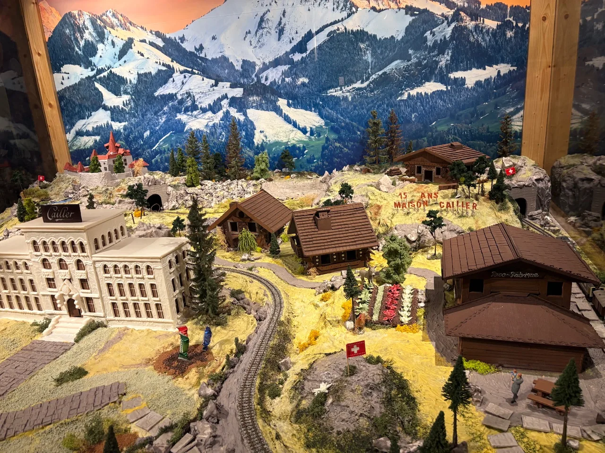
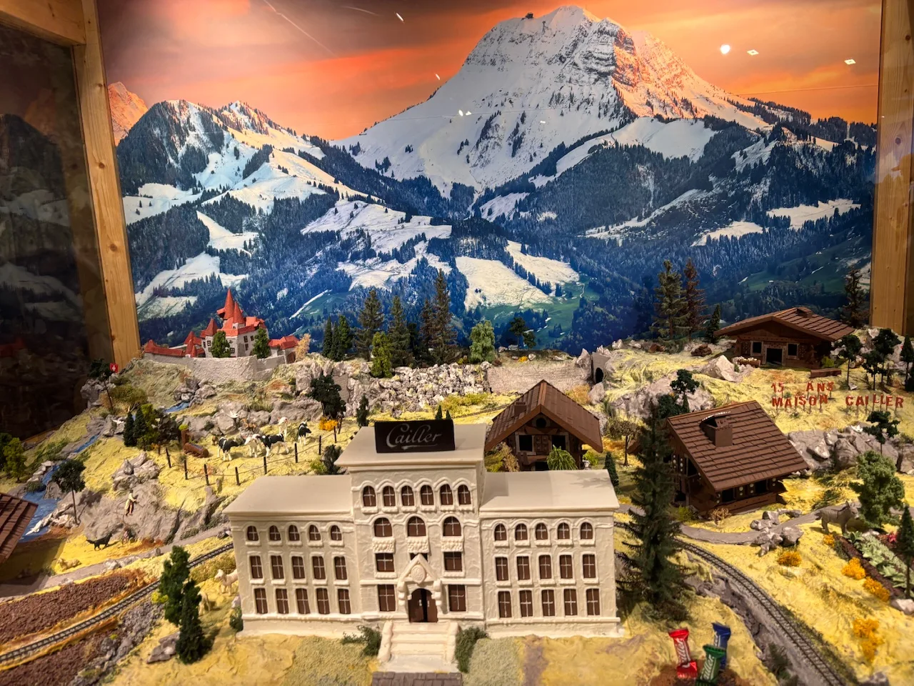
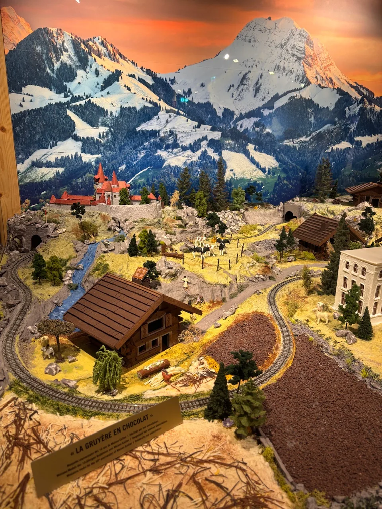
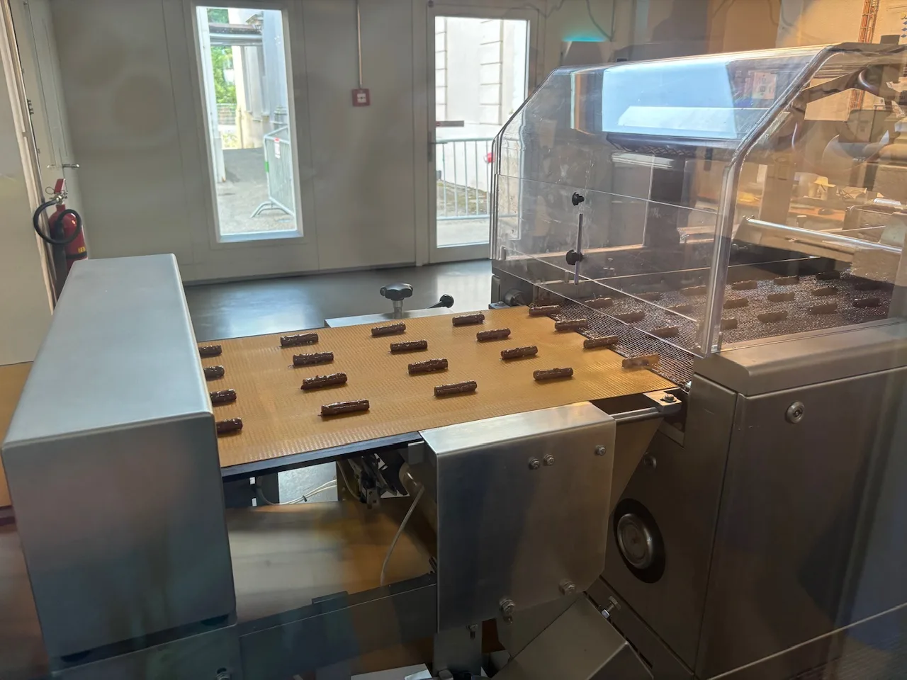
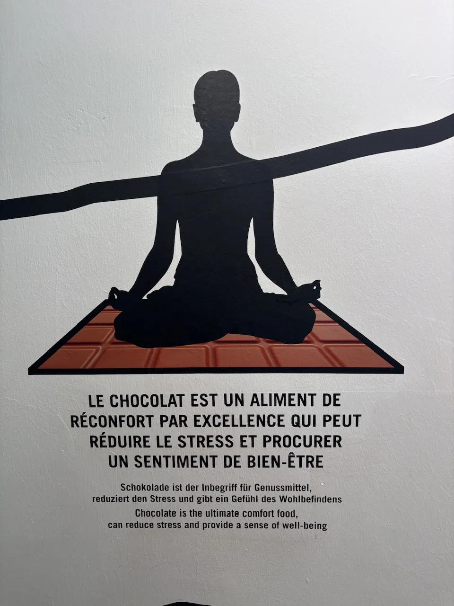
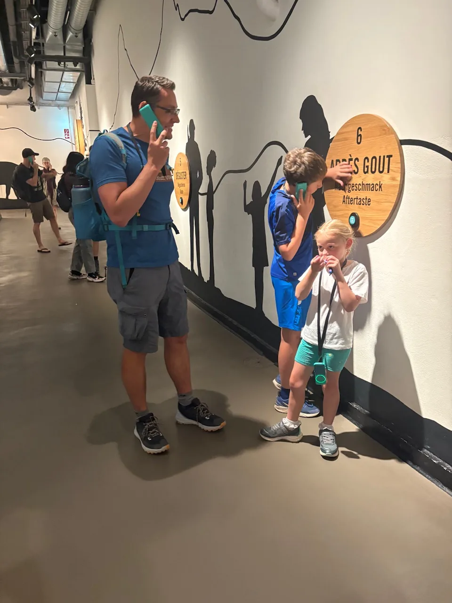
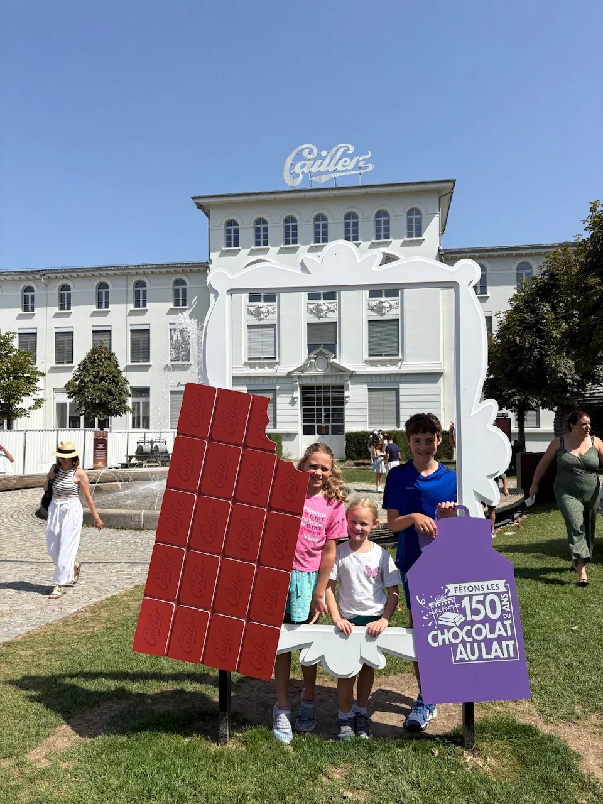
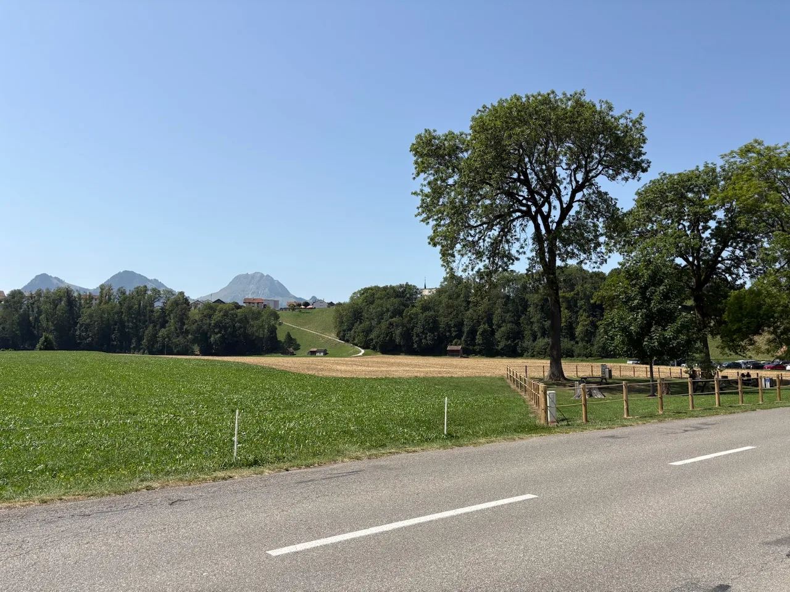

## Travel Log

Last day, and out promptly for the drive to Geneva Airport. En route we stopped at the Callier chocolate factory - world famous Swiss chocolate. The tour was interestingly and with lots of tasting. We may have over-indulged and made ourselves feel a bit sick!

The flight home and the timings through passport control were painless and quick.

All in all we were back home in Devon by 9pm. What a great holiday!

