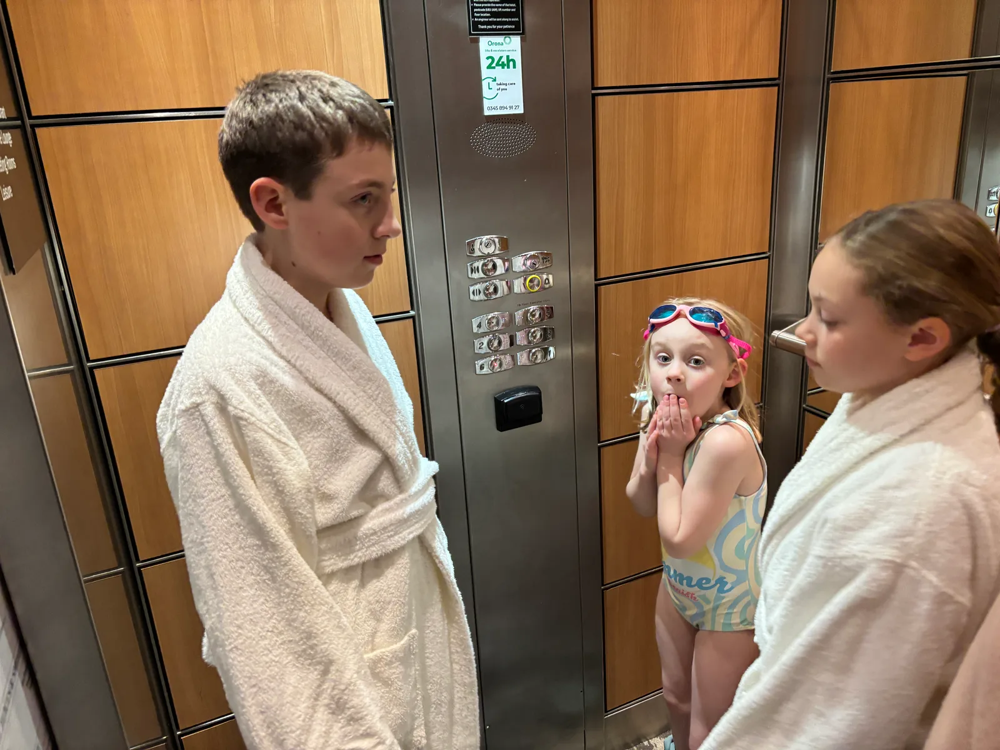
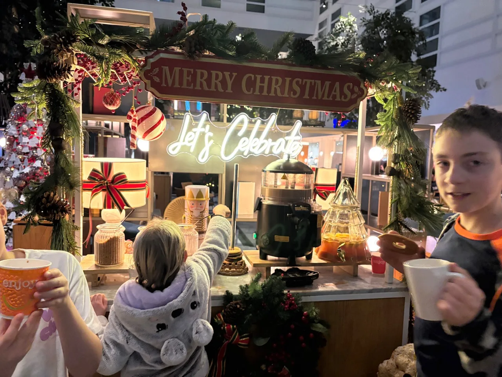

## Travel Log

We hit the road at around 2pm in the afternoon, heading to London for a night in a hotel near Heathrow airport. We said goodbye to our clean (for once) house and our cats who we’ll miss  while we’re away. The journey was uneventful with Google Maps taking us the M5, M4 way due to congestion on the A303.

After a couple of pit stops on the way and rain for almost all of the journey we arrived at just before 6pm. This gave us time to use the pool and try the upgraded Executive Lounge for dinner.

The pool was a bit chilly and the hot tub was out of order and unfortunately after just a few minutes Bess managed to kick Jasper in the face and his nose erupted in blood.  After trailing splatters of blood across the tiles to the shower area eventually the bleeding stopped. After some ice from the helpful staff member Jasper and Alex went back to the room and Nick and the girls did a few laps. Not exactly the best start!

The Executive Lounge turned out to be a good deal though - nice assortment of food and even beer and wine (and Pepsi!) on tap.

We tried to turn in for an early night as we’ll be up at 5:30am for breakfast and to get to the airport.

