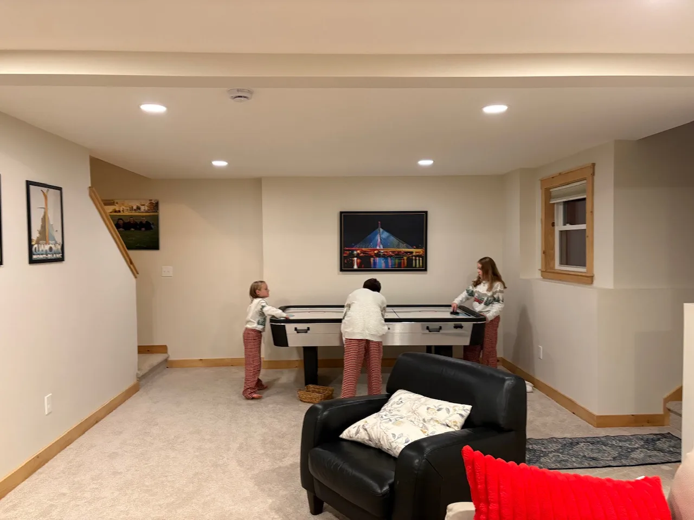
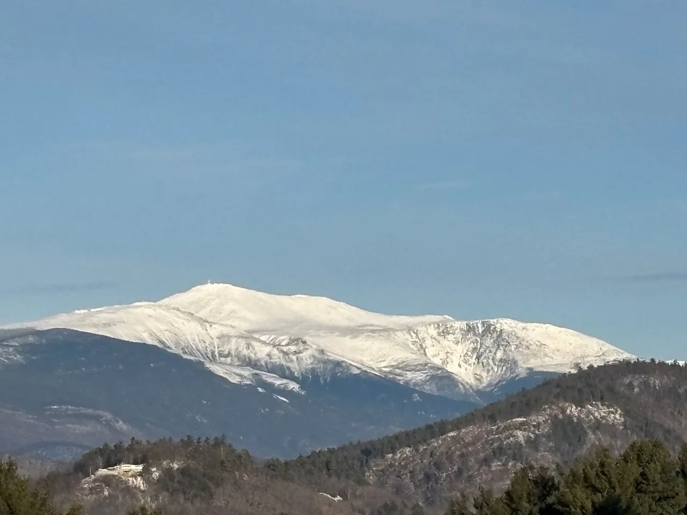
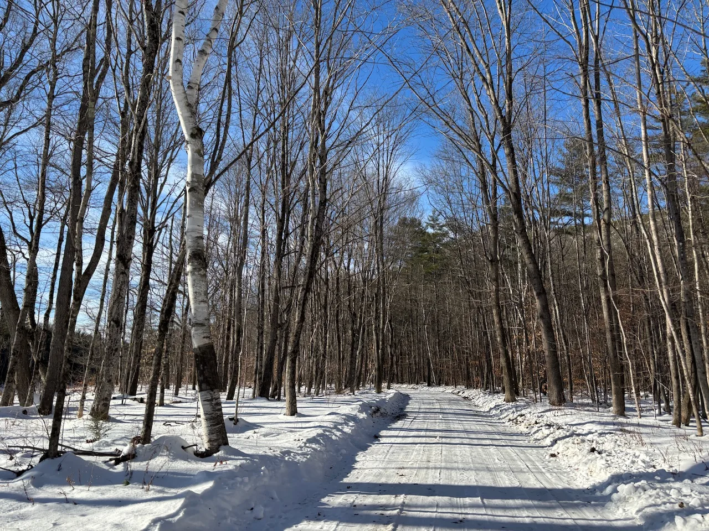
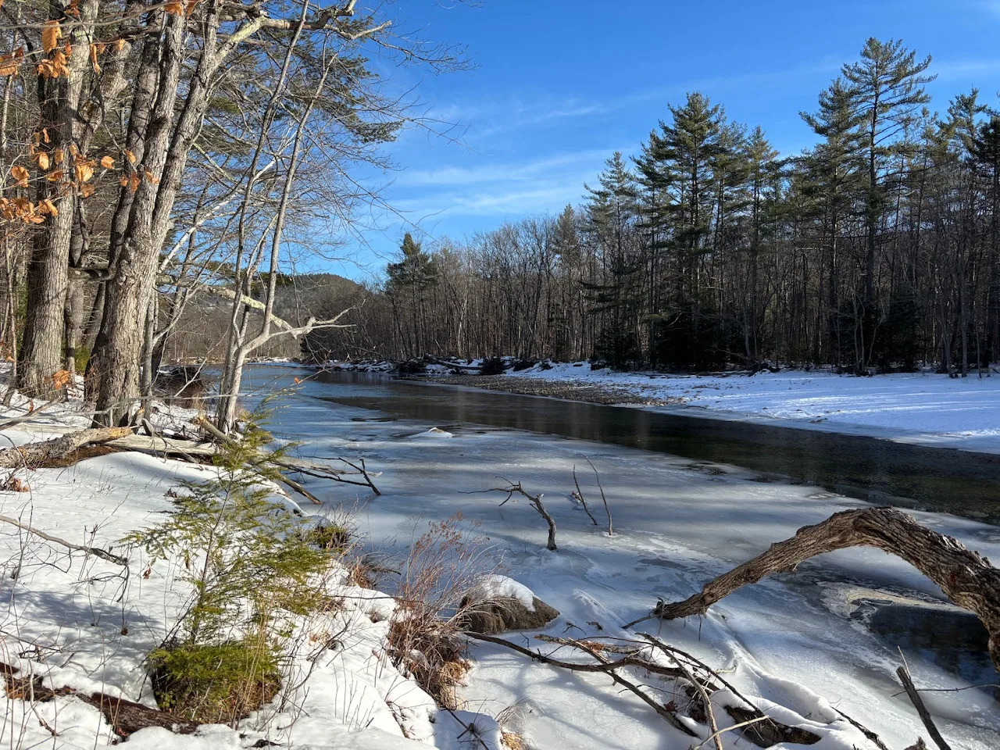
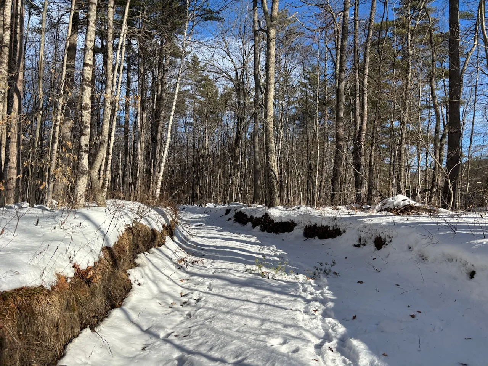
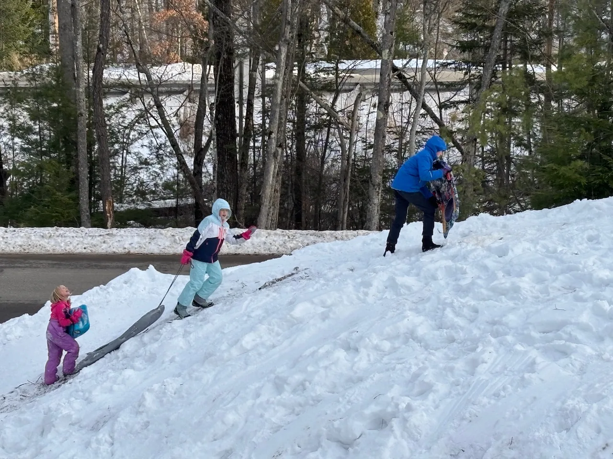

## Travel Log

We went to Walmart to do our Christmas secret Santa. This was surprisingly challenging and time-consuming! We each had a $15 budget.

The Christmas Loft was a bit shit - we were saying that a Devon garden centre or a John Lewis is about 10x more Christmassy than the Christmas Loft.

We didn’t really know where to sledge in town so we came home and the kids built a sledging course on the driveway which kept them busy for a few hours.

Nick and Alex went for a sunny winter walk along the river - nice to stretch our legs.

In the evening we watching Furry Vengeance - a funny movie, and played some air hockey.

