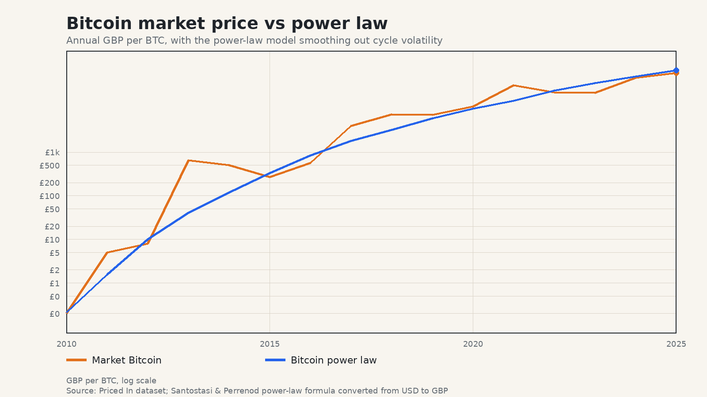
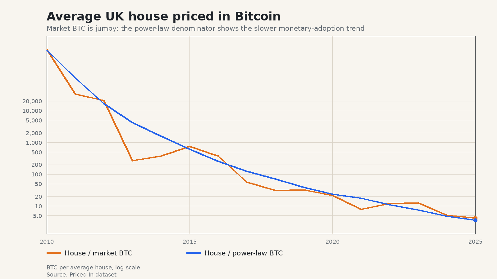
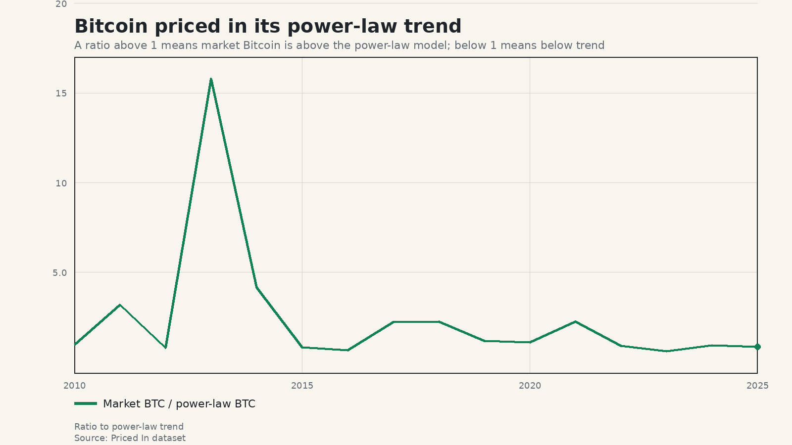

I have added a new Bitcoin power law series to [Priced In](https://www.nickjstevens.com/priced-in/index.html).

Until now, the app could already price things in Bitcoin. That is useful, but also messy. Bitcoin's market price is famously volatile. If you price a house, a pint, or a loaf of bread in Bitcoin, the chart can end up saying as much about the last Bitcoin cycle as it says about the thing you are trying to understand.

That is interesting in its own right, but it is not always what I want from the tool.

What I wanted was a way of asking a slightly different question:

> What if we priced things in Bitcoin, but stripped out most of the short term volatility?

That is where the Bitcoin power law comes in.



## The paper behind the new series

The new series is based on Giovanni Santostasi and Stephen Perrenod's paper, [A Mechanistic Derivation of the Bitcoin Price Power Law: Network Adoption Dynamics and Generalised Metcalfe Scaling](https://zenodo.org/records/19387099).

The paper argues that Bitcoin's price follows a power law in time:

```text
P(t) ~ t^beta
```

More specifically, the direct price fit used in Priced In is:

```text
log10 P(t) = -16.509 + 5.690 log10 t
```

where `P(t)` is the Bitcoin price in USD and `t` is the number of days since the Bitcoin Genesis Block on 3 January 2009. The `R^2` is 0.961, very strong. 

The authors do not just fit a line and stop there. The interesting part of the paper is that they try to explain why this relationship might exist. Their argument links Bitcoin's price history to network adoption dynamics and a generalised Metcalfe-style network value law. In simple terms: as the network grows, its value grows in a highly non-linear way.

Whether you fully buy the thesis or not, the empirical relationship is useful. It gives us a smoother long run Bitcoin price series that can be used as a denominator.

## Why add this to Priced In?

Priced In is about changing the unit of account.

A house priced in pounds tells one story. A house priced in hours worked tells another. A house priced in gold or Bitcoin tells another again.

The problem with using market Bitcoin directly is that the signal can be overwhelmed by volatility. Bitcoin's four-year cycles are part of its history, but they can make it hard to see the slower purchasing power trend.

The power law series gives a different lens. It is still Bitcoin-denominated, but it behaves more like a long run adoption curve than a volatile market ticker.

That helps in two ways.

First, it gives a smoother comparison. If a house becomes cheaper when priced in Bitcoin power law terms, that is less likely to be just because Bitcoin happened to be in a blow-off top that year.

Second, it gives a more coherent early history. Market Bitcoin prices before the major exchange era are sparse and noisy. The power law model gives a continuous estimate from Bitcoin's early years onward. It is not claiming that the model price was the traded price every year. It is saying: this is where the long run power law trend places Bitcoin at that point in time.

That distinction matters.



You can explore that chart in the app here: [average UK house price in Bitcoin power law terms](https://www.nickjstevens.com/priced-in/single.html?item=house&denom=context%3Abitcoin_power_law&range=full&log=1). For comparison, here is the same item [priced in market Bitcoin](https://www.nickjstevens.com/priced-in/single.html?item=house&denom=context%3Abitcoin&range=full&log=1).

## Market Bitcoin vs power law Bitcoin

I have kept the existing Bitcoin series. The new power law series does not replace it. They answer different questions.

Market Bitcoin asks:

> What did Bitcoin actually trade for?

Bitcoin power law asks:

> What does the long run adoption trend imply Bitcoin was worth, ignoring most of the cycle noise?

If you want to see how volatile Bitcoin purchasing power has been, use the market Bitcoin series. If you want to ask whether something has become cheaper or more expensive relative to Bitcoin's long run monetary adoption curve, use the power law series.

This is especially useful for everyday prices. A loaf of bread priced in Bitcoin might swing wildly because Bitcoin had a huge year. A loaf of bread priced in Bitcoin power law terms should show the slower underlying change.

## Bitcoin priced in the power law

I have also made denominator series usable as items. That means you can now price one monetary series in another.

For example, you can look at [market Bitcoin priced in the Bitcoin power law](https://www.nickjstevens.com/priced-in/single.html?item=context%3Abitcoin&denom=context%3Abitcoin_power_law&range=full). A value above 1 means market Bitcoin is above the power law model. A value below 1 means it is below the model.



You can also try:

- [Bitcoin priced in silver](https://www.nickjstevens.com/priced-in/single.html?item=context%3Abitcoin&denom=item%3Asilver&range=full&log=1)
- [Bitcoin priced in gold](https://www.nickjstevens.com/priced-in/single.html?item=context%3Abitcoin&denom=context%3Agold&range=full&log=1)
- [Gold priced in Bitcoin](https://www.nickjstevens.com/priced-in/single.html?item=context%3Agold&denom=context%3Abitcoin&range=full&log=1)
- [Eggs priced in Bitcoin power law terms](https://www.nickjstevens.com/priced-in/single.html?item=eggs&denom=context%3Abitcoin_power_law&range=full&log=1)

That opens up a more general ratio view between monetary assets and real-world prices.

## A note of caution

The Bitcoin power law is a model. Models are useful but not perfect. Priced In is a backwards-looking data tool, and does not try to predict the future, even though this bitcoin model allows for future projection. Priced In provides annual data only, which already filters out some noise, but bitcoin is famously volatile, and the new bitcoin power law series provides another way to tune out some more of the noise, especially since inflation statistics all move for different reasons.

