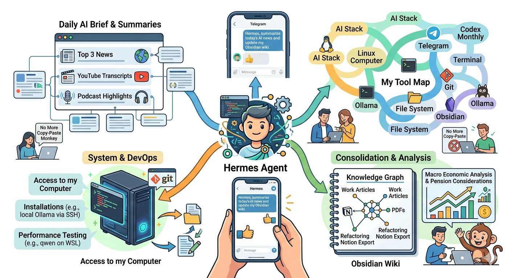

I’ve been trialling AI tools for a while but my recent experimentation with [Hermes Agent](https://github.com/nousresearch/hermes-agent) has been nothing short of game-changing. 

I’ve had a paid ChatGPT Plus and Gemini Pro subscription for a while, and I like Codex when working with a specific repo. But my earlier attempts with an AI personal assistant with OpenClaw failed miserably. 

Hermes Agent solved my previous attempts by getting me up and running with an agentic AI, with memory, continuously improving skills, and access to my computer. 

I installed Hermes on an old Linux computer, connected it to Codex (the monthly subscription is fine - you don’t need API credits) and off it went. You don’t need any set up apart from connecting to Telegram and you just start using Hermes and it’ll use its memory system, improving skills and tool use to really make a difference. 

Here are some specific examples of what I use Hermes for, all of which was set up with natural language via Telegram chat:

- Daily AI brief for the top 3 news stories
- Daily fetching and summarising of YouTube transcripts using a ‘watchlist’ of YouTube channels
- Daily fetching and summarising of podcast episodes from a list of my favourite podcasts
- Weekly downloading of articles and PDFs for work domains I’m interested in, then consolidating in an Obsidian wiki
- Weekly analysis of the current macroeconomic environment and the considerations for my pension investments
- Setting up custom installations, e.g., local Ollama via SSH on a different PC on my home network for local LLMs
- Testing configurations: which is more performant, running qwen on WSL, WSL with Docker, or native Windows?
- Refactoring: convert this Notion export folder over to Obsidian, dealing gracefully with name clashes
- Spontaneous advice: based on what you know about me, what’s one thing I should do to move me towards my goals

Honestly, it’s been fantastic, and the fact that it can write to the file system, work with git, employ terminal use, is just so helpful. 

I no longer need to copy and paste between a ChatGPT session to fix some obscure Proxmox and Docker issue - Hermes can diagnose and fix the issue without me being a go-between copy-paste monkey. 

So if you haven’t tried agentic AI, or want a step up from vanilla Codex, give Hermes Agent a go. 

You might find [my Tool Map](https://www.nickjstevens.com/ai-tool-map/) useful to understand and visualise how the various tools in an AI stack fit together. 

