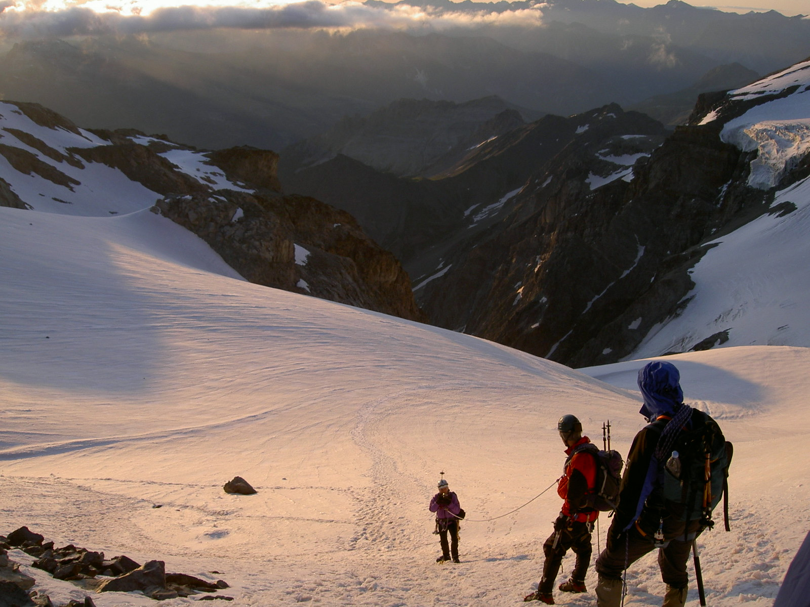

There is no single, universal definition of safety. Its personal. It’s relative. Which is why I want to share a little personal safety story. Perhaps this acts as a catalyst to engage. Or perhaps it’s just some self catharsis in writing this down. Either way, mental health and wellbeing is the lens through which I look at safety. 

## My safety story 

If you know me well, it’s clear that mental health and wellbeing is my personal lens through which I look at a safety. I’ll happily talk about cold showers, meditation, Wim Hof breathing for hours. 

If I trace back the roots of why mental health is important to me the definitive moment was probably having kids. There was something about becoming a parent, that made me realise that every father, mother, son, daughter, should go home safe every day. When you bring into the world a new consciousness, it brings challenges and ultimately big realisations, for me at least. Having kids made me realise there are bigger things than my own self interests. And, frankly, having kids made it essential I find a way to balance work stress and home stress, otherwise I'd have buckled under the strain!

When I was younger, pre kids, I had what I would call a near-death experience mountaineering in the alps. Hardly “touching the void”, but nonetheless, part of my safety story. I was climbing a glacier, roped together with someone in front and someone behind and we skirted a huge buttress on our left. It was dawn. It was beautiful. A rock, the size of a cannonball, buzzed in front of my face, at eye level, about 6 inches out, travelling at a hell of a speed. If it had hit me, it would have taken my head off. I was lucky. There was no warning; I didn't hear it first. This was an inflection point in my life and rocked my deeply (so deeply that I shaved my head and gave up alpine mountaineering overnight). My realisation is that objective danger - those random acts of god - that's a poor game of dice to play. Safety is about managing risks. Random hazards with fatal consequences are very hard to manage. The games we play, and the work we do, should be risks on our terms. Where we are in control. We should know, evaluate, assess and understand the risks on the things we design. And more than the cost-benefit analysis of risks, it's the deeper moral reasoning of “what is right” that should direct us. 

You hear stories of near death experiences that cause people to change their lives (quitting work and buying that camper van...!), cancer survivors, car crash survivors, and these stories certainly are inspirational, but something that has stuck with me is the principle that it you don’t need a near-death experience to make a positive change for yourself, you just need to put yourself first. And I’m talking small changes, not selling up and driving off into the sunset, but small changes to how you think, sleep, eat, exercise, whatever.

It’s a process and it’s a sliding spectrum. Every day will be different - deposits in some accounts and withdrawal in others to use a bank account metaphor. There is no reaching the goal of a balanced work and life. It’s a dynamic equilibrium at best, like balancing a broom on your finger. Some days you’ll drop the broom, and that’s ok. It’s ok to not be ok. 

More generally, it's a universal truth that we will all die. I like read up on Stoicism as a tool in the toolbox of mental health, and the ancient Stoics had a saying “Memento Mori” - meaning remember death. I like to recall this since it gives everything, every decision, every action, an absolute perspective. If I'm stressing about something that, relatively speaking, is inconsequential, this can pull me back, ground me, and splash water on my face enough so that I can put myself first when needed. For me it’s not morbid, but a statement that helps me make the best of things and to make the most of my time. If you help yourself you can help others. I like the analogy of flight safety of putting on your own oxygen mask first - it's the same here - to help others you first need to help yourself.

## Summary

So in summary, my safety story is one on the mental and wellbeing side of safety. Small changes do compound, so start now. In terms of tools - Stoicism has helped me, meditation has helped me, and yes even the craziness of Wim Hof breathing and cold exposure has helped me. Letting go of others expectations of me has helped me. Just being me and being vulnerable (like this share!) has helped me. My hope is that having helped myself and found some stability, that I can help others. I want to look out for colleagues. Support them. Help them. Listen to them. Stand up for them. 

## Related articles

[Personal Resilience](https://www.nickjstevens.com/blog/personal-resilience/) 

[Meditation safety moment](https://www.nickjstevens.com/blog/meditation-safety-moment/)
