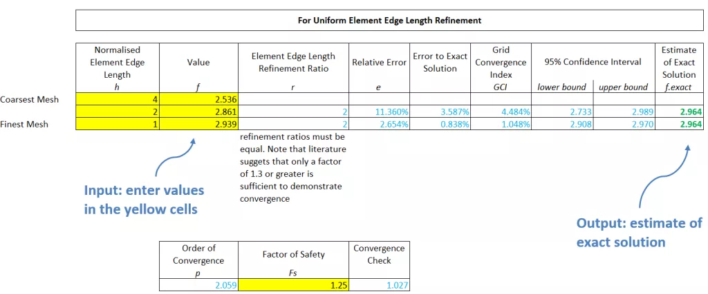

## Update December 2017 – Web App Version!

New [Mesh Convergence Web App](https://www.nickjstevens.com/fea/richardson-extrapolation/) is now available to check mesh convergence. Even easier to use than the Excel spreadsheet below so check it out now.

## Update December 2016 – Correction to Spreadsheet

After some feedback and stress-testing of the spreadsheet by Len Schwer, a couple of corrections have been made. These are:

- Condition formatting to highlight when the values entered are not in the asymptotic region (i.e. not converging).
- Use of absolute values for the order of convergence, p, to make the predicted values more robust, although at the expense of giving a sensible value even if the result is not converging (hence the importance of the point above).

For information, the formula for the order of convergence is now:

$p=\frac{|\ln{|({f_3-f_2})/({f_2-f_1})|}|}{\ln{r}}$

This is comparable to the absolute functions used in the non-uniform refinement method.

The updated spreadsheet, v2.2, is here:

[Element_Refinement_Convergence_Richardson_Extrapolation_v2.2](/blog-assets/notion-migration/richardson-extrapolation-and-grid-convergence-index/Element_Refinement_Convergence_Richardson_Extrapolation_v2.2.xlsx)

## Update August 2016 – Added Non-Uniform Mesh Refinement

I’ve now updated the spreadsheet to be able to use non-uniform mesh refinement. To be clear, by non-uniform, I mean that the ratio of edge spacing or mesh size between subsequent meshes does not have to be the same. This method is not mine – see the excellent paper linked below, I’ve just put it together in Excel for ease of access for anyone. The implementation in Excel is a bit clunky, requiring the Goal Seek tool to iterate to the solution. But it works, and the spreadsheet is here:

- *Replaced by updated version above*

## Mesh Convergence Using Richardson Extrapolation and Grid Convergence Index

After reading the excellent post written by [Angus Ramsay](https://www.ramsay-maunder.co.uk/software/) explaining Recursive Richardson Extrapolation (RRE), and the associated programme, it prompted me to do my own reading and I created a simple Excel spreadsheet to help me understand the RRE approach. RRE essentially extrapolates the results from a discretised mesh solution to estimate the **exact solution**.

In addition, I also included in my Excel spreadsheet the 95% confidence bands predicted by the Grid Convergence Index (GCI).

I found these two references invaluable in explaining the Grid Convergence Index and I encourage you to check them out:

- [https://www.dynamore.de/de/download/papers/forum08/dokumente/I-I-03.pdf](https://www.dynamore.de/de/download/papers/forum08/dokumente/I-I-03.pdf)
- [http://www.grc.nasa.gov/WWW/wind/valid/tutorial/spatconv.html](http://www.grc.nasa.gov/WWW/wind/valid/tutorial/spatconv.html)

## Excel Spreadsheet for Richardson Extrapolation

The simple spreadsheet can be found here:

- *Replaced by updated version above*

A screenshot of the spreadsheet is below. Enter your results in the yellow cells. It is important that uniform mesh refinement is used (i.e. the edge length ratio between meshes is constant).

Mesh convergence is one of the most important aspects of numerical analysis, so it is worth having tools like this to help explore your analysis. I hope you find it useful.
