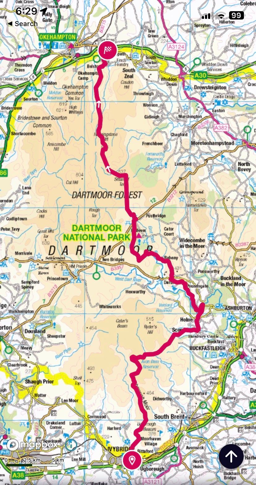
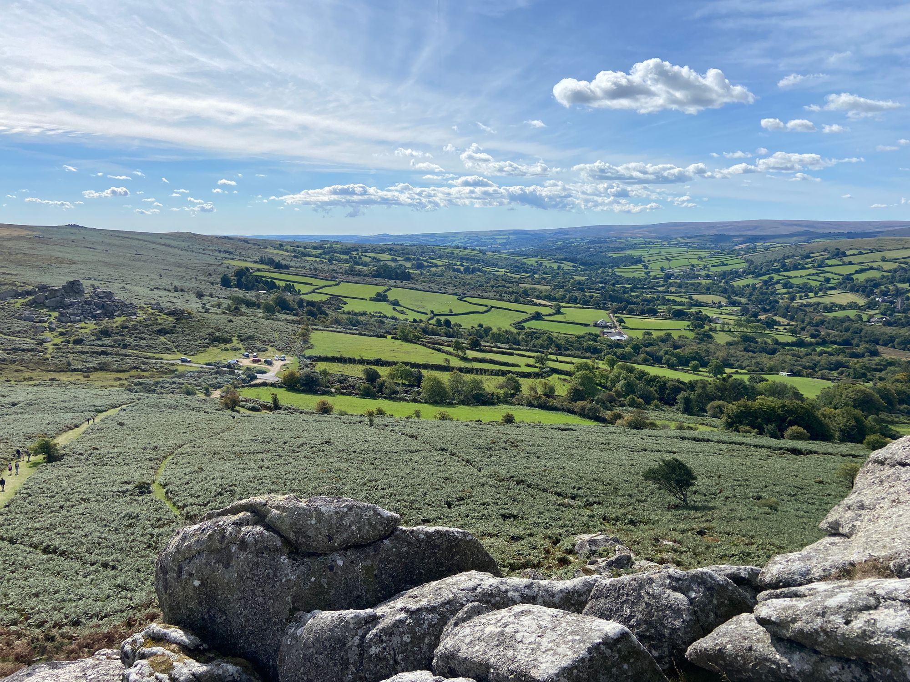
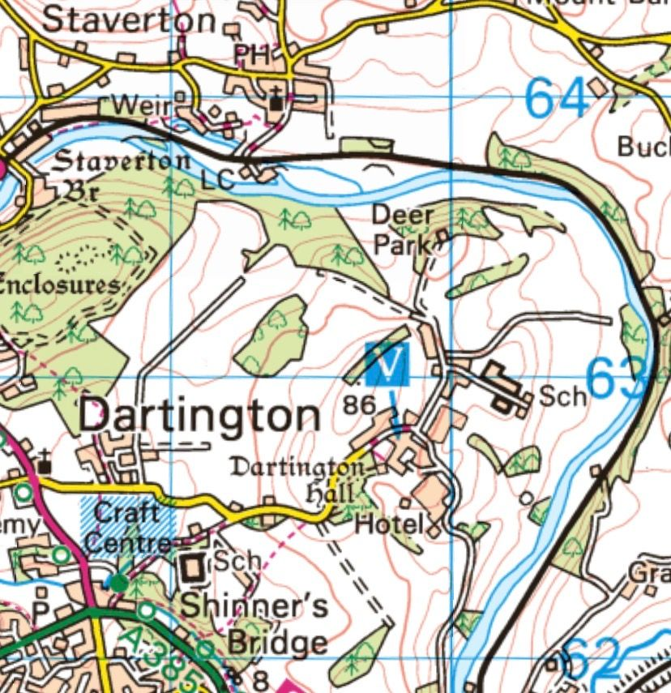
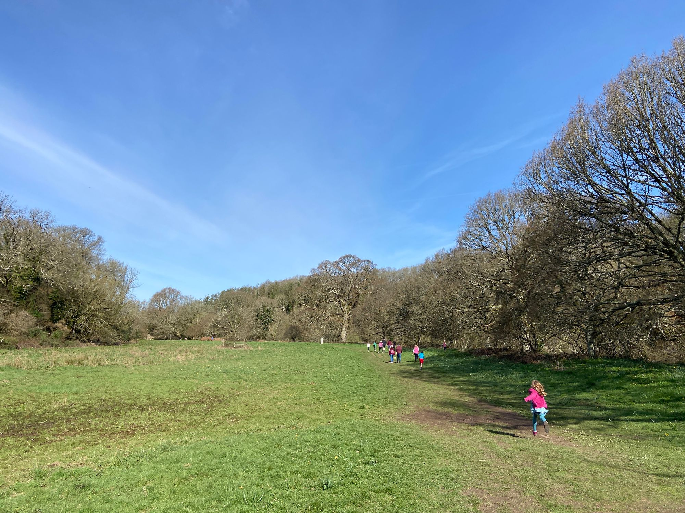
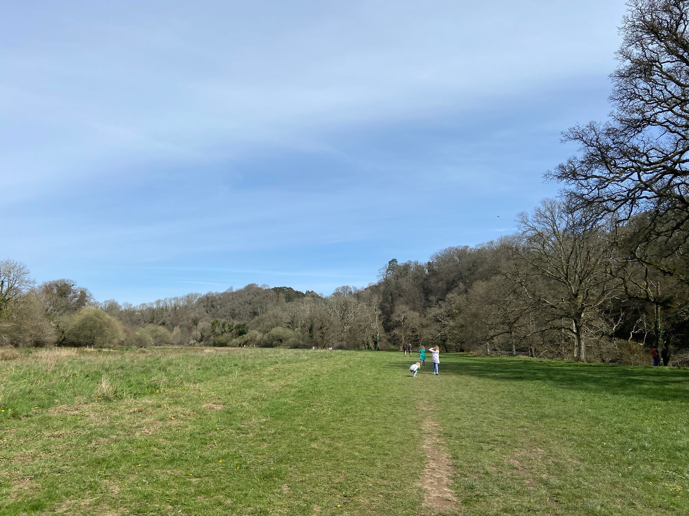

<blockquote>To me, running is a grand adventure, an intrepid outward exploration of the landscape and a revealing inward journey of the self. — Dean Karnazes</blockquote><blockquote>We cannot direct the wind, but we can adjust the sails. — Bertha Calloway</blockquote>
I’m struck by a feeling of wanderlust again. A need to challenge myself, physically and mentally. Here are two challenges I’ve put to myself and my reasoning behind them.
<h1 id="%F0%9F%8E%92-crossing-dartmoor-in-a-day">🎒 Crossing Dartmoor in a Day</h1>
My latest fixation is on crossing Dartmoor on foot, south to north, in one day. I want this to be a solo expedition and it will certainly be a physical and mental challenge. Those who know Dartmoor need no context, but for those who don’t, Dartmoor is a land of bogs, rough moor, and rocky tors. A place that doesn’t just experience the weather but <em>is</em> the weather.

I intend to do it as a self-supported run, where I hope to cover the distance, some 60km, in 9 or 10 hours. The route is outlined below.

I will start at either Ivybridge train station or a stop on a bus route nearby. I’ll then head up onto the moor joining the Two Moors Way. I’ll follow this trail to Holne, where I’ll pick up some more supplies from the Holne shop and café. It’s 21km for this first leg.

I’ll continue on the Two Moors Way to Bel Tor where I’ll leave this trail and pick up paths over Sharp Tor, Yar Tor and Bellever Tor, before dropping back down through the woods and into Postbridge. Postbridge also has a little shop so I’ll take on more supplies here before the final leg. Holne to Postbridge is a further 17km.

From Postbridge I follow the East Dart River until going over Sittaford Tor and Hangingstone Hill. The final tor is Belstone before dropping back down to civilisation. I’ll either finish at Whitehouse Services off the A30, or drop down to Okehampton train station, depending on the transport option I take. This last leg is 20km, and the total distance is circa 58km, on paper at least. In terms of elevation, the total is 1700m ascent/descent - not too bad considering the distance.

Because I can resupply in both Holne and Postbridge I can hopefully travel relatively light, carrying just water and a few emergency items like phone, spare clothing, and the like.

Dartmoor is on my doorstep and is a beautiful National Park. I’ve written a bit more on how much I value Dartmoor and its wild spaces in <a href="/blog/saturday-blueprint-on-dartmoor/">Saturday Blueprint 20 on Dartmoor</a>. This is an adventure I’m very much looking forward to.
<h1 id="%F0%9F%90%BA-lone-wolf-2023">🐺 Lone Wolf 2023</h1>
The <a href="https://dynamicadventurescic.co.uk/">Lone Wolf</a> is an ultra-running event organised by Dynamic Adventures CIC based out of Dartington, Devon. The event concept is to run a 7km loop every hour on the hour. You keep going until you can’t complete a 7km loop in the allotted hour or you’re not back on the start line on the hour ready for the next lap. The event time limit is 24 hours, but for me, that’s way outside my capability since that would mean covering a total distance of 100 miles!

Dartington is a lovely estate bounded on two sides by the River Dart, running wide and peaceful here. The route then will be mostly trail, with fields along the river, through the woods, and across a deer park.

As a family, my wife and I recently took the kids on an Easter egg treasure hunt fun run which was organised by Dynamic Adventures and I got chatting to one of the team. He told that, perhaps surprisingly, this 7km an hour format often means that people run the furthest they’ve ever run. The built-in rest that stops you from overdoing it too early - the limit of only 7km an hour - no more and no less - is a great way to pace yourself to a new ultra distance.

I’ll have to see if this is true for me. The furthest I’ve ever run is 70km. Maybe I’ll get in 11 or 12 laps? Who knows. 12 laps would be a shade over 50 miles which would be an outstanding achievement.

Whatever the outcome, it’s an adventure and the process of training and running the event will be something to soak up, to embrace. In the fire of tribulation perhaps I will have the opportunity to reforge some inner part of my character.

Here are some photos from the Easter egg fun run to give a sense of Dartington estate. I doubt the weather will be so favourable at the end of October however!

It’s a pleasure writing to you. Have a great week. 😊

Nick
<h3 id="about-the-saturday-blueprint">About the Saturday Blueprint</h3>
The <a href="/blog/tag/newsletter/">Saturday Blueprint</a> is a weekly newsletter every Saturday on health, vitality and philosophy by <a href="/blog/">Nick Stevens</a>.

Join the <a href="https://www.facebook.com/devonblueprint/">Facebook page</a> to interact with the community.
