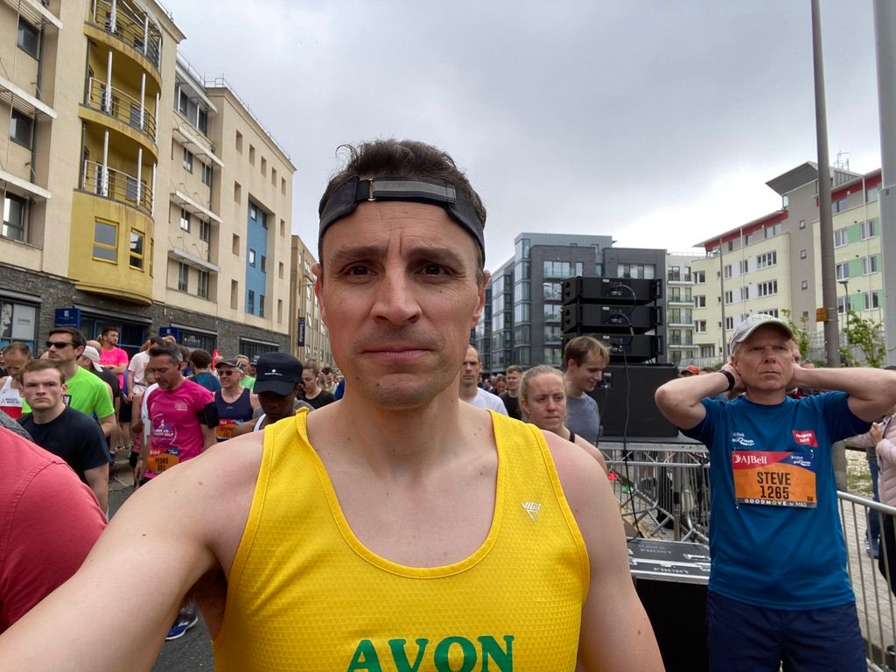

<blockquote>May what I do flow from me like a river, no forcing and no holding back, the way it is with children. — Rainer Maria Rilke</blockquote>
I recently raced the Bristol Half Marathon and this was a good example of when I intentionally entered a flow state, also called ‘getting in the zone’.
<h1 id="%F0%9F%90%B3-what-is-flow">🐳 What is flow?</h1>
Getting in the zone, or finding your flow, are ways of talking about the mental state called the flow state. A state of mind where you are present, engaged, relaxed yet energised, focused, and performing well. It’s associated with improved performance, mainly due to the state being characterised by low stress hormones and high beneficial hormones.

One definition of flow is “a state of full engagement in a task that is accompanied with low-levels of self-referential thinking”.

The ‘low self-referential thinking’ is particularly important - this is the ‘losing yourself’ mental state where you’re almost not connected to yourself, you’re instead wholly engrossed in the task itself. The usual mind-wandering and self-talk that we all have as daily chatter disappears, to be replaced by laser focus on the task at hand.

Perhaps non-intuitively, in flow parts of the brain are shutting down, as opposed to becoming more active. And I mean literally shutting down - parts of the prefrontal cortex actually turn off - and this explains why the passage of time passes differently when in a flow state, because the areas of the prefrontal cortex responsible for temporal reasoning are off. There is a beautiful term for this: “the deep now”, describing the lack of ability to separate past from future, and instead to be wholly in the moment, present in the ‘now’.

There are other things the prefrontal cortex does that slow or stop when in a flow state, including many higher-order cognitive abilities like decision-making, planning, personality expression, social behaviour and vocabulary control.

Without the part of the brain that processes these aspects of higher-order cognition we essentially disable our inner critic - that voice in our head that is always talking, always nagging, always saying now it’s time to stop.

A flow state is a liberation from the over-thinking parts of us. We quite literally get out of our own way. The result is a huge increase in performance and creativity. This has been quantified in studies showing a 500% improvement in productivity and a 230% improvement in learning. That’s huge. And that’s why top performers, from artists to athletes, want to get in and stay in a flow state.

The chemistry set of the brain when in a flow state produces more norepinephrine, dopamine, anandamide, serotonin and endorphins. All five of these are performance-enhancing neurochemicals that make you faster, stronger and quicker.

Let’s follow the theme and explore a recent experience of mine at the Bristol Half Marathon, and close with some tips on how to find your flow.
<h1 id="%F0%9F%8E%BD-half-marathon-flow">🎽 Half marathon flow</h1>
On 14th May 2023 I raced the Bristol Half Marathon. This was a focus for me with training beforehand, but I was also training my mind too. I put a good amount of effort into visualisation - that is imaging the race, the sensations, the effort, the pain, the speed.

On the day itself I got down to the start line and aimed to relax. To let go of nerves and pent-up energy, and just be still. To find my flow state I had a few things to do:
<ol><li><strong>Relax</strong>. I smiled at the supporters and race volunteers. I really soaked up the atmosphere and the crowds and the music. In between smiles I completely relaxed my face and eyes, almost letting them close as a ran.</li><li><strong>Focus</strong>. I tuned in to perceived effort. I ignored my watch and others around me and instead tried to run entirely by feel. I was focusing on the process, not trying to project onto the desired outcome. In the moment only and running by feel I aimed to sense my redline limit, and stay just below it.</li></ol><blockquote>Enjoyment appears at the boundary between boredom and anxiety, when the challenges are just balanced with the person's capacity to act. — Mihaly Csikszentmihalyi</blockquote>
Overall this was successful. I finished in a faster time than I dared hope for (1:29:34), and certainly felt I’d given it my all.
<h1 id="%F0%9F%94%8D-how-to-find-your-flow">🔍 How to find your flow</h1>
The first and most important principle to know is that tension stops you from entering a flow state. So the task at hand is to let go of all stresses and worries.

The second principle is to engage in the process of a task - that is where the doing is not just valued, but everything. It helps if the task is challenging, because that can make it more engaging.

Music is a great way to get in the zone. That flow state where it is simultaneously relaxing and energising. 

Don’t overthink it: it’s not something you can brute force or overly practice.

I’ll end with a useful principle or directive and quote:
<blockquote>Spend more time doing things that make you forget about the time. — Charlotte Eriksson</blockquote>

It’s a pleasure writing to you. Have a great week. 😊

Nick
<h3 id="about-the-saturday-blueprint">About the Saturday Blueprint</h3>
The <a href="/blog/newsletter/">Saturday Blueprint</a> is a weekly newsletter every Saturday on health, vitality and philosophy by <a href="/blog/">Nick Stevens</a>.

Join the <a href="https://www.facebook.com/devonblueprint/">Facebook page</a> to interact with the community.
