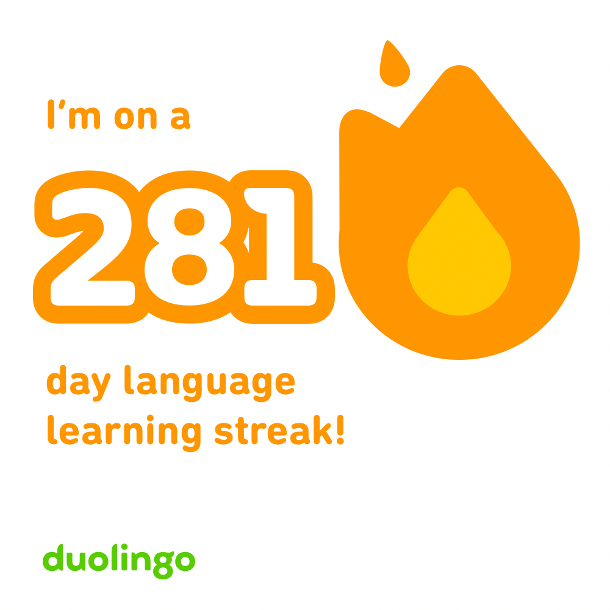
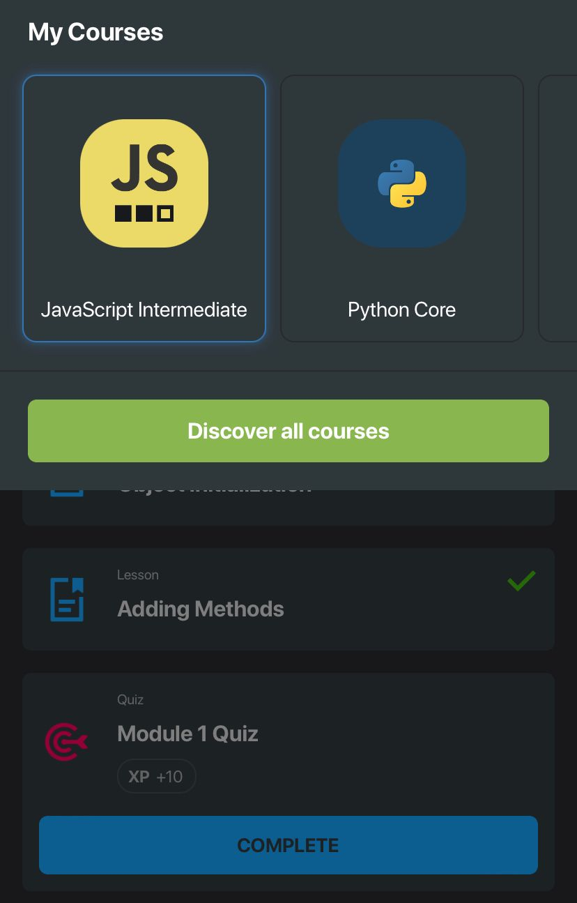
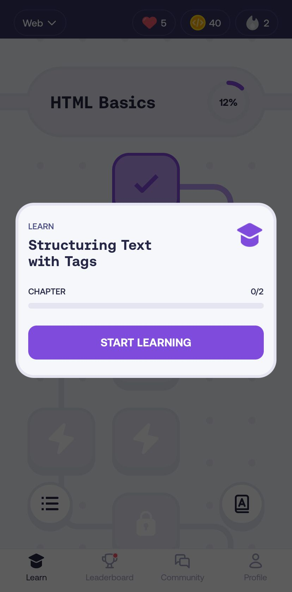
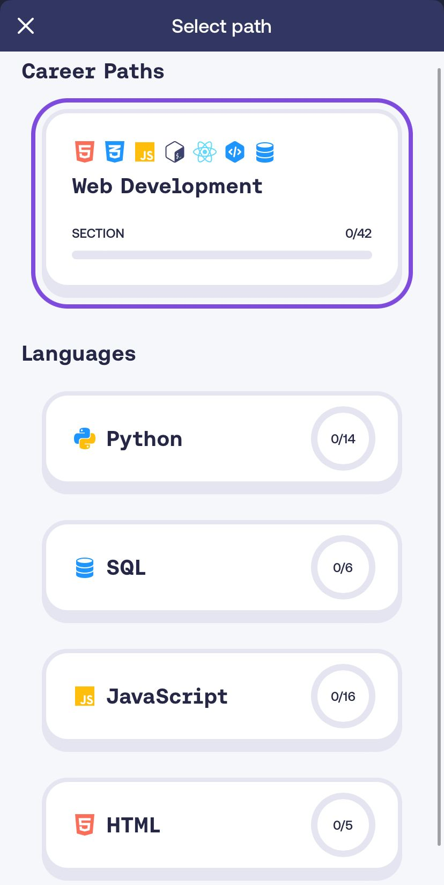

<blockquote>Knowledge without practice is useless, and practice without knowledge is dangerous. — Confucius, Chinese philosopher</blockquote><h1 id="%F0%9F%93%96-learning">📖 Learning</h1>
I’ve always loved to learn and research. Research a holiday or a piece of equipment to buy or even which Linux operating system to play with 🤓. The <em>process</em> of learning and researching is a huge part of the enjoyment for me. I often stop short of actually buying the thing, once I’ve finished researching it.

I can’t really pinpoint when I found my love of learning. It wasn’t childhood I don’t think… Perhaps not until I graduated from University. It’s something I’ve been musing on as I think of how I can pass on this trait to my own children.

A love of learning would seem to be a virtuous character trait that is useful in many situations. Learning leads to growth and improvement. You also need to be humble enough to ask for help and realistic in appraising your weaknesses. The ability to ‘look silly’ is hugely important - it is a risk and yes it may embarrass but there are much bigger upsides. Nassim Nicholas Taleb, author of <em><strong>Antifragile</strong></em>, would categorise this as an asymmetric bet because the upside is pretty much unbounded but the downside is looking silly for a short time.
<blockquote>The beautiful thing about learning is that no one can take it away from you. — B.B. King</blockquote>
In recent <a href="/blog/saturday-blueprint-on-flow/">Saturday Blueprint 36 on Flow</a> we saw that being relaxed and in a flow state can increase learning rates by 230%. Learning also feels intuitively <em>good</em> for you.

An example is the famous language teacher Michel Thomas who became something of a prodigy in teaching languages with his method developed in the 90s. 

Michel Thomas taught himself to speak 11 languages - how did he do this? His lessons were based on an environment of informality and relaxation. When he was given a group of students who were doing poorly in their French class, for example, he started with the furniture. Out went the school-type desks and in came the armchairs and coffee tables. 

He didn’t want his students to read or write, either. They didn’t take notes and didn’t even try to remember what they had learned in class. He told them he just wanted them to relax. Can you imagine how this would go down in a school or university now? The outrage!

But, his method was anything but ineffective - his results spoke for themselves. The students were putting together sentences in French. By removing the anxiety and expectation around learning, the natural byproduct was to unblock the mental resistance and allow learning to flourish.

You assimilate new knowledge much faster by applying or teaching what you’ve learnt than by just being lectured to. So think about either practically applying something you are learning, or in some way teaching someone else.

And if you want to learn <em>faster</em> then find a way to have a stake in the outcome. For example; if you want to learn to cook, invite friends over for dinner; if you want to learn to perform, then sign up for an open mic night. You get the idea - commit to something where you have skin in the game. Necessity and not looking stupid are good motivators learn it would seem!
<h2 id="curiosity">Curiosity</h2>
“Follow your curiosity” is actually pretty sound advice - it tends to lead you towards work that is more flow-like. We talked about flow in <a href="/blog/saturday-blueprint-on-flow/">Saturday Blueprint 36 on Flow</a>. Topics that fill you with a sense of curiosity and with an absence of stress are golden tickets to getting into a flow state and truly creating and crafting something of value and beauty.

Curiosity is the difference that can turn a task into something prouder, into a <em>craft</em>.
<blockquote>Some things are a job, others are a craft. The primary difference is not the task, but the enthusiasm and curiosity put into the task. The more engaged and interested you are, the more it becomes a craft. — James Clear</blockquote>
Curiosity is also a deeply intrinsic motivator. It’ll still be burning strong long after external motivators like a pay rise or job recognition have fizzled out. This means much more consistency and longevity and we know the power of compounding.

James Clear expresses this extremely well with the quote that "Knowledge is the compound interest of curiosity".

When you can naturally and unforcefully stick with something for years or decades, now that’s a superpower. There isn’t a shortcut, but in terms of what to do now, it’s simple: <strong>find something that you’re genuinely curious about and excited to learn, and <a href="/blog/saturday-blueprint-on-starting-now/">just start</a></strong>.

This can be anything, and you’ll see below three things I’m currently learning, but choose whatever resonates with you at some deep level, and even better <strong>learn about things worth learning</strong>, something that is of practical or meaningful value.
<h2 id="tools">Tools</h2>
Here are my top tools for research or learning.

For nutrition or scientific research I use the following:
<ul><li>Elicit : used for asking queries of papers in natural language, powdered by AI</li><li>Semantic Scholar : another AI powered research tool</li><li>Google Scholar : a Google-powered search of all papers</li><li>Consensus : ask questions in natural language and the AI will give answers backed by evidence from journals and papers</li><li>SciHub : a free way to access scientific papers</li></ul>
For general use there is:
<ul><li>Reddit : great for peer up-voted opinions on any topic. I tend to just add ‘Reddit’ on the end of any Google search, especially if I’m looking for reviews of something.</li><li>ChatGPT : great for when I have a mental block and just need some other inputs to get my creative juices flowing.</li></ul>
For micro learning I love apps that allow me to learn for a few minutes a day, but to do that consistently. Some great apps are:
<ul><li>Duolingo : for learning languages. I’m close to a 300-day streak in learning French.</li><li>Sololearn : for learning coding and programming.</li></ul><h2></h2><h1 id="%F0%9F%8E%B9-piano-%F0%9F%92%BBprogramming-and-%F0%9F%92%ACparlance">🎹 Piano, 💻Programming and 💬Parlance</h1>
What, specifically, am I learning now? I go through phases, but right now there are three things I’m spending most of my learning time on. We got an upright piano last year and it’s been fantastic to dabble in that, and what with awe at how quickly the kids can pick it up. I’ve not really found a piano app I love, so any suggestions please let me know!

I’m also doubling down on programming. I’ve got a neat app idea that I want to execute and am following a few online courses to give me the skillset. I love The Odin Project and am also enrolled in the free EdX Harvard CS50 course. For quick doses of micro-learning I like Sololearn and Mimo.

(Did you know❓: I have made a <a href="https://www.nickjstevens.com/fea/richardson-extrapolation/">basic web app for calculating mesh convergence in finite element analyses</a> 🤓)

The last of the three is learning French. I’m off to the Alps for the family summer holiday (skin in the game and a practical application of French!) and have found that the Duolingo app is utterly fantastic. I’ve dabbled with HelloTalk too but I’m not really fluent enough to hold a conversation. Duolingo though is great and it’s free (though with a paid offering).

All three of these are interesting for me, certainly challenging, and offer a complete contrast to my day job.

What are you learning now?

If you’ve found this article useful you might also like to go right back to my very first newsletter with <a href="/blog/saturday-blueprint-on-starting-now/">Saturday Blueprint 1 on Unlearning</a>.

It’s a pleasure writing to you. Have a great week. 😊

Nick
<h3 id="about-the-saturday-blueprint">About the Saturday Blueprint</h3>
The <a href="/blog/tag/newsletter/">Saturday Blueprint</a> is a weekly newsletter every Saturday on health, vitality and philosophy by <a href="/blog/">Nick Stevens</a>.

Join the <a href="https://www.facebook.com/devonblueprint/">Facebook page</a> to interact with the community.
