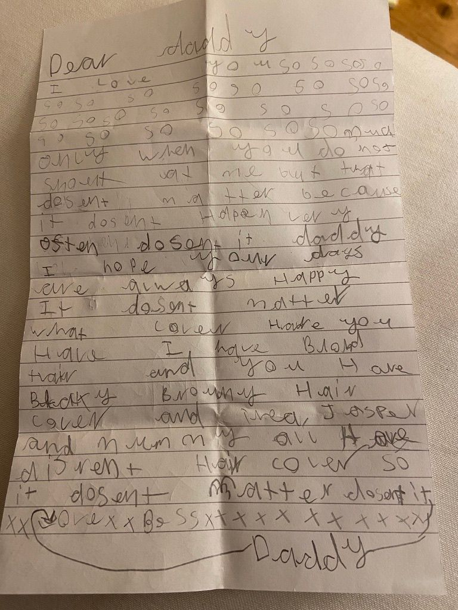
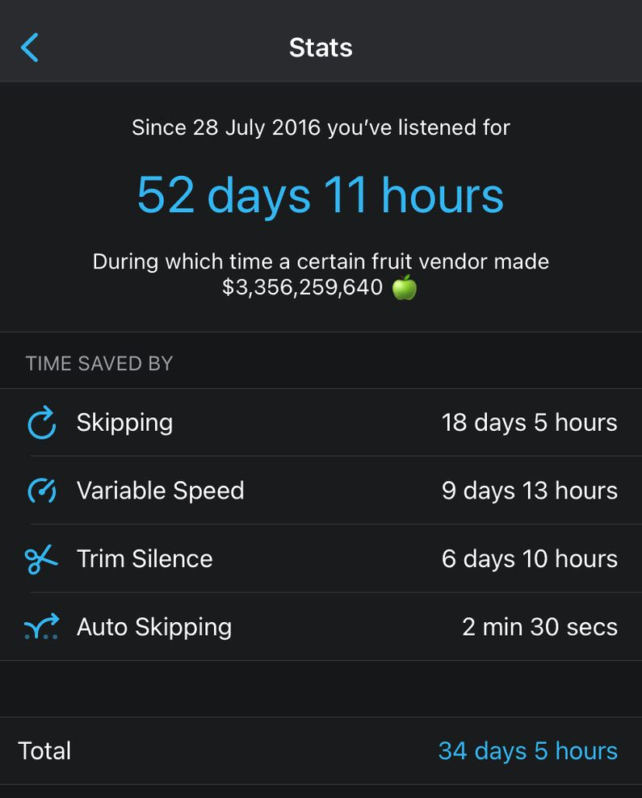

Hi 👋. Here is this week's <a href="/blog/tag/newsletter/">Saturday Blueprint</a>.
<h1 id="%F0%9F%A4%94-quote-i%E2%80%99m-thinking-about">🤔 Quote I’m thinking about</h1><blockquote>Most successful people are just an anxiety disorder harnessed for productivity – Andrew Wilkinson</blockquote>
This resonates with me - I identify as someone who is driven, with all the anxiety and overthinking baggage that I personally have along with it. I should chill out more, stress less, and not care for “success”.
<h1 id="%E2%98%80%EF%B8%8F-summer">☀️ Summer</h1>
<em>Summer is well and truly here and I have to say I’ve not been reading or writing as much. I’ve been enjoying the extra time with my kids, I’ve been doing some decorating around the house, and generally just living life. There’s a natural cadence to life driven by the seasons, and it’s true for me the the darker, cooler months are best for a long book, a hot drink and a pen.</em>

Camping might come to mind during these lovely summer months. Lazy days, warm evenings and nights out under the stars. Well back in <a href="/blog/saturday-blueprint-on-coffee-and-steak/">Saturday Blueprint 6 on Coffee and Steak</a> I talked about how I use an ancestral approach to think about food. I’m sorry to say though that this approach did not extend to camping. I’d have thought that an ancestral approach would be sleeping on a hard floor, in the dark, in nature. But I just cannot get any semblance of a good night’s sleep when camping.

I once tried sleeping on a roll mat on my bedroom floor for a week as an experiment. I didn’t get used to the hard floor. My resting heart rate variability plummeted (bad - a sign of stress). And I felt physically and mentally dreadful.

So I think I’m just not cut out for sleeping on a hard surface. Do I give up camping altogether or do I get a proper Thermarest to upgrade my foam mat? Or maybe I need to be radical and go down the hammock approach…!?

I don’t know the answer, but I do know I like the <em>idea</em> of camping. I also like the rest of it - the evenings watching the sun set, the cooking over a small stove, the cosy sleeping bag. So I can’t just ditch it. Plus the kids have such a blast I might just need to keep sucking it up just to watch them have fun.
<h1 id="%F0%9F%91%A8%E2%80%8D%F0%9F%91%A7-stoicism-from-a-7-year-old">👨‍👧 Stoicism from a 7 year old</h1>
My daughter and I have a little tradition we’ve been doing for the last few months - I’ve been writing her little post-it notes and putting in a gold purse next to her pillow. She wakes up and reads the notes every morning. If I forget she berates me - it’s something she really looks forward to every day.

Well I got a surprise the other when she wrote <em>me</em> a letter. It’s Stoicism from a 7 year old, and it makes my heart want to burst. Here it is:
<blockquote>Dear daddy I love you so so so so so so so so so so so so so so so so so so so so so so so so so so much only when you do not shout at me but that doesn’t matter because it doesn’t happen very often doesn’t it daddy. I hope your days are always happy. It doesn’t matter what colour hair you have. I have blond hair and you have blacky browny hair hair colour and thea, jasper and mummy all have different hair colour so it doesn’t matter doesn’t it daddy. Love Bess</blockquote>
I will cling to “<strong>I hope your days are always happy</strong>” until it’s the last memory in my brain.
<h1 id="%F0%9F%92%8D-cool-finds">💍 Cool finds</h1>
A quick list of things I've read or found this week that I want to share.
<ul><li>My favourite podcast app is <a href="https://pocketcasts.com/">Pocket Casts</a> - I absolutely love it. I particularly like the Trim Silence feature which automatically cuts out pauses in podcasts - and as you can see below I've saved quite the time with this nifty feature!</li></ul>

It’s a pleasure writing to you. Have a great week. 😊 Nick
<h3 id="about-the-saturday-blueprint">About the Saturday Blueprint</h3>
The <a href="/blog/tag/newsletter/">Saturday Blueprint</a> is a weekly newsletter every Saturday on health, vitality and philosophy by <a href="/blog/">Nick Stevens</a>.

Join the <a href="https://www.facebook.com/devonblueprint/">Facebook page</a> to interact with the community.
