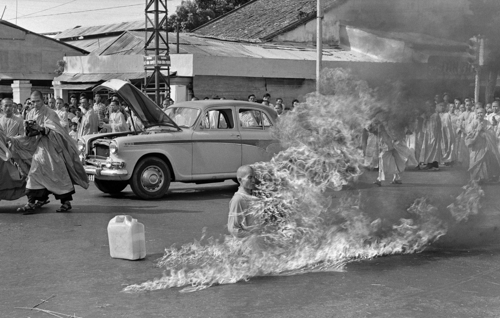
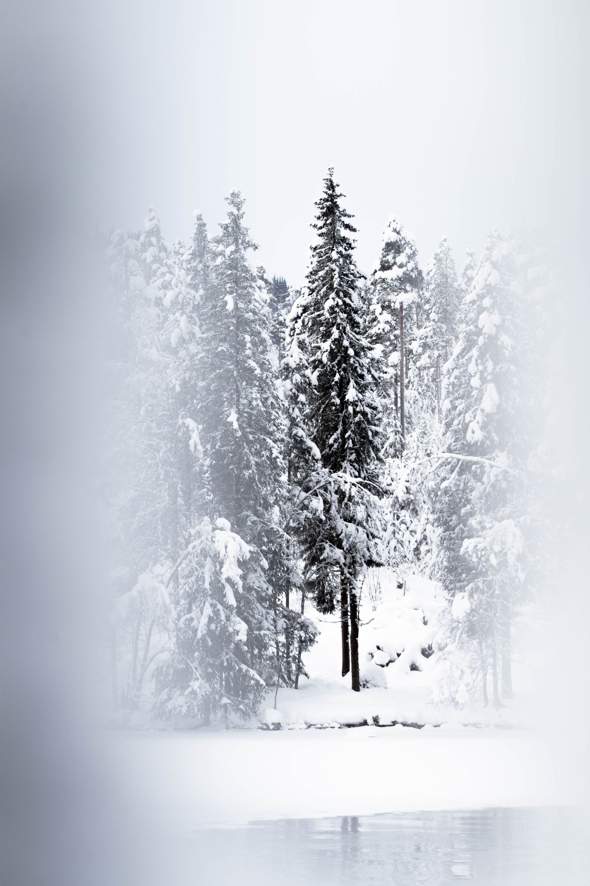

Hi 👋. Here is this week's <a href="/blog/newsletter/">Saturday Blueprint</a>.
<h1 id="%F0%9F%A4%94-quote-i%E2%80%99m-thinking-about">🤔 Quote I’m thinking about:</h1><blockquote>You don’t see things as they are. You see them as you are. — Derek Sivers  </blockquote>
I love this quote by one of my favourite authors, Derek Sivers. In one quote he simplifies and expresses the importance of perspective. Everything we experience is via our own sense of self. This is how we see everything. Our own unconscious mind filters and processes everything so that when we actually see things we cannot possibly see things as they are. There is only subjectivity. Even if you and I received the exact same input, we would have completely different experiences. How do you control who you are? Your <strong>character</strong>. I’ll write about this in more detail next week.
<h1 id="%F0%9F%91%A9%E2%80%8D%E2%9A%95%EF%B8%8F-placebo-effect">👩‍⚕️ Placebo effect</h1>
The placebo effect is an astonishing demonstration of the power of the mind. Look at any randomised controlled trial and there will always be some in the placebo group that present the <strong>full response</strong> that the drug or intervention gives, purely from the mind. From belief  Incredible. 
<h1 id="%F0%9F%8F%85-the-burning-monk">🏅 The Burning Monk</h1>
I linked this last week, but since we're on the theme of the power of the mind it is still a dreadful and poweful example. 

On the 11th June 1963 Vietnamese monk Thích Quảng Đức burned himself to death in protest against religious inequality. He’d be forever known as The Burning Monk for this act of selfless sacrifice.

<h1 id="%F0%9F%99%8B%E2%80%8D%E2%99%82%EF%B8%8F-the-12th-man">🙋‍♂️ The 12th Man</h1>
I’ve <a href="/blog/on-the-cold/">written about the cold before</a>, and the cold has incredible mental, physical and spiritual benefits.

If you want a simple and immediate demonstration and test of the power of the mind simply go and stand under a cold shower. There’s an instant flinch and recoil but if you set your mind, accept that it’ll be cold and uncomfortable for a few tens of seconds, you can do it. Anyone can do it. All that separates those that can and those that can't is that mindset. That belief.  

Think also of the things that can be endured if your life depended on it. A visceral example of this is from the excellent movie The 12th Man (2017).

In March 1943 a Norwegian commando, <a href="https://en.m.wikipedia.org/wiki/Jan_Baalsrud">Jan Baalsrud</a>, had to evade Nazi German capture by swimming ashore in ice-cold Arctic waters. In freezing conditions, soaked to the bone, and missing a boot he hid in a snowy gully. I have to remind myself that this is a true event when I watch the film, and I think back on that scene often. I think about this scene when I stand under the cold shower. Jan stood fast against the onslaught of the cold because he had to. Because his life depended on it. I can choose to withstand but a fraction of what he did, but nevertheless a small win for mind over matter.

Of the twelve in his group that were attacked by Germans the other eleven were killed. He became the twelfth man. The one that got away.

What is utterly remarkable is that it wasn’t one chilly swim ashore and a short hide out in the snowy cold and that was it. The story of Jan that unfolds is one that would seem far-fetched for any Hollywood script.

He evaded capture in occupied Norway for two <em>months</em>. An incredible survival story and harsh lesson in the power of the mind and the will. To never give up. To never give in. To describe the facts of his evasion is hardly enough to actually get across what it must have been like to actually go through it. His feet, frozen and frostbitten, we’re amputated by himself with a knife, to stop the spread of gangrene. He was buried in an avalanche. He went snow blind. He was caught in a snowstorm for 3 <em>days</em>. He was trapped under snow for 4 days. He spent 5 days out in the opem under the cold, Norwegian skies.

As his health and strength deteriorated he had the help of sympathetic locals. He was put on a stretcher and dragged to a high pass in the snow to rendezvous with the Norwegian resistance. He was left at the rendezvous point by the locals, but the resistance didn’t show up. He was left alone. Abandoned. He spent 27 days (<strong>27 days!</strong>) until help finally arrived. During those long, lonely, insufferable days he sheltered behind a snow wall, never out of the elements, and amputated nine more of his gangrenous toes.

But survive he did. After a period of recovery he was back training other allies in the fight against Germany. Truly remarkable and, like every great survival story, a marvel of the mind, the will and the heart to endure.
<blockquote>“If it's endurable, then endure it." — Marcus Aurelius</blockquote>
The film is a great adaptation of the real events, and one that has stuck in my memory for many years with the power and potency of the message. The untapped depths within each and every one of us to survive. To dig deeper than we’ve ever had to. It’s there. It’s always been there. Let’s just hope we don’t have to use it! So tomorrow morning, when I next get under that cold shower, I’m going to embrace the voluntary suffering and remember the heroes who have suffered so that I can live.
<h1 id="%F0%9F%92%8D-cool-finds">💍 Cool finds</h1>
A quick list of things I've read or found this week that I want to share.

This article on temptation bundling: 
<figure class="kg-card kg-bookmark-card"><a class="kg-bookmark-container" href="https://nesslabs.com/temptation-bundling">

Temptation bundling: stop procrastinating by boosting your willpower

Temptation bundling is a productivity technique that involves combining an activity that gives you instant gratification, such as watching TV, with one that is beneficial but has a delayed reward, such as exercising.

Ness LabsDr. Hannah England

</a></figure>
I'm a Getting Things Done and productivity nerd. I enjoyed this article on the distinction between <strong>do</strong> dates and <strong>due</strong> dates:
<figure class="kg-card kg-bookmark-card"><a class="kg-bookmark-container" href="https://gracemarshall.com/do-dates-vs-due-dates/">

Do Dates vs Due Dates - Grace Marshall

One of the benefits of being Human, not Superhero (one of the nine characteristics of a Productivity Ninja) is that when you make a mistake, or as I put it, have a ‘doh’ moment, you can chalk it up as a point of learning, rather...

Grace MarshallGrace

</a></figure>

It’s a pleasure writing to you. Have a great week. 😊

Nick
<h3 id="about-the-saturday-blueprint">About the Saturday Blueprint</h3>
The <a href="/blog/newsletter/">Saturday Blueprint</a> is a weekly newsletter every Saturday on health, vitality and philosophy by <a href="/blog/">Nick Stevens</a>.

Join the <a href="https://www.facebook.com/devonblueprint/">Facebook page</a> to interact with the community.
