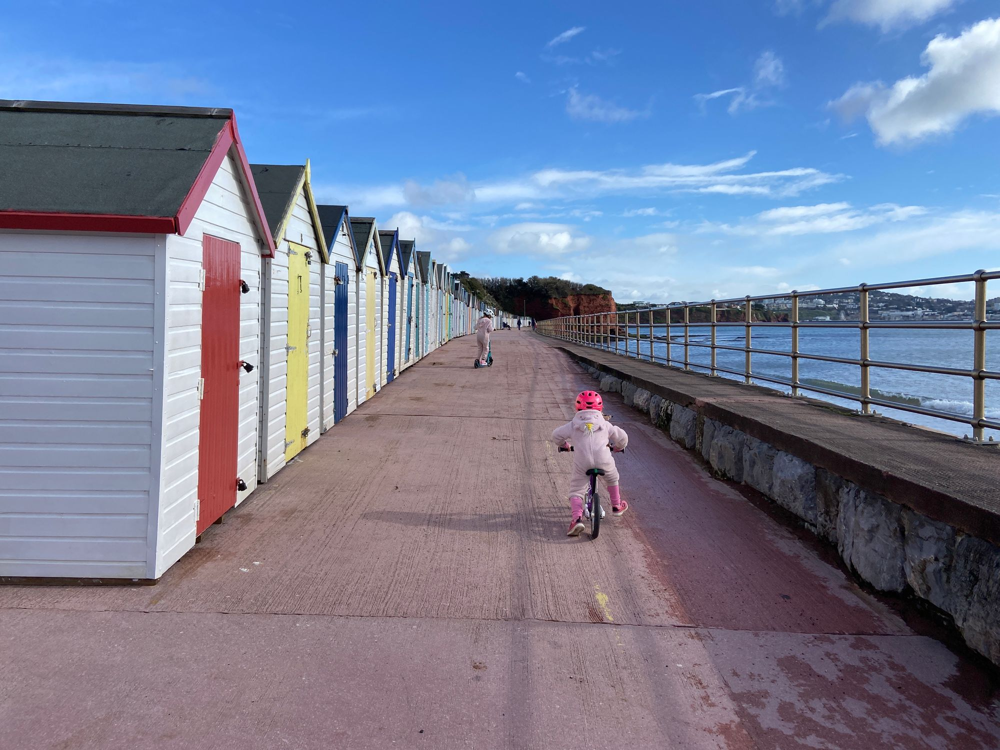
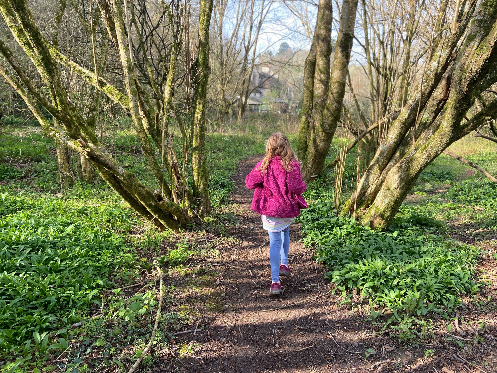
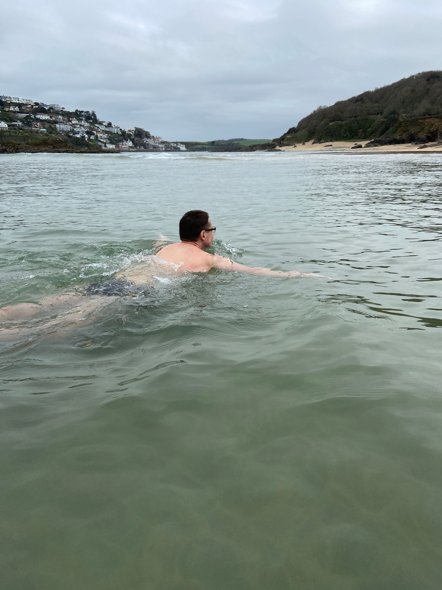
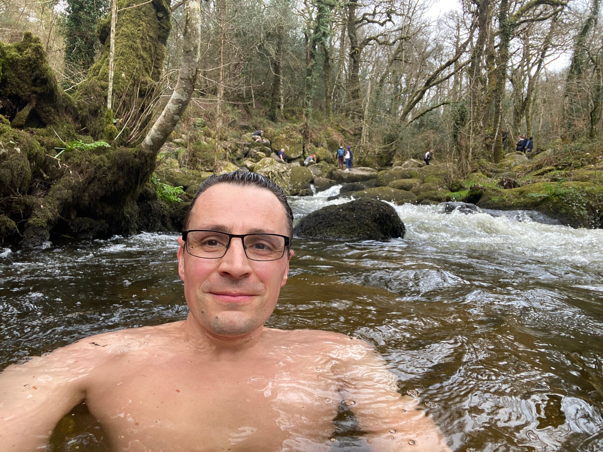
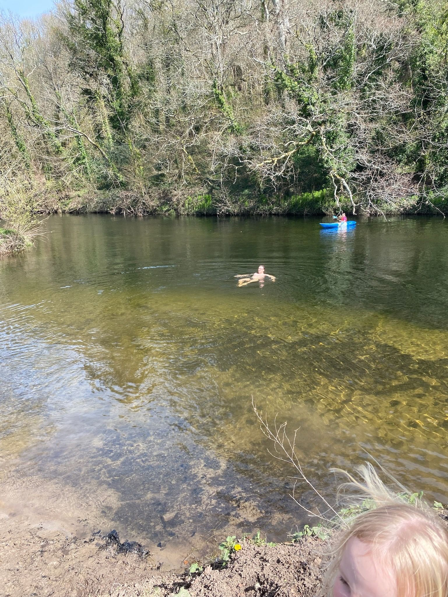
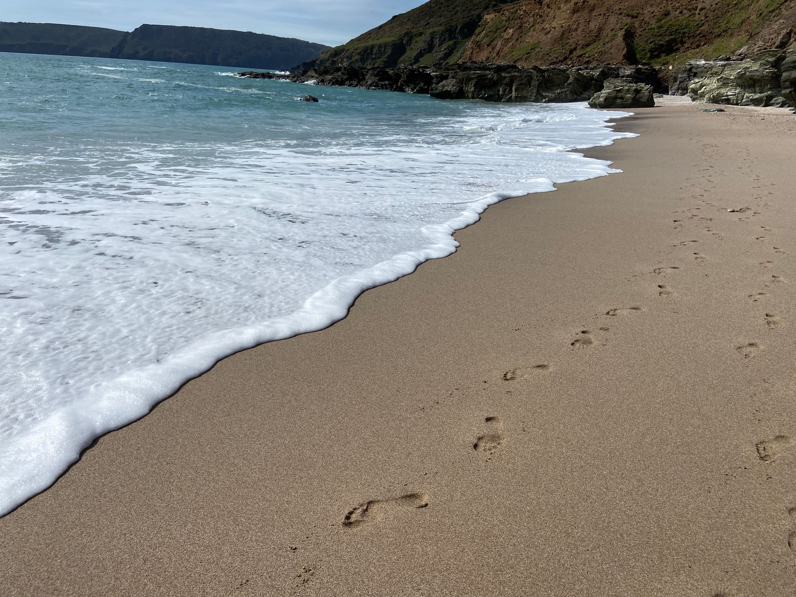
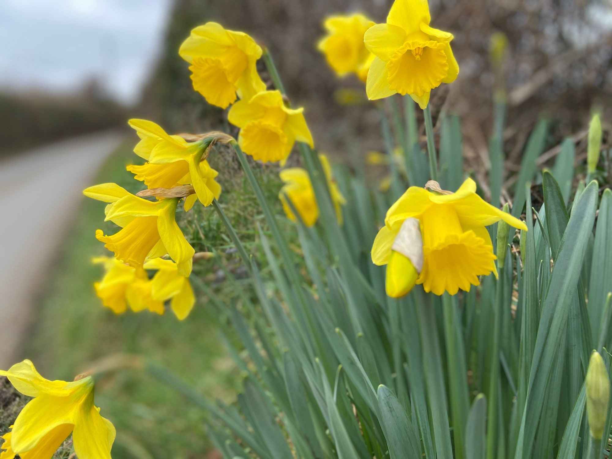

<blockquote>The old Lakota was wise. He knew that a man’s heart, away from nature, becomes hard; he knew that lack of respect for growing, living things soon led to lack of respect for humans, too. So he kept his children close to nature’s softening influence. – Luther Standing Bear</blockquote>
Spring is a perfect time to reconnect with nature. I share some of my recent Spring days in Devon.
<h1 id="%F0%9F%8C%A4%EF%B8%8F-spring-in-devon">🌤️ Spring in Devon</h1>
The arrival of Spring is always welcome. It arrives non-linearly and somewhat imperceptibly. But come mid-April, at least where I live in Devon in the south west of England, Spring is truly here. The arrival of Spring is a gradual softening of nature. The harshness of winter yields to a more nurturing environment, one that invites exploration. The <em>outdoors</em> is no longer a place of hushed denial but instead opens up to tentative investigation. Short spells of sunshine on your face are wondrous after a winter of grey and cold.

For me, it’s a time for Spring walks with the family. I recently had a lovely time at an easter egg hunt family fun run. And the easter break from school afforded the opportunity to get out on bikes and scooters in the spring sunshine.

It’s also a time for embracing dips in the sea or rivers, where the water is still cold, but the air is alive. In fact, the cold water in Spring is enticing, and I’ll take any opportunity to swim.

Over the past few weeks I’ve had a few outdoor dips - in the River Dart, the River Bovey and the sea near Salcombe.

The milder weather also means the drying out of the winter mud. This is great for losing my shoes and walking barefoot on the grass again. Or even better, that feeling of the sand and the surf when walking barefoot on the beach.

It’s hard to convey just how uplifting the combination of sun and water and family is for my soul. I struggle to think of a happier place than walking hand in hand with my wife with the kids running ahead wild and free and the sun touching our faces with warmth and light. Oh, and with a dip in the river too!

Spring inevitably follows winter, and yet why do I, why do we all, forget this in the depths of winter? It’s a reminder that all things shall pass. And that when spring does come that we enjoy it as deeply as we can because it too won’t last. Just like those footprints on the beach…
<h1 id="%F0%9F%8C%B3-seasons">🌳 Seasons</h1>
The seasons give a natural cadence to life. A slowly cyclic metronome with which to measure our years.

Just like our circadian rhythm is crucial to our daily bodily function, I’d argue that the seasonal rhythm is just as important, but now at a longer wavelength, fundamental, perhaps, to our mental function. As we learn and practice and grow through life we need our metronome just as the learning pianist needs hers. It’s a stable and comforting backdrop from which we can live out our hopes, fears, duties and dreams.

The change is slow but is nonetheless relentless. The transition from winter to spring is perhaps the most precious because it brings with it the promise of renewal. Casting off the old, the dark. Embracing the new and the light. Spring is the season of rebirth. Of life and colour returning.

After spring comes summer, and I’ve written about that before in <a href="/blog/saturday-blueprint-on-summer/">Saturday Blueprint 14 on Summer</a> so why not go back and take a read?

Until next week, I hope you enjoy something of nature in whatever fashion you can. For me, I’ll be digging out the paddle board, the sun cream, the beach bags, and the sunglasses, because I know that today is a glorious day to be alive and Spring is just outside the door waiting for me.

It’s a pleasure writing to you. Have a great week. 😊

Nick
<h3 id="about-the-saturday-blueprint">About the Saturday Blueprint</h3>
The <a href="/blog/tag/newsletter/">Saturday Blueprint</a> is a weekly newsletter every Saturday on health, vitality and philosophy by <a href="/blog/">Nick Stevens</a>.

Join the <a href="https://www.facebook.com/devonblueprint/">Facebook page</a> to interact with the community.
