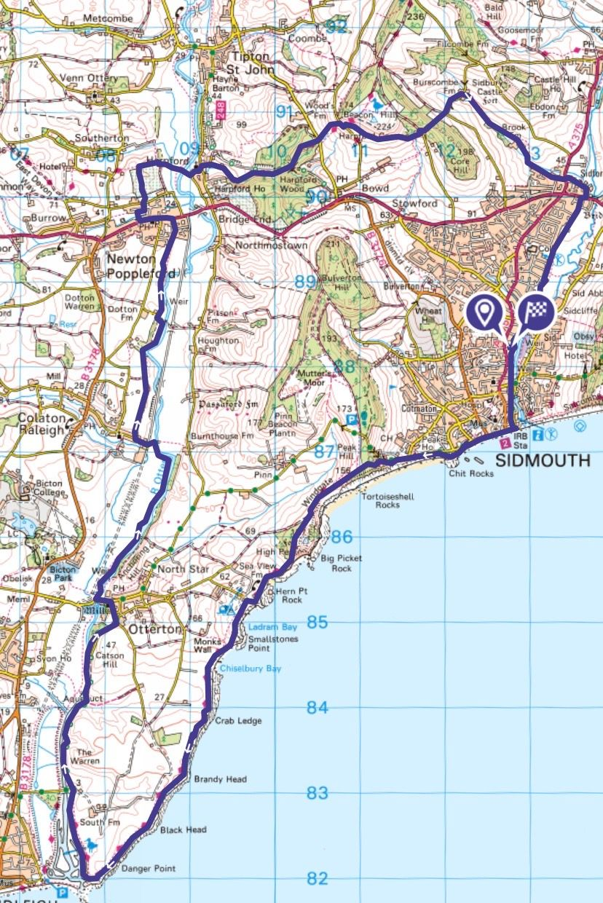
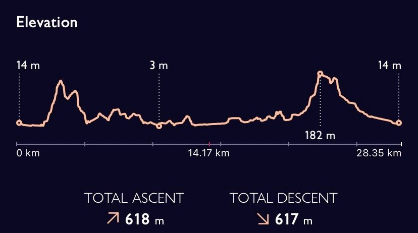
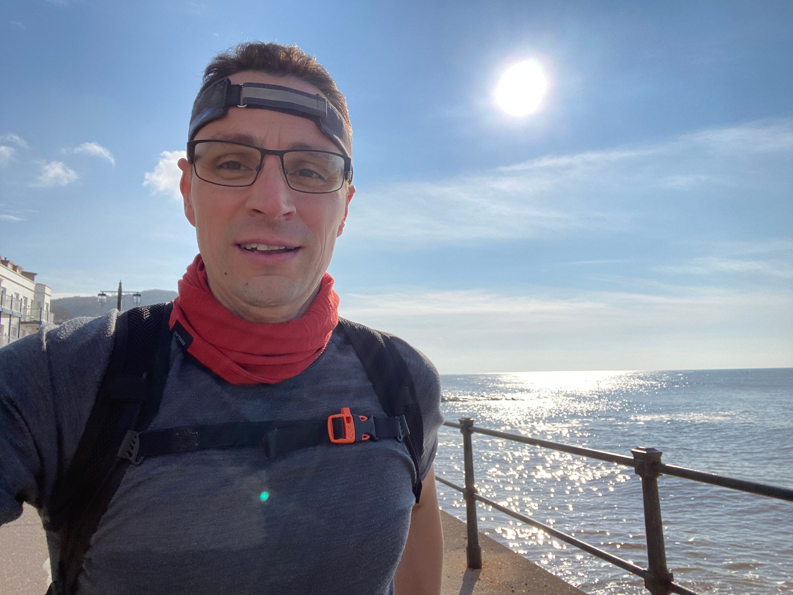
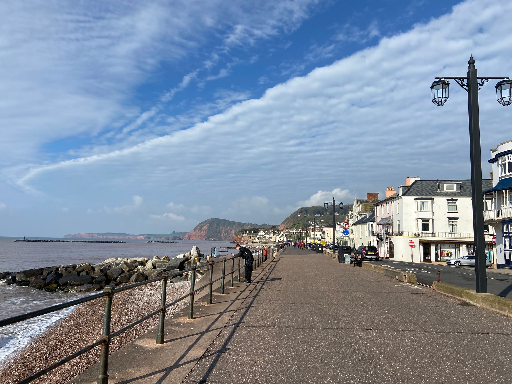
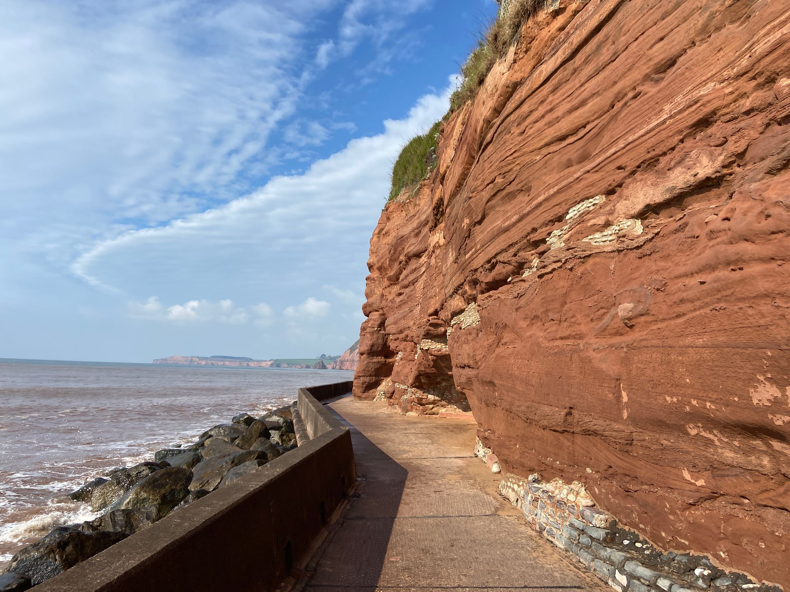
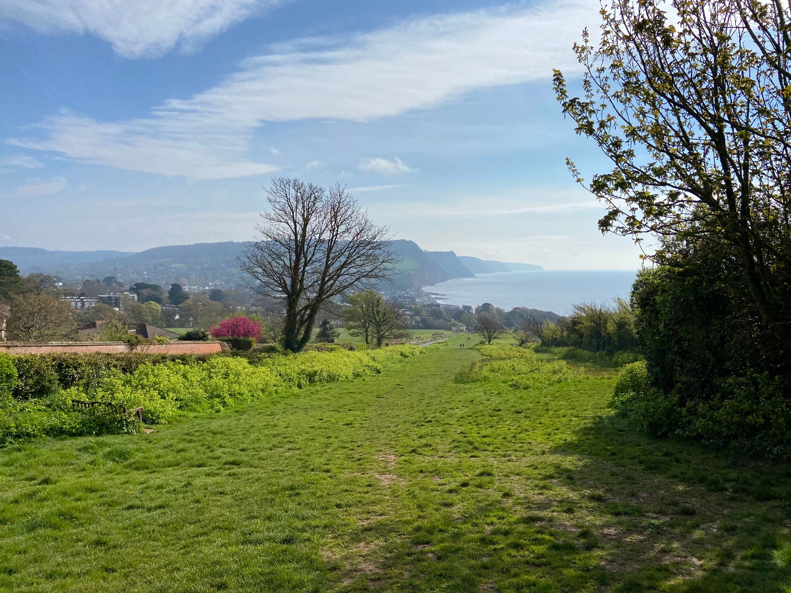
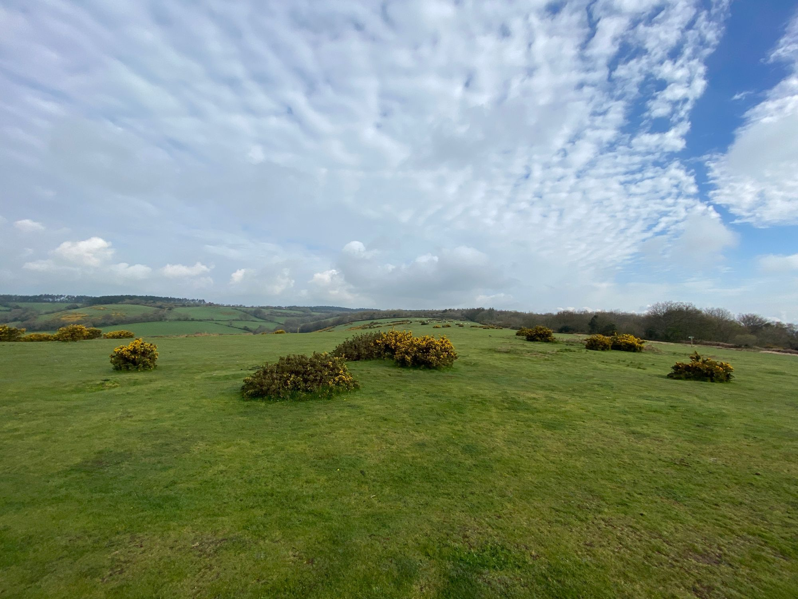
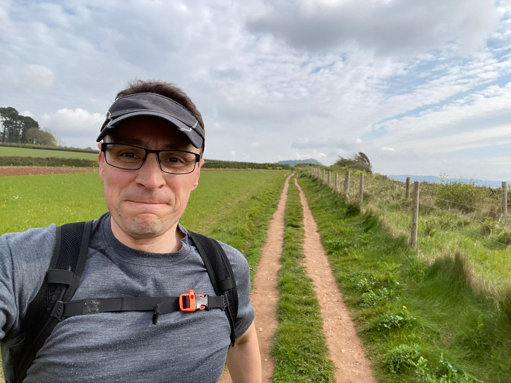
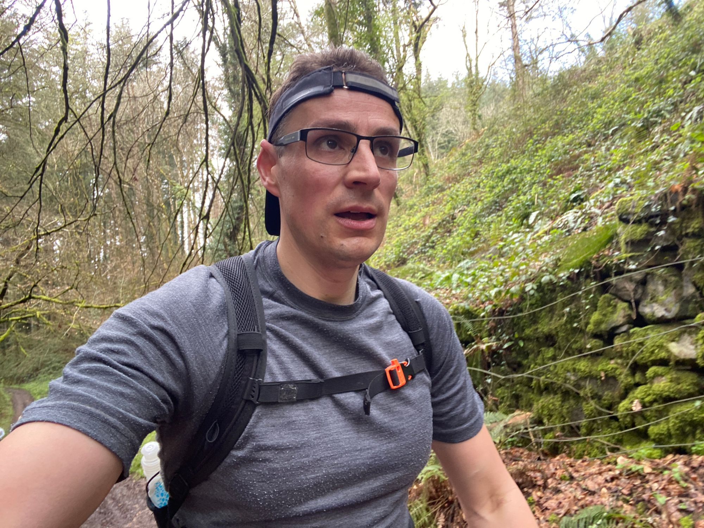

<blockquote>Make friends with pain, and you will never be alone. — Ken Chlouber (creator of the Leadville Trail 100)</blockquote>
I don’t enter running races often - just a few times a year - but when I do race I really enjoy it. The Long Distance Walkers Association organise ‘challenge events’ and this week I’ll share my recent experience of the Sidmouth Saunter - an 18 or 30-mile walk or run through the east Devon countryside.
<h1 id="%F0%9F%8F%85-the-sidmouth-saunter">🏅 The Sidmouth Saunter</h1>
The Sidmouth Saunter is a walking and running event organised by the Long Distance Walkers Association (LDWA). It’s held every two years, alternating with the sister race the Devonshire Dumpling.

There are two routes - an 18-mile option and a 30-mile option. I opted for the 18-mile option this time, as a last long run before the Bristol Half Marathon that is 3 weeks later.

Walkers start at 8 am, runners at 9 am. I love LDWA events because the routes are great (scenery, trails, etc), they are informal and friendly, and above all are so cheap!

The event has a few checkpoints with food and drink but is otherwise self-supported. The route isn’t marked or marshalled, it’s a self-navigation event. I ran with the GPX route loaded onto my phone and with a turn-by-turn printout of the course. This makes it tricky and interesting because you need to run at the same time as reading the map and route description! I took a couple of minor wrong turns this time, but nothing major.

The 18-mile route that I did is shown on the OS map below, followed by the elevation profile. 600m of ascent/descent is pretty hilly and certainly makes for a challenging route.

I don't race that often but when I do it is good fun. There is a step change in mental and physical performance when racing compared to training. You can go to deeper places and access and greater well of fortitude.

For me, things start to get interesting when I reach about the 2-hour mark. That’s when I start to feel more emotion and have to dig deep to find the resolve I need to keep pushing. Music helps when I reach this point because it connects to the more primal side that is activated at this point. I have an “epic running” playlist of big songs and emotional music.

The transition to this mental state is wonderful in hindsight, a real soul search. It makes crossing that finish line an achievement to be proud of.

<h1 id="%F0%9F%94%AE-lessons-for-future-races">🔮 Lessons for future races</h1>
In terms of what I learnt from this event, specifically in relation to my upcoming Bristol Half Marathon, it’s this:
<h2 id="pre-race">Pre-race:</h2><ul><li>My pre-race meal was 6 scrambled eggs with Serrano ham and a glass of homemade kefir. A high-fat and protein and zero carb breakfast. The idea here is that no fibre will be easier on my stomach and that the ketogenic breakfast will keep me in ‘fat-burner’ mode for fuel as opposed to glucose burning. I will likely keep the same except to add some honey for a bit of easily digestible carbs.</li><li>For chaffing I plastered my nipples and used talc powder for my groin and feet.</li><li>Next time I will have more electrolytes beforehand.</li></ul><h2 id="during">During:</h2><ul><li>I carried a little tin of salt which worked well for adding electrolytes to the water at the checkpoints.</li><li>I applied Vaseline to my groin when I felt some friction.</li><li>I drank only water, with salt added. I should drink more electrolytes next time though.</li><li>I had a few handfuls of raisins as my only source of fuel.</li><li>Self-navigation was tricky using the printout provided. Next time I’ll rewrite the instructions in a numbered list so I can better follow them.</li><li>I’m undecided on whether I’ll run in my calf sleeves or just use them for post-race recovery.</li></ul><h2 id="post-race">Post-race:</h2><ul><li>I used my calf compression sleeves to aid recovery.</li><li>I had an Epsom salt bath.</li><li>I ate cleanly afterwards - ie didn’t just chomp on all the sweets and chocolate (!!) but ate real food.</li></ul>
And that’s it. In the last few weeks before the Half I’ll do a taper of sorts with my running mileage, not that I’m running that much anyway. I will also do some visualisation exercises because the mind needs training as much as the body. And finally, I will use my cork massage balls and foam roller to iron out any kinks and knots.

With that, I should be ready to have a blast around a half-marathon course, in what will be my first big city road race in many, many years.

Keep on running.

It’s a pleasure writing to you. Have a great week. 😊

Nick
<h3 id="about-the-saturday-blueprint">About the Saturday Blueprint</h3>
The <a href="/blog/tag/newsletter/">Saturday Blueprint</a> is a weekly newsletter every Saturday on health, vitality and philosophy by <a href="/blog/">Nick Stevens</a>.

Join the <a href="https://www.facebook.com/devonblueprint/">Facebook page</a> to interact with the community.
