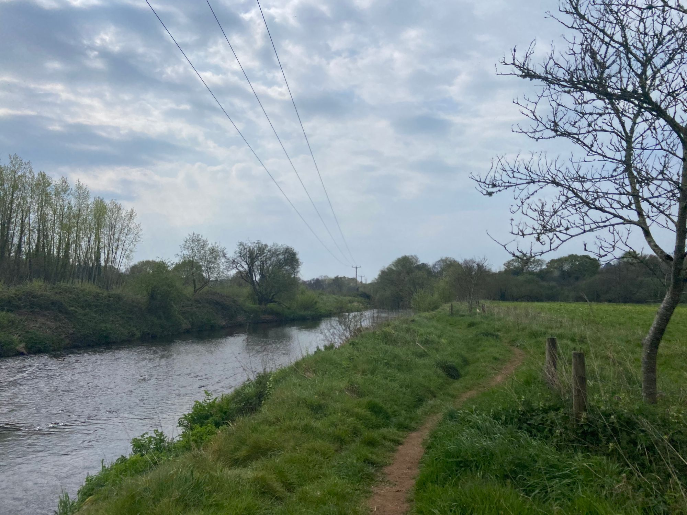
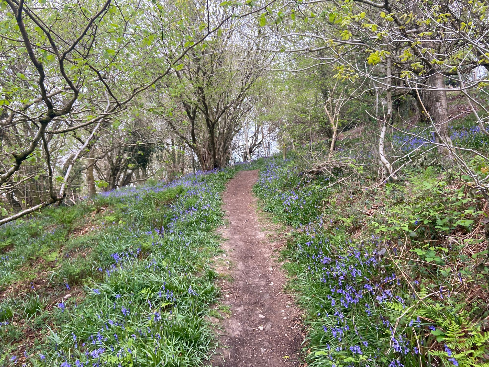
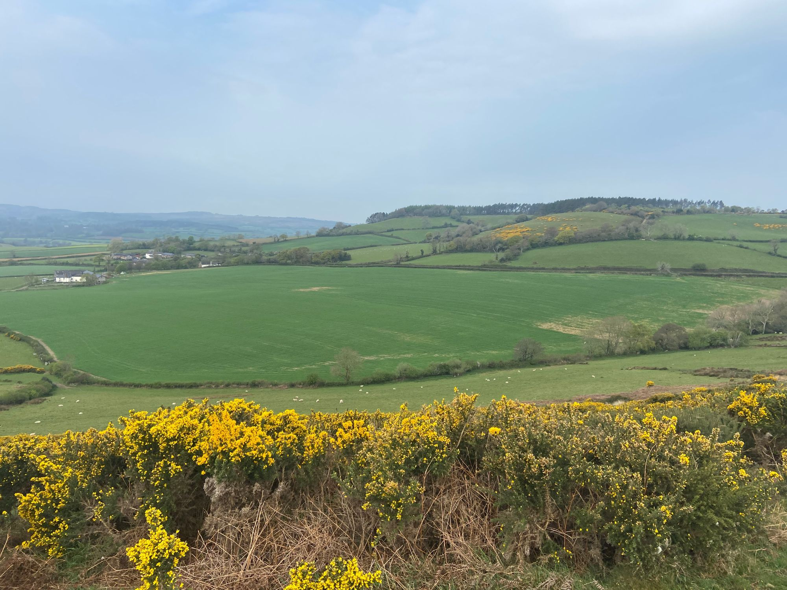
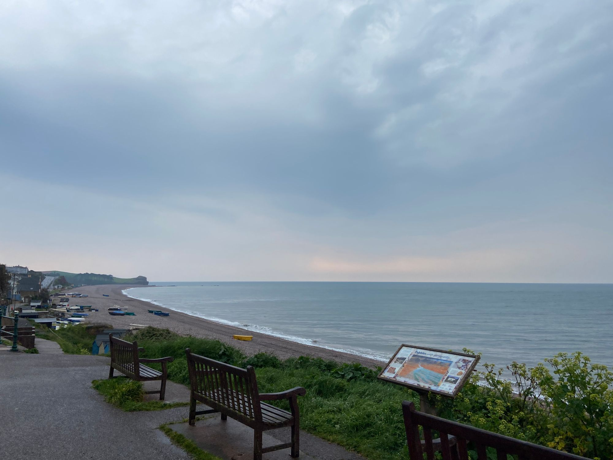
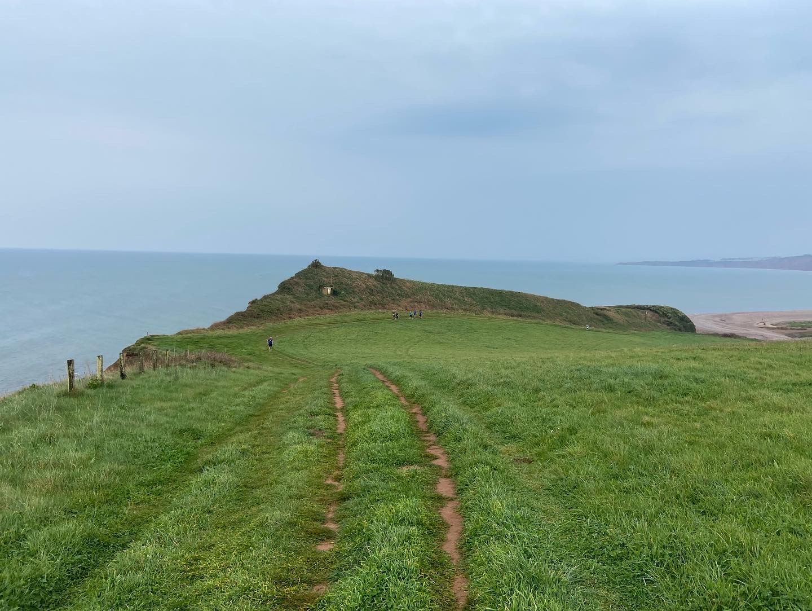
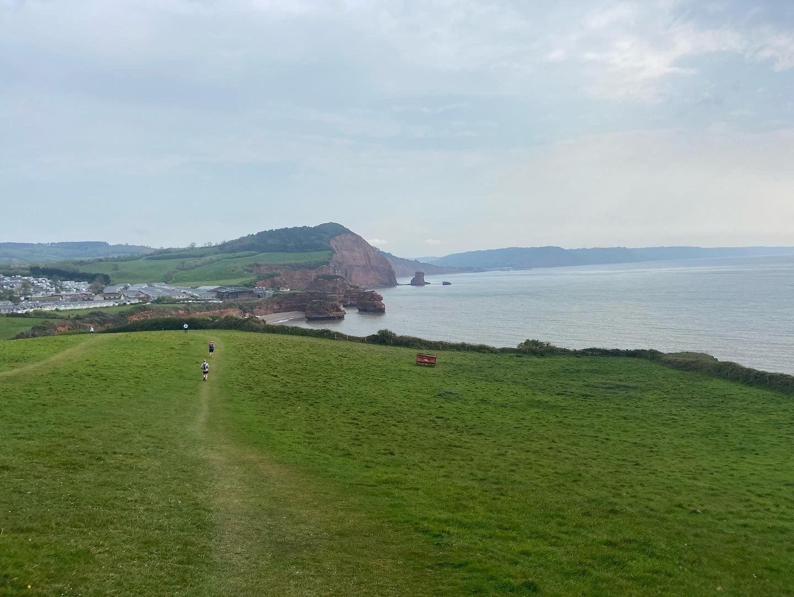
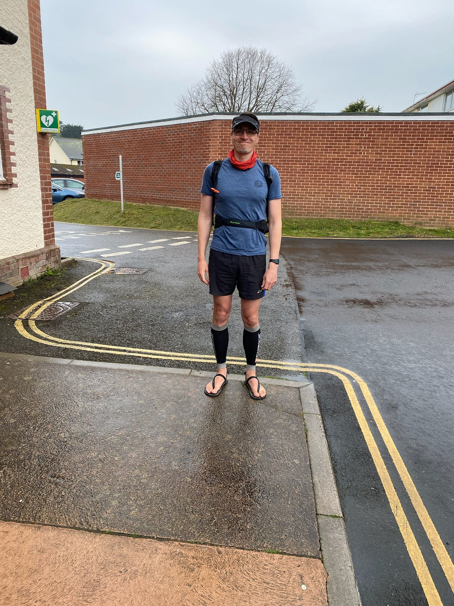

Last weekend I ran the <a href="https://ldwa.org.uk/CornwallAndDevon/W/3014/devon-dumpling-2022.html">Devonshire Dumpling</a>. This is an event organised by the Long Distance Walkers Association, with two route options, 32km (20 mile) and 52km (32 miles). They have a walkers start time and runners start time. I signed up for the “short” option, though still 20 miles… almost 100% off road.

I elected to run this race in sandals. I’ve been running in my <a href="https://pantasandals.com/products/zaros">Panta Zaros running sandals</a> for a few months now and I love them. They are ultra light, totally minimalist (just 6mm of rubber with a bit of tread) and very freeing. Here are some lessons, which turn out to be generally useful and transferable, should you not wish to run a race in sandals yourself!
<h2 id="lesson-1-sometimes-you-can-win-by-being-the-only-one-in-the-race">Lesson 1: sometimes you can win by being the only one in the race</h2>
The surprising ending to this story is that I won the race. In those dorky looking sandals. This isn’t a self-congratulatory post. I didn’t expect to win. I’m not a fast runner anymore (young kids, stressful job, yada yada). The reason then for writing this is because the cliché is true - <em>you’ve got to be in it to win it</em>. And I wanted to remind my future of this. You’ll 100% lose if you don’t start.

So here’s a question for you - how many “races” have you lost by not even starting them? This is where the running metaphor can end and the rest of life can take over. What have you given yourself no chance in because you haven’t even started... yet?
<ul><li>What language will you never learn because you won’t start?</li><li>What story will you never write because you haven’t picked up the pen?</li><li>What adventure will you never take because you haven’t booked the flights?</li></ul>
Is there risk of failing with trying something new or hard or uncomfortable? Of course. That’s the idea. That’s being vulnerable and that way lies growth and strength.
<blockquote>“Don’t be afraid to fail. Be afraid not to try.” — Michael Jordan</blockquote>
My own personal takeaway here is that you can win just by being the only one in the race.

The directive from this is simply to <strong>start, start now</strong>.
<h2 id="lesson-2-resilience-comes-from-stress">Lesson 2: resilience comes from stress</h2>
Hormesis is the mechanism where small stresses lead to an overcompensation and therefore make us more resilient, stronger. For me, I went for sandals and a long distance (three times as far as I’d run during training) because it would challenge me. It would stress my mind, my legs, my feet. But the result is that I’d come through stronger. Well it did hurt, I did have doubts and low points, but the feeling of achievement is all the sweeter for the striving.

Getting out of your comfort zone is a good thing. It’s a mental hack for you to realise that things are rarely as bad in reality as you made them in your imagination. For me, if I can run 20 miles in sandals, what else can I do. I suppose the cliché of: <em>I can do anything I put my mind to</em>.

The directive from this is <strong>don’t make it easy, make it hard</strong>.
<h2 id="lesson-3-freedom-comes-from-looking-like-a-plonker">Lesson 3: freedom comes from looking like a plonker</h2>
We don’t have to be bound by our egos. It’s liberating to know that no one much cares what you look like. Buddha said:
<blockquote>“The root of suffering is attachment”</blockquote>
Removing or even reducing the attachment to our egos is the path to freedom. Freedom from external pressures. Freedom to be authentic. In the case of sandals, the freedom to be like a child again - to run without a care, to run based on how you’re feeling rather than any external signal.

Looking like a plonker, which is an objective fact for me, is my own personal path to freedom.

The directive here is <strong>act like a child</strong>.
<h2 id="lesson-4-you-need-less-much-less-than-you-think">Lesson 4: you need less, much less, than you think</h2>
Sandals are an odd choice for many reasons, but you can’t object to the fact that they are minimal. They are very light, they are very flexible (no arch support, cushioning or any of that ”tech”), and very thin. I just love the ground feel you get - it’s like being barefoot on the beach. And without socks your feet are just out in the elements. You’ll get cold toes, or muddy feet, you’ve got to watch your step in a way you don’t wearing cushioned shoes. It’s freeing.

Yes, but so what? Well the minimalist approach is a useful reminder (which sometimes has to be tested by action) that you need less than you think. Sometimes <em>much</em> less. It’s easy to accumulate and add. It’s much harder to subtract and simplify.

In business, what’s the surest way to make more profit?  It’s to reduce expenses, rather than seek to increase your income. Subtraction is the superpower, not addition.

In a world where every conceivable product or service is a few clicks away it’s nice to test just how little you need, even if to appreciate what you’ve got. In the past I’ve done a week-long test of sleeping on the floor, just on a thin foam camping pad (I’m not normal… but that’s precisely the point… none of us are 😜). Will I give up a bed? No, but I don’t <em>need</em> a bed. And I just appreciate it all the more now.

Minimalism is a way of challenging norms, of challenging comfort. What if you ran a mile barefoot? What if you slept on the floor? What if you walked instead of taking the car? What if? What if?

The directive here is to <strong>ditch the unnecessary</strong>.
<h2 id="closing">Closing</h2>
There we have it. Some lessons learnt and re-learnt for me. Lessons shared for future me, and maybe someone else reading this.

In summary:
<ul><li>Lesson 1: sometimes you can win by being the only one in the race. Directive: start, start now.</li><li>Lesson 2: resilience comes from stress. Directive: don’t make it easy, make it hard.</li><li>Lesson 3: freedom comes from looking like a plonker. Directive: act like a child.</li><li>Lesson 4: you need less, much less, than you think. Directive: ditch the unnecessary.</li></ul>
👋 happy trails 🏃‍♂️
<h2 id="some-other-photos-from-the-day">Some other photos from the day</h2>

<h2 id="and-here-is-the-run-on-strava">And here is the run on Strava</h2>
<a href="https://strava.app.link/n5cSwkU4Cpb">https://strava.app.link/n5cSwkU4Cpb</a>
