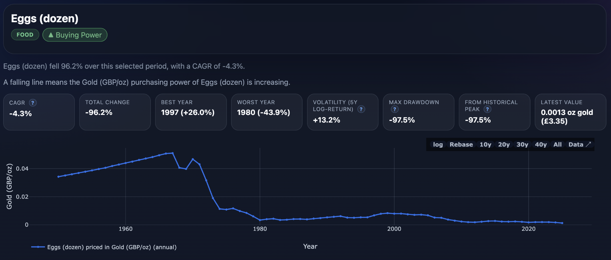

I've been curious about economics, markets, power, and investing for a long time, and like to think about things from first principles (the curse of the mechanical engineer?!). I read and listen to a lot of discussions and debates from all angles, and this quote provides the best 'mental rug pull' that sets up my baseline position: 

>The natural state of the free market is deflation
— Jeff Booth

The reason I see this as a mental rug pull is because it changes our fundamental understanding of the economic system we're in. Look around and deflation is not something you see. Why not? And what is inflation anyway, and why is there this magically 'target' of 2% inflation - on what basis does that number come from?

Without peeling back too many layers, it's a truism that inflation can mask the true value of our time and energy. And rather than constructing a logical argument against the fallacy of inflation, or arriving by deduction at the conclusion that the natural state of the free market is deflation, I instead took a side step and asked: what does the data show?

To this end, I built a [web app](https://www.nickjstevens.com/priced-in/index.html) to explore the UK cost data and the results are, to put it mildly, suprising. 

By changing the denominator and pricing houses, eggs, or butter in hard assets like gold you can strip away fiat currency devaluation and see what’s really happening your purchasing power. When you price (say) eggs in gold, the price of eggs *are* deflating. Gold is a better measuring stick because it cannot be printed - it is a 'hard asset'. But if you price the same eggs in the British Pound, a fiat currency that the Bank of England can print at will, then eggs are getting more expensive as we can readily see. This is inflation; and it's not the price of eggs that is increasing, but that the fiat currency is losing purchasing power. Why? Because it can be printed, watering down it's value insididiously over time. Is the 2% 'inflation target' just a level that is hard for us plebs to detect? And so we almost don't notice we're getting slightly poorer each year, slightly more squeezed…

But back to the data and to the web app. My [web app](https://www.nickjstevens.com/priced-in/index.html) exists to make long-run UK living costs more intuitive by re-pricing everyday goods and services in multiple “money lenses” (nominal GBP, CPI-adjusted real GBP, gold, hours worked at median wage, and bitcoin). The goal is to show how the same item can look very different depending on the unit of account, and to illustrate changes in purchasing power over time rather than just headline prices.

The data coverage is annual and goes back as far as 1950 where the data exists. Sources include official, market, and derived series with lineage notes in the app so you can see exactly where the data originates.

I invite you to explore the data in your own way and draw your own conclusions. 
