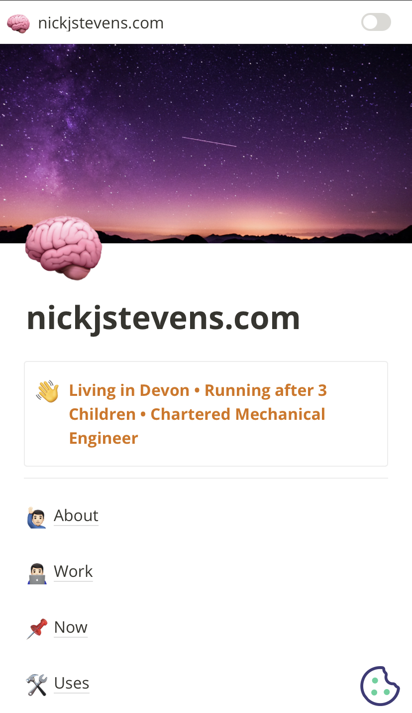

I recently made the decision to migrate my website from [Hugo](https://gohugo.io/), a static site generator, to [Notion](https://www.notion.so/), a no code tool.

Having made the leap, I wanted to summarise my reasons for doing so, and some of the trade-offs involved. Plus, some practical tips if you are thinking of doing the same. 

## Start with Why

The reason I considered moving Notion for hosting my website in the first place is because of how easy it is to create content. I was writing blog posts in Notion before anyway, but had a manual step to copy over to Hugo, and inevitably faff with some details like Hugo short-codes, maths equations, and sort out images. Then to make a change to an article, I’d either just do it in the Hugo markdown file directly (so now not aligned to the original post in Notion) or have to update in two places. This was inefficient, and not fun.

I just want to write my thoughts, in one place, easily, and not worry about the details. Notion gives me that.   

And to some extent I'm predicting that Notion will only become more important in the future for personal websites and blogs. The tooling will get better and the trade-offs will improve. I'm all-in for Notion for the long game, and converting my website is the first step. I have no doubt that all the shortcomings below can and will be addressed in the future, making Notion a credible go-to for websites and blogs.

## What I gain

For me, here are the pros in using Notion for website or blog:

- Live updating - instant publishing and immediate editing / updates
- Exploring and showing connected thoughts and ideas - thinking in public has less barriers / friction in Notion
- No need to know how to design and code - I had lots of pain trying to upgrade Hugo and my theme
- Notion is an opinionated tool and there in many ways more intuitive - at the least the constraints help focus the mind on the content
- Short time to build a functional website, blog or landing page
- Ability to tinker (on content, not styling) - content is the most important thing and this is front and centre in Notion
- Presentation as published reflects exactly my writing presentation - WYSIWYG!
- I don't have to worry about links changing if I move around content 

## What I lose

There are trade-offs, and here are what I see as the cons:

- Limited (constrained) design freedom - but see above as this is also a pro in keeping it simple and avoiding over-analysing things
- I can't easily list all categories, and categories in the Notion table are not clickable or navigable
- I can't create useful summarises like a tag cloud, most popular posts, etc.
- Unless manually added, there is no ability to recommend related posts to the one being read
- Headers and menus are hard work, especially with lots of items, and I can't have a repeating item (like a header or footer) on each page
- Comments and discussions are not possible
- Poorer performance (page load speed etc.) via [web.dev](http://web.dev/) - and this likely extends to poor SEO performance too
- No RSS feeds

## Migration Considerations

- Use [Fruition](https://fruitionsite.com/) (this is what I did and it’s great) or one of the paid alternatives like [super.so](http://super.so/) 
- You can inject custom scripts in Fruition to handle things like Google Analytics and Cookie Consent
- Consider setting up page redirects from the old URLs (if you know how - I didn’t so didn’t do this!)
- Use [https://chilipepper.io/](https://chilipepper.io/) for forms 

I'm still tinkering and playing with this site so will update this page as I go. It's been a fun experiment so far! 

I’m happy to answer any questions, and would love to know how others have got on, or if there are pros and cons also worth considering.
